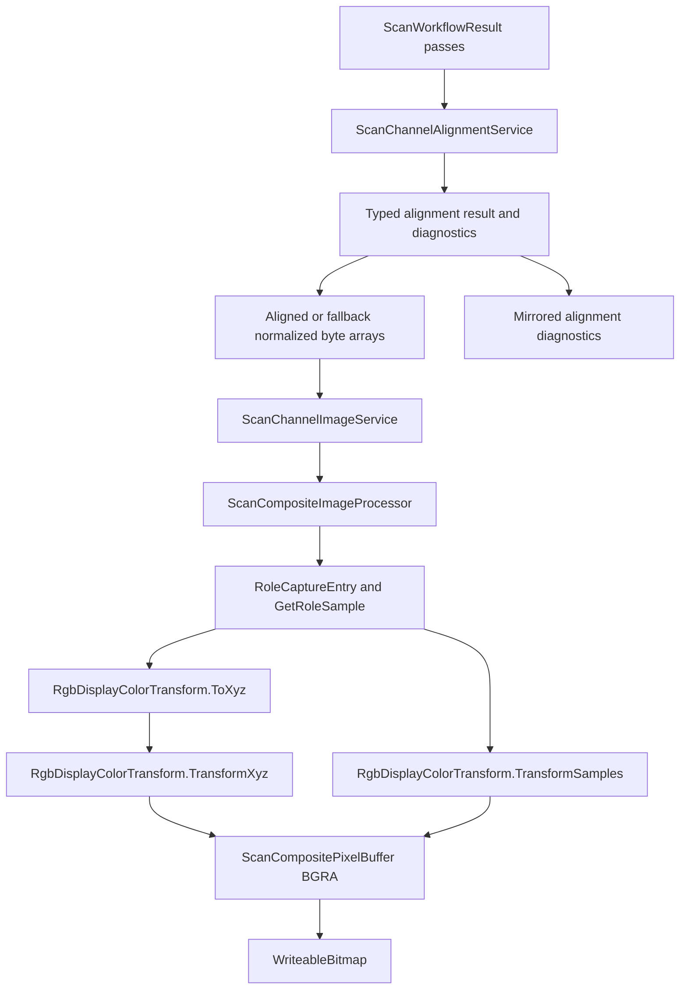

# 配准, 色彩处理与合成预览

## Scope and non-responsibilities

本文只覆盖通道对齐后的 pass 到 RGB 合成预览的路径。范围包括 alignment service, composite processor, channel image service, 以及它们如何把对齐 pass, XYZ/display color, BGRA 预览和 bitmap 写入连接起来。

不覆盖单通道 raw 预览的 packed byte 解码细节, DNG 文件写入细节, 或 UI 控件行为。原始 byte 到 BGRA 的预览路径在 `image-decoding-preview.md` 中说明。

## Functionality

`ScanChannelAlignmentService.BuildAlignedNormalizedPassBuffers` 先把每个 `ScanPassCapture.ImageBytes` 归一化到同一方向, 再以唯一 Green 角色作为参考通道估计其它通道的平移。它返回 typed `ScanChannelAlignmentResult`, status 可能是 `Aligned`, `Disabled`, `Fallback` 或 `Failed`, 并携带 per-channel outcomes 和 diagnostics。源码只使用 `MotionTypes.Translation`。支持的模式来自 `ScanChannelAlignmentMode`: `Ecc`, `MutualInformation`, `EccThenMutualInformation`。

`ScanCompositeImageProcessor.TryBuildRgbComposite` 要求 Red, Green, Blue 每个角色正好出现一次。`TryBuildPartialRgbComposite` 允许缺少 RGB 角色, 并通过 `ScanRowAvailability` 把尚未完成的行写成透明 alpha。

`ScanCompositeImageProcessor` 的色彩管理开启时, 会把 Red, Green, Blue 16 位样本映射到 CIE 1931 primary, 解出 white point gains, 生成 XYZ, 再通过源码中的显示矩阵转成 display RGB 并写为 BGRA。色彩管理关闭时, 它用归一化样本和 `OutputGamma` 直接编码三通道。

`ScanChannelImageService` 是应用层协调者。它调用 alignment service, 可选应用 white level override, 构造方向已归一的 `ScanWorkflowResult`, 再调用 composite processor。同步预览入口使用 `CancellationToken.None`; async 合成和导出入口接收调用方 token, 把 token 传入 `Task.Run` worker、alignment、processor 和内部循环。最后它把 `ScanCompositePixelBuffer.Pixels` 写入 WinUI `WriteableBitmap.PixelBuffer`。

## Key entry points

| 角色 | 入口符号 | 作用 |
| --- | --- | --- |
| alignment | `ScanChannelAlignmentService.BuildAlignedNormalizedPassBuffers` | 构造 typed alignment result, normalized pass buffer 数组, channel outcomes 和 diagnostics |
| alignment | `ScanChannelAlignmentService.EstimateTranslation` | 按 alignment mode 分派 ECC, mutual information, 或二者组合 |
| alignment | `ScanChannelAlignmentService.ApplyTranslation` | 对 16 位样本格做双线性平移采样 |
| composite processor | `ScanCompositeImageProcessor.TryBuildRgbComposite` | 从完整 RGB pass 构造 `ScanCompositePixelBuffer` |
| composite processor | `ScanCompositeImageProcessor.TryBuildPartialRgbComposite` | 从部分可用行构造透明占位的 RGB buffer |
| composite processor | `RgbDisplayColorTransform.ToXyz` | 把缩放后的 RGB 样本投到 XYZ |
| composite processor | `RgbDisplayColorTransform.TransformXyz` | 把 XYZ 转为 display color 并编码输出字节 |
| channel image service | `ScanChannelImageService.TryBuildRgbComposite` | 应用层输出 `ScanCompositeFrame` 与 bitmap |
| channel image service | `ScanChannelImageService.TryBuildPartialRgbComposite` | 扫描过程中输出部分合成预览 |

## Implementation mechanism

### alignment service

`BuildAlignedNormalizedPassBuffers` 首先检查 `CancellationToken`, 再调用 `_processor.NormalizePassBuffer` 处理每个 pass 的方向。没有 pass, 无效宽度, `result.Rows <= 0`, 输入 buffer 为空, 或 normalized buffer 为空时返回 `Failed`, diagnostic kind 为 `EmptyInput`, 且不返回可用 buffers。找不到唯一 Green 角色时返回 `Disabled` 和 `MissingUniqueGreen` diagnostics。有效像素范围、coarse ROI 或 fine ROI 为空时返回 `Fallback`, 保留可用 normalized buffers, 并写 `InvalidRoi` diagnostics。

Green 参考图由 `BuildSampledRoiMat` 从有效像素范围采样到 `MatType.CV_32FC1`, 每个元素来自 `_decoder.TryGetSample16` 后除以 `ushort.MaxValue`。粗采样受 `CoarseMaxDimension` 限制。fine window 由 `BuildFineWindow` 取有效区域中央, 上限由 `FineMaxWidth` 和 `FineMaxHeight` 控制。

OpenCvSharp 调用只出现在 `EstimateEccTranslationCore`: 创建 `2 x 3` 的 `CV_32FC1` warp matrix, 设置平移初值, 使用 `TermCriteria(CriteriaTypes.Count | CriteriaTypes.Eps, maxIterations, EccMinIncrement)`, 然后调用 `Cv2.FindTransformECC(reference, moving, warpMatrix, MotionModel, criteria, null, EccGaussianFilterSize)`。互信息路径由源码中的 `ComputeMutualInformation` 评分, 本文不添加额外参数或公式。

估计到有意义平移后, service 调用 `DecodeToSampleGrid` 分配 `ushort[width * rows]`, 用 `ApplyTranslation` 产生目标样本格, 再由 `EncodeSampleGrid` 克隆原始 pass buffer 并按 packed 格式写回样本。

### composite processor

`NormalizePassBuffer` 对需要反向的 pass 分配新 `byte[]`, 按 `ScanDebugConstants.BytesPerLine` 逐行反拷贝。不需要反向时返回原始 `ImageBytes` 引用。

RGB 合成核心 `TryBuildRgbCompositeCore` 先验证 pass, assignment, color management 和尺寸。它用 `BuildRoleMap` 把角色映射到 `RoleCaptureEntry`, 每个 entry 保存 capture, 手动反向标记和 `ScanRowAvailability`。`GetRoleSample` 会检查角色存在和行可用性, 再用 `ResolveSampleRow` 处理方向, 最后调用 `_decoder.TryGetSample16`。不存在或不可用的样本返回 0。

色彩管理开启时, processor 为全图分配 `XyzColor[pixelCount]`, `double[pixelCount]`, `byte[pixelCount * 4]`。第一轮把 RGB 样本转成 XYZ 并收集 Y 值, 然后用 `ComputePositivePercentile(..., LuminanceScalePercentile)` 设置亮度缩放。第二轮用 `TransformXyz` 写 BGRA。色彩管理关闭时不分配 XYZ 和亮度数组, 直接用 `TransformSamples` 写 BGRA。

alpha 由 `IsAnyRgbRoleAvailable(passByRole, y)` 决定。完整合成通常所有行可用, alpha 为 255。部分合成会把未完成行写为 alpha 0。

### channel image service

`TryBuildRgbCompositeBuffer` 调用 alignment service。`Failed` result 会阻止合成并返回错误；`Aligned`, `Disabled` 和 `Fallback` result 继续使用 result buffers。调用者把 alignment diagnostics 镜像到 diagnostic sink, 因此 ECC native failure、disabled assignment、fallback ROI 和 per-channel fallback 都能在上层可见。成功后, 如果 `applyWhiteLevel` 为 true, 调用 `ApplyWhiteLevelOverrides`; 否则直接使用 aligned passes。随后它用 `BuildAlignedResult` 把所有 pass 标记为 `DirectionPositive = true`, 用 `BuildNormalizedAssignment` 把 reverse flags 清零, 再交给 processor。

`TryBuildPartialRgbCompositeBuffer` 不调用 alignment service。它只通过 `_processor.NormalizePassBuffer` 归一化方向, 构造 `BuildRoleAvailabilityMap`, 再调用 partial processor。该设计说明部分预览走可用行与透明 alpha, 不走 OpenCV 对齐。

`TryBuildRgbComposite` 和 `TryBuildPartialRgbComposite` 都复用尺寸匹配的 `WriteableBitmap`, 否则新建 bitmap。像素写入固定为 `stream.Position = 0`, `stream.Write(buffer.Pixels, 0, buffer.Pixels.Length)`, 然后 `Invalidate()`。

## Control and data flow

完整合成路径: `ScanChannelImageService.TryBuildRgbComposite` -> `TryBuildRgbCompositeBuffer` -> `ScanChannelAlignmentService.BuildAlignedNormalizedPassBuffers` -> alignment diagnostic mirroring -> `ScanCompositeImageProcessor.TryBuildRgbComposite` -> `WriteableBitmap`。

部分合成路径: `ScanChannelImageService.TryBuildPartialRgbComposite` -> `TryBuildPartialRgbCompositeBuffer` -> `BuildNormalizedPassBuffers` -> `BuildRoleAvailabilityMap` -> `ScanCompositeImageProcessor.TryBuildPartialRgbComposite` -> `WriteableBitmap`。

## Dependencies

| 模块 | 依赖 |
| --- | --- |
| alignment service | `IScanCompositeImageProcessor`, `IScanImageDecoder`, OpenCvSharp `Mat`, `Cv2.FindTransformECC` |
| composite processor | `IScanImageDecoder`, `ScanWorkflowResult`, `ScanChannelAssignment`, `ScanColorManagementOptions` |
| channel image service | alignment service, composite processor, preview presenter, decoder, WinUI imaging APIs |

相关源码路径: `PRISM Utility.Core/Services/ScanChannelAlignmentService.cs`, `PRISM Utility.Core/Services/ScanCompositeImageProcessor.cs`, `PRISM Utility/Services/ScanChannelImageService.cs`, `PRISM Utility.Core/Models/ScanWorkflowModels.cs`, `PRISM Utility.Core/Models/ScanCompositePixelBuffer.cs`。

## State and concurrency

alignment service 和 composite processor 没有可变实例字段, 主要状态存在于方法内分配的 `Mat`, diagnostics list, outcomes list, `ushort[]`, `byte[]`, `XyzColor[]` 和 `double[]`。`ScanChannelImageService.BuildRgbCompositeBufferAsync`, `SaveRgbImageAsync`, `ExportDngChannelsAsync`, `ExportMonochromeDngAsync`, 以及 DNG 导出 helper 接收 `CancellationToken`。这些 async 路径在进入 `Task.Run` 前检查 token, 把 token 传给 worker, 并在 alignment、composite、packed buffer、black-level plane 和 output publish 边界继续检查。`OperationCanceledException` 不被 alignment fallback catch 吞掉, 会沿调用链传播。

输出文件写入使用 `ScanOutputFileTransaction` 或 `ScanOutputFilePairTransaction`。PNG 和 DNG 先写 task-owned temporary path, publish 前取消会抛 `OperationCanceledException` 并保留既有 target；publish 失败会恢复已有 target 或保留已提交 target 加 backup 供后续处理。当前证据是 managed filesystem harness, 不代表 live file picker 或 UI smoke。

应用层合成和 bitmap 写入耦合在 `ScanChannelImageService` 内。该 service 同时持有 DNG writer, geometry settings, alignment, processor, presenter 和 decoder, 所以它既做图像数据协调, 也做 WinUI bitmap 输出和文件 picker 相关工作。

## Error handling

alignment service 的无 Green 或多个 Green 返回 `Disabled`, 并为每个 channel 写 `MissingUniqueGreen` diagnostic。空有效范围、空 reference mat 或 per-channel moving mat 为空返回 `Fallback`, 保留 usable normalized buffers, 并写 `InvalidRoi` 或 `EmptyInput` diagnostics。没有 pass、无效尺寸或空 buffers 返回 `Failed`, 且不提供 usable buffers。单个 moving 通道发生 `OpenCVException`, `OpenCvSharpException` 或 `InvalidOperationException` 时, 该通道 outcome 变成 `Fallback`, diagnostic kind 会区分 `NonConverged`, `OpenCvFailure`, `AlignmentUnavailable` 或 `UnsupportedMode`, OpenCV native status、function、file 和 line 会保留在 diagnostic 中。

ECC 加 mutual information 模式中, ECC 抛出 native 异常时会退回到 mutual information 初值 0, 并把 ECC failure diagnostic 保留在 result 中。如果 ECC 和 mutual information 都失败, result 同时记录 ECC fallback diagnostic 和 mutual information fallback diagnostic。其它不支持的 alignment mode 会在 `EstimateTranslation` 抛出 `InvalidOperationException`, 外层 per-channel catch 把该通道标为 `Fallback` 和 `UnsupportedMode` diagnostic。`OperationCanceledException` 不在该 catch 范围内, 会沿调用链传播为取消。

composite processor 对空 pass, RGB 角色缺失或重复, 非有限色彩参数, 波长范围, gamma 下限, 手动白点色温范围, 无法解 white point gains, 以及无效尺寸返回 `false` 和错误文本。

## Test coverage

codegraph 显示 `IScanCompositeImageProcessor.TryBuildRgbComposite` 的 core 实现有 `Host Software/PrismUtility.Core.Tests/ScanCompositeImageProcessorTests.cs` 覆盖, `ScanChannelAlignmentService` 有 `Host Software/PrismUtility.Core.Tests/ScanChannelAlignmentServiceTests.cs` 覆盖。SCAN-002 focused 26 个 tests 两次通过, combined managed suite 为 487/487；覆盖 typed `Aligned`、`Disabled`、`Fallback`、`Failed`, diagnostic kinds/native metadata, ECC to MI fallback visibility, fatal no buffers, usable fallback buffers, cancellation propagation 和所有 alignment callers mirror diagnostics。SCAN-001 cancellation 和 output ownership 由 `Host Software/PrismUtility.Core.Tests/Scan001CancellationTests.cs` 与 `Host Software/PrismUtility.Core.Tests/Scan001OutputOwnershipTests.cs` 覆盖。本文不把这些 managed tests 说成 live UI file picker 或物理 scanner smoke。

## Known issues and solutions

Issue-ID: ALIGN-SILENT-FALLBACK

事实: SCAN-002 已关闭。`ScanChannelAlignmentService.BuildAlignedNormalizedPassBuffers` 返回 typed `ScanChannelAlignmentResult`: `Aligned`, `Disabled`, `Fallback` 或 `Failed`。diagnostics 携带 kind、channel index、channel role 和 native OpenCV metadata。找不到唯一 Green 返回 `Disabled`; ROI、reference 或 moving input 不可用返回 `Fallback` 且保留 usable normalized buffers; fatal empty buffers 返回 `Failed` 且无 usable buffers; ECC 失败后转 mutual information fallback 会写 diagnostic; cancellation 继续传播。`ScanChannelImageService` 的 alignment callers 会镜像 diagnostics。

补救: 不再把 alignment fallback 诊断缺口登记为当前风险。后续新增 alignment caller 时, 继续镜像 diagnostics 并保留 failed 与 fallback buffer 语义。SCAN-003 及后续回调异常隔离仍按各自条目处理。

Issue-ID: ALIGN-COMPOSITE-ALLOC-COPY

证据: alignment 的有效平移路径会分配 sample grid, translated grid, 并 clone 源 buffer。composite 色彩管理开启时会为全图分配 XYZ 数组, 亮度数组和 BGRA 数组。channel image service 写 bitmap 时复制整个 `buffer.Pixels` 到 `PixelBuffer`。

补救: 对大图预览测量分配和复制成本后, 再考虑 tile 化, 缓冲复用, 或把 partial preview 限制为较小行窗口。当前源码没有这些优化。

Issue-ID: COMPOSITE-ASYNC-CANCEL

证据: SCAN-001 已关闭。`ScanChannelImageService.BuildRgbCompositeBufferAsync`、DNG export 和 PNG save 路径接收 `CancellationToken`; `Task.Run` worker、alignment、composite processor、packed buffer、black-level plane 和 publish 边界都会检查 token。输出写入使用 temporary transaction, 取消和 publish failure 不会把半写结果当作成功。

补救: 不再把 async 合成不可取消登记为当前风险。后续如果要让 alignment fallback 变成 typed outcome, 继续按 SCAN-002 返回结构化诊断；如果要减少大图分配和复制成本, 继续按 IMG-003 处理。

Registry links: ALIGN-SILENT-FALLBACK -> [SCAN-002](issues-and-remediation.md#scan-002); ALIGN-COMPOSITE-ALLOC-COPY -> [IMG-003](issues-and-remediation.md#img-003); COMPOSITE-ASYNC-CANCEL -> [SCAN-001](issues-and-remediation.md#scan-001).

## Related source

`PRISM Utility.Core/Services/ScanChannelAlignmentService.cs`

`PRISM Utility.Core/Services/ScanCompositeImageProcessor.cs`

`PRISM Utility/Services/ScanChannelImageService.cs`

`PRISM Utility.Core/Models/ScanWorkflowModels.cs`

`PRISM Utility.Core/Models/ScanCompositePixelBuffer.cs`
