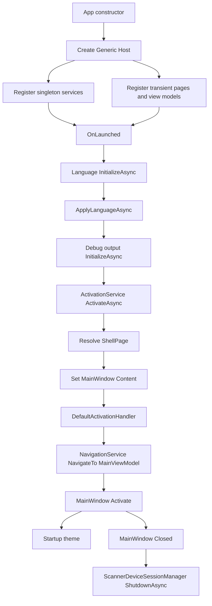

# 应用生命周期与依赖注入

## 范围与非职责 Scope and non-responsibilities

本文只覆盖 WinUI 宿主启动、Generic Host 依赖注入、激活、窗口关闭清理和 UI 线程派发。范围对应 C1 应用启动与基础设施。

本文不说明扫描业务页的内部工作流，不评估 USB 协议细节，也不把文档中的风险项写成已经修复的代码。

## 功能 Functionality

应用用 `App` 构造函数创建 .NET Generic Host，并把 WinUI 页面、ViewModel、基础服务和 Core 服务注册到同一个服务容器。启动后 `OnLaunched` 先调用语言服务的 `InitializeAsync`，再调用独立的 `ApplyLanguageAsync` 应用语言，然后初始化调试输出设置，最后调用 `IActivationService.ActivateAsync` 建立 Shell 并打开主窗口。

窗口关闭时，`MainWindow_Closed` 通过 `IScannerDeviceSessionManager.ShutdownAsync` 做扫描器会话清理。跨线程 UI 更新集中通过 `IUiDispatcher.TryEnqueue` 进入 `App.MainWindow.DispatcherQueue`。

## 关键入口 Key entry points

| 入口 | 源码证据 | 作用 |
| --- | --- | --- |
| `App.App` | `PRISM Utility/App.xaml.cs` | 构建 Host，注册服务，取得 `IScannerDeviceSessionManager`，订阅 `UnhandledException`。 |
| `App.GetService<T>` | `PRISM Utility/App.xaml.cs` | 从 Host 容器解析服务，未注册时抛出 `ArgumentException`。 |
| `App.OnLaunched` | `PRISM Utility/App.xaml.cs` | 依次初始化语言、应用语言、初始化调试输出设置，调用激活服务，绑定窗口关闭事件。 |
| `ActivationService.ActivateAsync` | `PRISM Utility/Services/ActivationService.cs` | 初始化主题，创建 Shell，运行激活 handler，激活窗口，应用主题。 |
| `DefaultActivationHandler.HandleInternalAsync` | `PRISM Utility/Activation/DefaultActivationHandler.cs` | 默认导航到 `MainViewModel`。 |
| `MainWindow.MainWindow` | `PRISM Utility/MainWindow.xaml.cs` | 创建窗口、图标、标题，并订阅系统主题颜色变化。 |
| `UiDispatcherService.TryEnqueue` | `PRISM Utility/Services/UiDispatcherService.cs` | 将回调派发到主窗口 DispatcherQueue。 |

## 实现机制 Implementation mechanism

`App` 使用 `Host.CreateDefaultBuilder().UseContentRoot(AppContext.BaseDirectory).ConfigureServices(...).Build()` 建立 Host。注册有三类 lifetime。

| Lifetime | 代表注册 | 设计含义 |
| --- | --- | --- |
| Singleton | `IActivationService`、`IPageService`、`INavigationService`、`IUiDispatcher`、设置服务、USB 协调器、扫描器访问协调器 | 保留跨窗口或跨页面的应用级状态。 |
| Transient | `ShellPage`、`ShellViewModel`、各 Page、各 ViewModel、`IScanWorkflowService` 等工作流服务 | 每次解析得到新实例，降低页面间状态共享。 |
| Options | `LocalSettingsOptions` | 从配置段绑定本地设置选项。 |

激活链由 `ActivationService` 管理。它先调用 `InitializeAsync` 初始化主题服务，再在 `App.MainWindow.Content == null` 时解析 `ShellPage`。Shell 放入主窗口后，`HandleActivationAsync` 先查找可处理参数的 `IActivationHandler`，再调用默认 handler。默认 handler 只有在导航 Frame 还没有内容时才导航到首页。

关闭链由 `MainWindow_Closed` 管理。`Interlocked.Exchange` 保证 `ShutdownAsync` 只进入一次，但事件处理器是 `async void`，异常不会自然回传给调用方。

UI 派发链由 `UiDispatcherService` 提供。它优先使用 `App.MainWindow.DispatcherQueue`，缺失时回退到当前线程的 `DispatcherQueue.GetForCurrentThread()`。

## 主要控制/数据流 Control and data flow

1. `App.App` 构造 Host，注册服务，初始化 XAML。
2. WinUI 调用 `App.OnLaunched`。
3. `OnLaunched` 调用 `ILanguageSelectorService.InitializeAsync()` 读取语言设置。
4. `OnLaunched` 调用 `ILanguageSelectorService.ApplyLanguageAsync()` 应用语言。
5. `OnLaunched` 调用 `IDebugOutputSettingsService.InitializeAsync()` 初始化调试输出设置。
6. `IActivationService.ActivateAsync` 初始化主题，解析 `ShellPage`，设置 `MainWindow.Content`。
7. `ActivationService.HandleActivationAsync` 运行自定义 handlers，再运行 `DefaultActivationHandler`。
8. `DefaultActivationHandler` 调用 `INavigationService.NavigateTo(typeof(MainViewModel).FullName!, args.Arguments)`。
9. `App.MainWindow.Activate()` 显示窗口。
10. `StartupAsync` 应用主题。
11. 窗口关闭后，`MainWindow_Closed` 调用扫描器会话管理器关闭硬件会话。

## 依赖关系 Dependencies

| 上游 | 下游 | 证据 |
| --- | --- | --- |
| `App` | `Microsoft.Extensions.Hosting.IHost` | `PRISM Utility/App.xaml.cs` |
| `App` | `IActivationService`、`ILanguageSelectorService`、`IDebugOutputSettingsService` | `PRISM Utility/App.xaml.cs` |
| `ActivationService` | `ShellPage`、`IThemeSelectorService`、`ActivationHandler<LaunchActivatedEventArgs>` | `PRISM Utility/Services/ActivationService.cs` |
| `DefaultActivationHandler` | `INavigationService`、`MainViewModel` | `PRISM Utility/Activation/DefaultActivationHandler.cs` |
| `UiDispatcherService` | `App.MainWindow.DispatcherQueue` | `PRISM Utility/Services/UiDispatcherService.cs` |
| `MainWindow` | `TitleBarHelper`、`UISettings.ColorValuesChanged` | `PRISM Utility/MainWindow.xaml.cs` |

## Mermaid

## 状态与并发 State and concurrency

`App.MainWindow` 是静态懒加载窗口。`App.AppTitlebar` 也是静态 UI 状态，由 Shell 激活事件写入。`App.Host` 是应用级容器，Singleton 服务共享状态，Transient 页面和 ViewModel 不应依赖跨解析保留的实例字段。

关闭清理使用 `_scannerShutdownCleanupStarted` 与 `Interlocked.Exchange` 防止重复进入。UI 派发使用 DispatcherQueue，但 `UiDispatcherService.TryEnqueue` 只返回是否成功入队，不等待 UI 回调执行。`MainWindow.Settings_ColorValuesChanged` 明确说明系统主题变化来自非 UI 线程，并用 `dispatcherQueue.TryEnqueue` 更新标题栏按钮颜色。

## 错误处理 Error handling

`App.GetService<T>` 对未注册服务抛出 `ArgumentException`，能快速暴露 DI 漏注册。`ActivationService` 没有捕获主题初始化、Shell 解析、handler 导航或窗口激活异常。`App_UnhandledException` 已调用 `UnhandledExceptionReporter.Report`，把异常送入 Debug mirror，并在 mirror 失败时退到 `Debug.WriteLine` 和 `Trace.WriteLine`；处理器不设置 `Handled`，因此不伪装为已恢复。关闭清理失败只写 `Debug.WriteLine`，没有用户可见反馈，也没有重试策略。

## 测试覆盖 Test coverage

当前测试清单包含 APP-001 的 reporter 和 source-contract 覆盖，证明全局处理器调用 reporter、reporter 不向外抛出、mirror-first fallback 生效、nested exception 文本保留，并且 `App_UnhandledException` 没有 `Handled` 赋值。`App.OnLaunched`、`ActivationService.ActivateAsync`、`DefaultActivationHandler`、`MainWindow_Closed` 和 `UiDispatcherService.TryEnqueue` 仍主要依赖源码审查、文档验证器和应用启动 smoke。live WinUI controlled unhandled-event smoke 当前记录为 `ENVIRONMENT_BLOCKED`，不能写成通过。

## 已知问题与解决方案 Known issues and solutions

| ID | 问题 | 证据 | 影响 | 短期方案 | 长期方案 |
| --- | --- | --- | --- | --- | --- |
| C1-LIFE-001 | 顶层异常报告已接入。 | `PRISM Utility/App.xaml.cs` 的 `App_UnhandledException` 调用 `UnhandledExceptionReporter.Report`，并且不设置 `Handled`。 | 未处理异常现在会尝试进入 Debug mirror、Debug 和 Trace；live WinUI event smoke 仍受环境阻塞。 | 保留 APP-001 evidence 中的 `ENVIRONMENT_BLOCKED` 状态，不把 live event smoke 写成 pass。 | 如需用户可见 fatal error 和 handled 策略，另行设计并补 WinUI smoke。 |
| C1-LIFE-002 | 关闭清理是 `async void`，失败只写 Debug。 | `PRISM Utility/App.xaml.cs` 的 `MainWindow_Closed` 调用 `ShutdownAsync` 后只 `Debug.WriteLine`。 | 硬件会话释放失败时用户可能看不到结果，测试也难断言。 | 在关闭路径记录结构化错误，并保留一次性保护。 | 把硬件清理抽成可测试的关闭协调器，让窗口事件只触发协调器。 |
| C1-DI-001 | DI 注册集中在一个方法，缺少容器验证。 | `PRISM Utility/App.xaml.cs` 的 `ConfigureServices` 同时注册 UI、Core、USB、扫描和 DNG 服务。 | 新增页面或服务时容易漏注册，问题到运行时才暴露。 | 增加轻量容器解析冒烟测试或启动自检清单。 | 按 C1 到 C6 分组注册扩展方法，并为关键入口建立契约测试。 |
| C1-UI-001 | UI 派发失败没有被调用方强制处理。 | `PRISM Utility/Services/UiDispatcherService.cs` 返回 `TryEnqueue` 的布尔值。 | 后台事件更新 UI 时，入队失败可能静默丢失状态。 | 调用方对 `false` 写入诊断日志。 | 统一 UI 调度抽象，提供可测试的失败路径和取消语义。 |

Registry links: C1-LIFE-001 -> [APP-001](issues-and-remediation.md#app-001); C1-LIFE-002 -> [APP-002](issues-and-remediation.md#app-002); C1-DI-001 -> [APP-003](issues-and-remediation.md#app-003); C1-UI-001 -> [APP-004](issues-and-remediation.md#app-004).

## 相关源码 Related source

| 路径 | 关键符号 |
| --- | --- |
| `PRISM Utility/App.xaml.cs` | `App`、`GetService<T>`、`OnLaunched`、`MainWindow_Closed`、`App_UnhandledException` |
| `PRISM Utility/Services/ActivationService.cs` | `ActivationService`、`ActivateAsync`、`HandleActivationAsync` |
| `PRISM Utility/Activation/ActivationHandler.cs` | `ActivationHandler<T>`、`CanHandle`、`HandleAsync` |
| `PRISM Utility/Activation/DefaultActivationHandler.cs` | `DefaultActivationHandler`、`HandleInternalAsync` |
| `PRISM Utility/Services/UiDispatcherService.cs` | `UiDispatcherService.TryEnqueue` |
| `PRISM Utility/MainWindow.xaml.cs` | `MainWindow`、`Settings_ColorValuesChanged` |
| `PRISM Utility/Views/ShellPage.xaml.cs` | `ShellPage` 构造函数和窗口标题栏绑定 |
