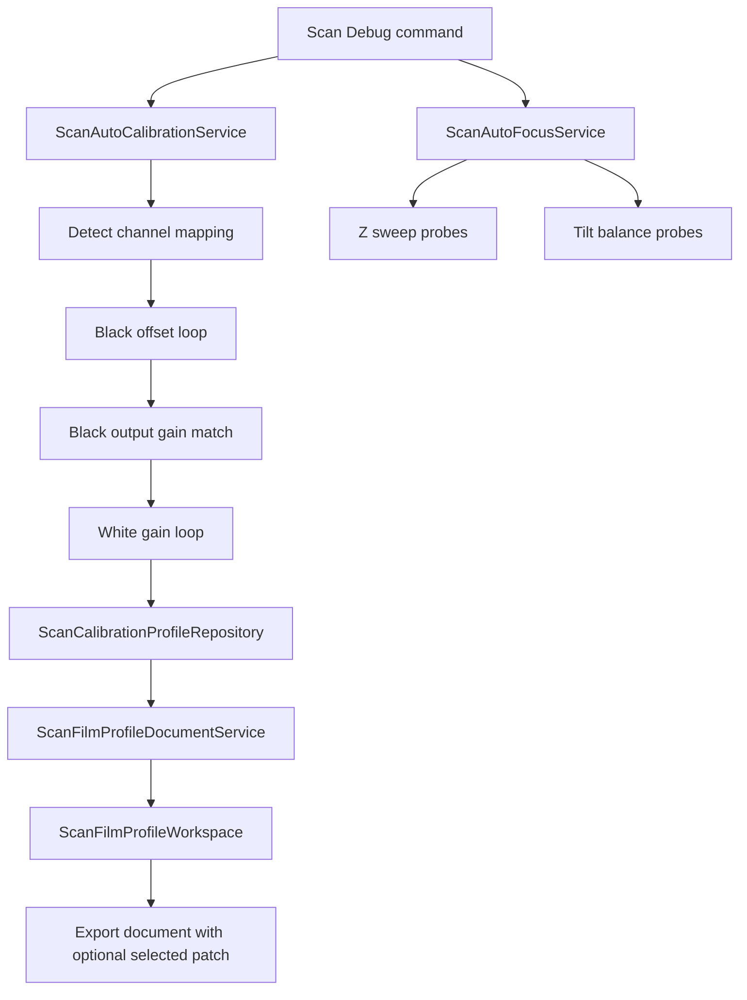

# 校准, 自动对焦, 胶片配置文件

## Scope and non-responsibilities

本文覆盖扫描调试页背后的黑场校准、白场校准、自动对焦、通道校准配置仓库、胶片配置文档服务和胶片配置工作区。它解释运行环路、通道映射、统计量、增益和偏移量如何相互配合，也说明配置文件如何被暂存、应用、导出和标记为干净状态。

本文不覆盖 USB 控制协议的帧格式、WinUI 布局细节、DNG 原生写入实现，也不声称这些流程已经有硬件端闭环测试覆盖。

## Functionality

自动校准入口是 `Host Software/PRISM Utility.Core/Services/ScanAutoCalibrationService.cs`。`AutoCalibrateAsync` 先执行黑场，再执行白场。黑场流程会把 ADC 偏移量和增益归零，提示用户遮盖传感器，探测偶数列和奇数列到 ADC1 和 ADC2 的映射，然后在最多 32 次粗调内采样暗帧。每一轮使用 `ScanCalibrationStatistics` 记录列均值、遮光区均值、偶数列均值、奇数列均值、有效均值、最小列均值、最大列均值、饱和比例和暗像素比例。

黑场偏移量的目标不是只看一个平均值。服务同时使用映射后的 ADC 均值和遮光均值，并用 `ChannelOffsetState` 保存前一次和更早一次的偏移、均值、误差和步长。这样能发现重复振荡，并回退到 `CalibrationAttempt` 历史中分数最低的快照。黑场达标后，`MatchBlackOutputSignalGainsAsync` 会继续匹配两个 ADC 的输出信号增益，避免只校准偏移而留下通道间暗场响应差。

白场流程继续使用通道映射和采样统计。它以白场目标值为中心调节 ADC 增益，`ChannelGainState` 和黑场偏移状态一样保存历史误差，用于减少来回振荡。最终保存的 `ScanChannelCalibrationProfile` 包含 `ScanParameterSnapshot`、归一化 ROI，以及可选的黑位和白位。这些黑位和白位后续会参与预览白位缩放和 DNG 黑位平面输出。

自动对焦入口是 `Host Software/PRISM Utility.Core/Services/ScanAutoFocusService.cs`。`AutoFocusAsync` 同时启用 1 号和 3 号焦点电机，先采集基线探针，再执行 Z 轴优化、倾斜平衡、第二次 Z 轴优化。Z 轴优化使用单向扫描，先移动到预加载位置，再按粗步长和细步长扫过窗口。每个探针都用 ROI 内的平均线剖面计算 Brenner 能量，输出 overall、left、right 和 tilt imbalance。倾斜平衡通过两个电机反向运动改变左右侧焦平面，选择绝对不平衡更小的方向继续。

胶片配置文件部分由 `Host Software/PRISM Utility.Core/Services/ScanCalibrationProfileRepository.cs`、`Host Software/PRISM Utility.Core/Services/ScanFilmProfileDocumentService.cs` 和 `Host Software/PRISM Utility.Core/Services/ScanFilmProfileWorkspace.cs` 组成。仓库初始化时会优先读取 schema 1 current document, 缺失时迁移旧的 `ScanParameterSnapshot` 字典和 selected channel；future、malformed 或 payload 无效 document 不回退到 legacy。文档服务拥有唯一的导入导出 schema 版本 5，解析 JSON 时先检查 `SchemaVersion`、`ProfileName`、`SavedAtUtc` 和 `ChannelProfiles`，再交给归一化逻辑。工作区维护当前草稿、基线草稿、脏标记和暂存导入，只有 `ApplyStagedImportAsync` 成功替换仓库后才把暂存内容变成干净基线。

## Key entry points

1. `Host Software/PRISM Utility.Core/Contracts/Services/IScanAutoCalibrationService.cs` 定义黑场、白场和完整自动校准入口。
2. `Host Software/PRISM Utility.Core/Services/ScanAutoCalibrationService.cs` 实现校准环路、通道映射、统计采集、偏移量和增益决策。
3. `Host Software/PRISM Utility.Core/Services/ScanAutoFocusService.cs` 实现焦点探针、Z 轴扫描、倾斜平衡和异常时停止焦点电机。
4. `Host Software/PRISM Utility.Core/Services/ScanCalibrationProfileRepository.cs` 负责本地通道配置的初始化、迁移、保存、清除、替换和选中通道持久化。
5. `Host Software/PRISM Utility.Core/Services/ScanFilmProfileDocumentService.cs` 负责 schema 5 JSON 的解析、构建、验证和序列化。
6. `Host Software/PRISM Utility.Core/Services/ScanFilmProfileWorkspace.cs` 负责导入暂存、应用、导出补丁、导出后标记和草稿脏状态。

## Implementation mechanism

校准服务先构建可回退的工作快照，再把每次采样和每次参数写入串起来。黑场粗调时会在开启 warm up 后等待稳定，再调用扫描会话采样固定行数。统计结果经过 `ScanChannelMapping` 映射到 ADC1 和 ADC2，避免把偶数列和奇数列硬编码到某个 ADC。分数历史让服务在达到迭代上限、检测到振荡或下一步无法改善时，仍能回到实测最好的参数。

自动对焦服务把动作和观测分开。`MoveTiltAsync` 让两个焦点电机反向走相同步数，`MoveZAsync` 让两个电机同向走相同步数，`WaitForFocusMotorMotionCompleteEventsAsync` 优先等运动完成事件，遇到 `IOException` 时改为轮询 `GetMotionStateAsync`。每次采样失败都会抛出 `IOException`，外层 `catch` 会尝试停止两个焦点电机再继续抛出异常。

胶片配置工作区通过不可变快照发布状态。初始化使用 `SemaphoreSlim` 串行化，并只在工作区仍是默认干净状态时才用仓库内容水合。`UpdateIfUnchanged` 使用 `Interlocked.CompareExchange`，可以避免初始化读取期间覆盖用户已经捕获或暂存的草稿。导出时 `BuildExportDocument` 可以把当前选中通道的最新校准补丁临时写入导出文档，但不会在文件真正写成功前改变工作区状态。仓库自身也按 SET-003 使用 schema 1 current document 保存 profile 字典和 selected channel, document save 成功后才通过一个 `Volatile` snapshot 发布完整 generation。

## Control and data flow

PageMapping: ScanDebug page command -> ScanDebugViewModel -> ScanAutoCalibrationService and ScanAutoFocusService -> repository and workspace services.

ServiceCoverage: ScanFilmProfileWorkspace

## Dependencies

1. 校准和自动对焦都依赖 `IScanSessionService` 执行扫描、运动、warm up 和停止动作。
2. 校准和自动对焦都依赖 `IScanImageDecoder` 从行缓冲区提取 16 位样本。
3. 校准依赖 `IScanParameterService` 把快照写回设备参数。
4. 配置仓库依赖 `IScanCalibrationProfileStorage` 读写当前和旧版本地配置。
5. 文档服务依赖 Newtonsoft JSON 解析和序列化 schema 5 文档。
6. 工作区依赖仓库和文档服务，使用 `TimeProvider` 在导出时写入新的 `SavedAtUtc`。

## State and concurrency

`ScanCalibrationProfileRepository` 有两个门。`_initializeGate` 保证初始化只执行一次，`_writeGate` 保证保存、清除、替换和选中通道写入不会交错。快照通过复制字典返回，调用者拿到的是一致视图，不会直接修改仓库内部字典。current document 存在时优先于 retained legacy keys；legacy migration 只在 current document 缺失时运行。future、malformed 或 payload 无效 document 会让 repository 保持空 state, 不从 legacy keys 生成 stale fallback。

`ScanFilmProfileWorkspace` 用 `Volatile.Read` 发布当前快照，用 `Interlocked.Exchange` 更新普通状态，用 `Interlocked.CompareExchange` 保护初始化水合。脏状态不是单独计数器，而是由当前草稿和基线草稿的内容比较得出。暂存导入失败、取消应用或仓库替换失败时，工作区保留暂存内容，让用户可以修复原因后重试。

校准服务本身按一个会话串行执行。它会记录最佳快照和最近误差，但这些状态只在一次校准调用内部存在。自动对焦也按一次调用维护当前探针，不把运动状态存进共享单例。

## Error handling

校准取消通过 `OperationCanceledException` 传播，用户取消黑场提示会直接中止。采样失败、无法继续改善偏移量、黑场或白场无法收敛都会抛出 `IOException`。黑场 finally 会尽量关闭 warm up，即使关闭失败也不掩盖原始失败。

自动对焦中，扫描失败会抛出带标签的 `IOException`，ROI 太窄或解码宽度无效也会抛出 `IOException`。任何异常都会触发 `TryStopFocusMotorsAsync`，它分别停止 1 号和 3 号焦点电机，并吞掉停止过程中的错误，避免覆盖根因。

配置文件解析返回结构化验证结果，不把所有错误都转成异常。空 JSON、格式错误、未来 schema、缺少必需字段和无效时间戳会返回不可应用结果。仓库写入失败时，测试证明已发布状态不会被失败写入污染；current document 读取失败或 schema 不匹配时也不会回读 legacy 产生 stale fallback。工作区应用暂存时把取消映射为 `Canceled`，把其他异常映射为 `Failed`，并保留暂存导入。

## Test coverage

当前测试项目是 `Host Software/PrismUtility.Core.Tests/PrismUtility.Core.Tests.csproj`，目标框架是 `net8.0-windows10.0.19041.0`，使用 xUnit、Microsoft.NET.Test.Sdk 和 coverlet。与本页最相关的覆盖如下。

| 区域 | 代表性测试文件 | 覆盖点 |
| --- | --- | --- |
| 胶片配置仓库 | `Host Software/PrismUtility.Core.Tests/ScanCalibrationProfileRepositoryTests.cs` | 初始化归一化、旧配置迁移、快照不可变、保存失败不污染状态、取消不写入。 |
| SET-003 校准仓库 | `Host Software/PrismUtility.Core.Tests/Set003CalibrationProfileRepositoryTests.cs` | schema 1 current document、legacy-only migration、future/malformed 无 stale fallback、save-before-publish 和完整 generation snapshot。 |
| 胶片配置字符化 | `Host Software/PrismUtility.Core.Tests/ScanCalibrationProfileRepositoryCharacterizationTests.cs` | 角色名 trim 和大小写、黑位小于白位、旧格式迁移后的 ROI 默认值。 |
| 文档服务 | `Host Software/PrismUtility.Core.Tests/ScanFilmProfileDocumentServiceTests.cs` | schema 5、无效通道、混合有效和无效通道、确定性序列化、稳定验证顺序。 |
| 工作区 | `Host Software/PrismUtility.Core.Tests/ScanFilmProfileWorkspaceTests.cs` | 暂存和丢弃零写入、应用成功和失败、初始化并发、读取期间突变保护、导出补丁和时间戳。 |
| ScanDebug 胶片档案 workspace | `Host Software/PrismUtility.Core.Tests/FilmProfileSourceContractTests.cs`, `Host Software/PrismUtility.Core.Tests/FilmProfileLocalizationAccessibilityContractTests.cs`, `Host Software/PrismUtility.Core.Tests/ScanDebugFilmProfileOrchestrationSourceTests.cs` | ScanDebug 的 JSON New/Open/Validate/Save、staged review Apply/Discard、current/staged validation、dirty-state 投影和本地化/accessibility source contracts。 |
| CAL-001 managed 校准和自动对焦 | `Host Software/PrismUtility.Core.Tests/Cal001AutoCalibrationAndFocusTests.cs` | 15 个 deterministic fake tests 覆盖 dark convergence、white convergence、black/white oscillation best restore、invalid decoded width、ROI clamp、scan failure、motion timeout、cancellation、warm-up cleanup、focus motor IDs 0/2 stop on success/failure/cancel/timeout，以及未归一化 Brenner sharpness。 |

CAL-001 的 managed 测试缺口已关闭。当前证据是 `Cal001AutoCalibrationAndFocusTests.cs` 的 15 个 deterministic fake tests、full managed suite 555/555、Core build 和 app build 通过。P2 的 `EXTRACTION_BLOCKED`、`SPLIT_BLOCKED` 结果不影响这些 Core service tests, 因为它们直接验证 `ScanAutoCalibrationService`、`ScanAutoFocusService` 和 fake `IScanSessionService`/`IScanImageDecoder` 边界。

剩余缺口只在环境面。真实 scanner、真实照明、真实焦点运动、物理 warm-up 和硬件 smoke 仍为 `ENVIRONMENT_BLOCKED`，不能写成通过。CAL-002 仍保持独立：自动对焦 sharpness 当前按未归一化 Brenner 能量记录，managed tests 只是锁定这个当前行为，不关闭或改变 CAL-002。

VM-002 的 task 21 结果与胶片档案相关，但只作为回归保护使用。它确认 `ScanDebugViewModel` 仍拥有 film profile workspace subscription、external snapshot projection、`NewFilmProfile`、`ValidateFilmProfile`、`SaveFilmProfileJson`、`LoadFilmProfileJson`、`ApplyStagedFilmProfileImport`、`DiscardStagedFilmProfileImport`、`SynchronizeFilmProfileDraftFromInputs`、`RefreshFilmProfileWorkspaceProjection`、`ApplyDraftToFields`、current/staged validation issue projection 和 dirty-state projection。FilmProfile regression 204/204 通过，说明 characterization 没有破坏现有 profile workspace contract；这不是 production split，也不关闭 VM-002。CAL-001 managed tests 已可在不假定 ScanDebugViewModel 拆分的情况下关闭 managed gap；DNG-001 仍可继续补 DNG 托管和原生错误路径测试。

## Known issues and solutions

Issue-ID: CAL-AF-PROFILE-001

CAL-001 managed branch 已关闭：可控 `IScanSessionService` 和 `IScanImageDecoder` fake 覆盖黑场和白场收敛、黑白振荡最佳采样回退、ROI/宽度边界、扫描失败、取消、焦点 motion timeout、warm-up cleanup、0/2 号焦点电机 stop all paths, 以及未归一化 Brenner 指标锁定。物理 hardware smoke 仍为 `ENVIRONMENT_BLOCKED`。

Issue-ID: CAL-AF-PROFILE-002

自动对焦当前 sharpness 返回未归一化 Brenner 能量，代码中保留了归一化版本的注释。文档按当前行为记录，不把它描述成归一化指标。解决方向是先用测试锁定目标指标，再决定是否恢复方差归一化。

Issue-ID: CAL-AF-PROFILE-003

工作区导出补丁只在有选中通道时写入导出文档。没有选中通道时不会把临时补丁落到任何角色。调用者需要先确保 `SelectedCalibrationChannel` 代表用户当前正在调校的通道。

Registry links: CAL-AF-PROFILE-001 -> [CAL-001](issues-and-remediation.md#cal-001); CAL-AF-PROFILE-002 -> [CAL-002](issues-and-remediation.md#cal-002); CAL-AF-PROFILE-003 -> [CAL-003](issues-and-remediation.md#cal-003).

## Related source

`Host Software/PRISM Utility.Core/Services/ScanAutoCalibrationService.cs`

`Host Software/PRISM Utility.Core/Services/ScanAutoFocusService.cs`

`Host Software/PRISM Utility.Core/Models/ScanDebugModels.cs`

`Host Software/PRISM Utility.Core/Services/ScanCalibrationProfileRepository.cs`

`Host Software/PRISM Utility.Core/Services/ScanFilmProfileDocumentService.cs`

`Host Software/PRISM Utility.Core/Services/ScanFilmProfileWorkspace.cs`

`Host Software/PRISM Utility.Core/Models/ScanFilmProfileWorkspaceModels.cs`

`Host Software/PrismUtility.Core.Tests/ScanCalibrationProfileRepositoryTests.cs`

`Host Software/PrismUtility.Core.Tests/ScanFilmProfileDocumentServiceTests.cs`

`Host Software/PrismUtility.Core.Tests/ScanFilmProfileWorkspaceTests.cs`
