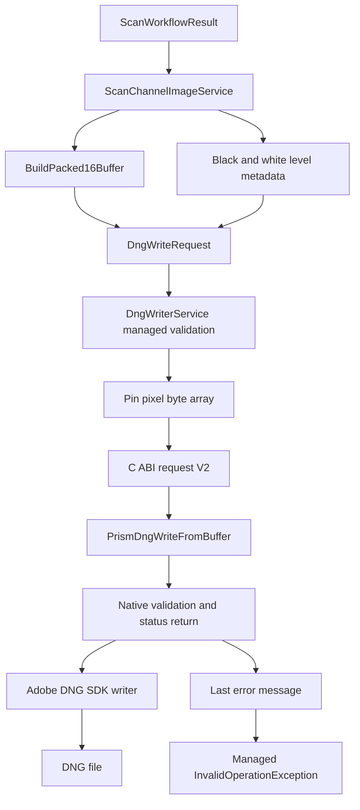

# DNG 导出和原生桥接

## Scope and non-responsibilities

本文覆盖扫描结果导出 PNG 和 DNG 的托管路径、DNG 写入请求模型、托管和原生双重验证、数组固定、C ABI、原生写入器、Adobe DNG SDK 依赖、Visual C++ v143 项目配置和 JPEG XL stub 限制。

本文不提供 Adobe DNG SDK 下载步骤，不修改包或项目依赖，不声称原生构建在所有开发机上都可用，也不覆盖 DNG 文件的后处理质量评估。

## Functionality

导出入口位于 `Host Software/PRISM Utility/Services/ScanChannelImageService.cs`。服务先把扫描通道归一化并按通道角色选取数据。PNG 路径构建 BGRA 预览帧并保存普通图像文件。DNG 路径根据 `ScanDngExportMode` 分为两种。`LinearRaw4` 把四个归一化通道交错打包为 16 位 little endian 多通道 raw DNG，输出一个 `_linearraw4.dng`。`LinearRgbIrw` 把 Red、Green、Blue 三个通道输出为 `_rgb.dng`，再把 IR 或其他辅助通道输出为单通道 `_irw.dng`。

DNG 请求模型在 `Host Software/PRISM Utility.Core/Models/DngWriteModels.cs`。`DngWriteRequest` 带有输出路径、像素数据、宽高、行跨度、位深、每像素样本数、像素布局、CFA、通道颜色、相机元数据、曝光时间、黑位、白位、捕获时间、active area、default crop、masked areas、每通道黑位平面和颜色矩阵。当前像素布局支持 raw mosaic、linear RGB、monochrome raw 和 four channel linear raw。

黑位和白位来自两条路径。导出前，`BuildBlackLevelPlanes` 会优先读取通道配置中的黑位；没有配置时，会从 masked areas 的偶数列和奇数列估算平面。`ResolveWhiteLevel` 会从参与导出的角色中取已配置白位，否则使用 65535。预览路径还可以对通道应用白位缩放。

## Key entry points

1. `Host Software/PRISM Utility/Services/ScanChannelImageService.cs` 构建 PNG 和 DNG 输出，包含四通道打包、RGB 和 IRW 分拆、masked area 黑位估算和白位处理。
2. `Host Software/PRISM Utility.Core/Models/DngWriteModels.cs` 定义托管 DNG 请求、像素布局、通道颜色、矩形、有理数、黑位平面和颜色元数据。
3. `Host Software/PRISM Utility.Core/Services/DngWriterService.cs` 验证托管请求、固定 `byte[]`、构建 ABI V2 结构体、调用原生 DLL，并把原生状态码和错误消息转为托管异常。
4. `Host Software/DngSdkWarpper/PrismDngApi.h` 定义 C ABI、状态码、ABI 版本、图像缓冲区、元数据、请求结构和导出函数。
5. `Host Software/DngSdkWarpper/PrismDngBridge.cpp` 暴露 `PrismDngWriteFromBuffer` 和 `PrismDngGetLastErrorMessage`。
6. `Host Software/DngSdkWarpper/PrismDngWriter.cpp` 使用 Adobe DNG SDK 创建 `dng_negative`、复制像素、设置元数据并写出 DNG。
7. `Host Software/DngSdkWarpper/PrismDngJxlStubs.cpp` 明确让 JPEG XL 解码和编码不可用。
8. `Host Software/DngSdkWarpper/DngSdkWarpper.vcxproj` 定义 v143 动态库项目、Win32、x64、ARM64 平台，以及 Adobe DNG SDK include 和源文件路径。

## Implementation mechanism

托管层先做边界验证。`DngWriterService.WriteRawDng` 拒绝空路径、空像素、零宽高、零行跨度、非 8 或 16 位数据、不支持的布局、raw mosaic 缺失 CFA、样本数和布局不匹配、四通道 raw 缺少四个 `ChannelColors`、masked areas 超过 4 个、黑位平面超过 4 个、黑位平面数与样本数不匹配、行跨度小于打包宽度、像素缓冲区不足，以及超过当前 ABI 可表达大小的像素缓冲区。

通过托管验证后，服务使用 `GCHandle.Alloc(request.PixelData, GCHandleType.Pinned)` 固定像素数组，在 finally 中释放。`BuildNativeRequest` 写入 `StructSize`、`AbiVersion = 2`、UTF 16 路径和字符串、图像参数、矩形、最多 4 个 masked areas、最多 4 个黑位平面、颜色矩阵、通道颜色和保留字段。P Invoke 使用 `CallingConvention.Cdecl` 调用 `DngSdkWarpper.dll`。

原生层再做一次验证。这不是重复浪费，而是托管和原生边界的双保险。托管验证保护调用者，并在进入 DLL 前给出 .NET 异常。原生验证保护 C ABI，因为 DLL 也可能被非 .NET 调用者调用，或收到不匹配的结构体。`PrismDngWriter::WriteFromBuffer` 检查 structSize、ABI 版本、输出路径、数据指针、图像尺寸、位深、缓冲区大小、像素布局、样本数、CFA、active area、default crop、masked areas 和黑位平面数量。失败时它不会抛出给 ABI 调用方，而是调用 `PrismDngSetLastErrorMessage` 并返回 `PRISM_DNG_STATUS_INVALID_ARGUMENT`、`PRISM_DNG_STATUS_UNSUPPORTED_FORMAT` 或 `PRISM_DNG_STATUS_INTERNAL_ERROR` 等状态码。task 23 只关闭托管验证和状态映射子范围；原生 C++ 仍有未验证的既有 parity 风险，因为它没有独立强制 packed row-stride minimum 或 blackLevelPlaneCount equality。这个风险未整改，因为本轮是 managed-only，且 task 23 没有运行原生构建或 native smoke。

托管层收到非 0 状态码时调用 `PrismDngGetLastErrorMessage` 取回原生消息，并抛出 `InvalidOperationException`。DLL 缺失会被包装成说明 `DngSdkWarpper.dll` 不在应用输出旁边的 `InvalidOperationException`。架构不匹配会被包装成说明原生库和当前进程架构不匹配的 `InvalidOperationException`。task 23 托管测试覆盖了 `DllNotFoundException`、`BadImageFormatException`、`EntryPointNotFoundException` missing export、native ABI error message 独立映射，以及原生状态 1 到 5 和 unknown status 的映射。

原生写入器依赖 Adobe DNG SDK。项目包含 `dng_camera_profile.h`、`dng_file_stream.h`、`dng_host.h`、`dng_image_writer.h`、`dng_negative.h` 等头文件，并在 `.vcxproj` 中把 `Adobe_DNG_SDK\dng_sdk\source`、`Adobe_DNG_SDK\libjxl` 和 `Adobe_DNG_SDK\xmp\toolkit\third-party\zlib` 加到 include 或源文件路径。工程使用 Visual Studio C++ toolset v143，配置为动态库，平台映射包含 Win32、x64 和 ARM64。因为 Adobe DNG SDK 文件不是本文下载或安装的对象，所以不能把原生构建描述成普通 `dotnet build` 必然可用。

JPEG XL 只满足链接需求。`PrismDngJxlStubs.cpp` 中 `SupportsJXL` 返回 false，`ParseJXL` 返回 false，编码和解码入口会抛出 “JPEG XL support is not compiled into this Project PRISM DNG bridge build.” 当前写入器也主动调用 `host.SetLossyMosaicJXL(false)` 和 `host.SetLosslessJXL(false)`。因此本文只记录无 JXL DNG 写入路径，不声称支持 JXL 压缩或读取。

## Control and data flow

PageMapping: Scan Debug export command -> ScanDebugViewModel -> ScanChannelImageService -> DngWriterService -> DngSdkWarpper C ABI.

ServiceCoverage: ScanFilmProfileWorkspace

## Dependencies

1. `Host Software/PRISM Utility/Services/ScanChannelImageService.cs` depends on WinRT storage APIs for file creation and on `IDngWriterService` for DNG output.
2. `Host Software/PRISM Utility.Core/Services/DngWriterService.cs` depends on `DngSdkWarpper.dll` being present beside the application output and matching process architecture.
3. `Host Software/DngSdkWarpper/DngSdkWarpper.vcxproj` depends on Visual Studio C++ v143 and Windows target platform 10.0.
4. The native project references Adobe DNG SDK source and zlib paths under `Adobe_DNG_SDK`; those files are required for native build but are not stored in this repository.
5. Solution mapping in `Host Software/PRISM Utility.sln` includes `DngSdkWarpper` for x86 to Win32, x64 to x64, and arm64 to ARM64.

## State and concurrency

DNG export creates files asynchronously, then runs CPU and native work inside `Task.Run`. The pixel buffer is a managed `byte[]` whose address is fixed only during the native call. The pinned handle is always released in finally. No native pointer is cached after `PrismDngWriteFromBuffer` returns.

The C ABI keeps the last error message in `thread_local` native storage exposed through `PrismDngGetLastErrorMessage`. The managed layer reads that message immediately after a failed status. This keeps separate native caller threads from overwriting each other's last-error text, while still requiring each thread to read the message before issuing another bridge call on the same thread.

## Error handling

Managed validation throws .NET exceptions before pinning or native calls for impossible requests. Native validation returns status codes instead of throwing across the ABI. This error return contract is critical: C callers receive an integer status, while .NET callers receive an `InvalidOperationException` that includes both the status code and the native last error text when available.

Native write failures from Adobe DNG SDK are caught inside `PrismDngWriter::WriteFromBuffer`, converted to a wide last error string, and returned as `PRISM_DNG_STATUS_INTERNAL_ERROR`. The outer bridge also catches unexpected exceptions while preparing output and returns `PRISM_DNG_STATUS_INTERNAL_ERROR`. Missing DLL and architecture mismatch are handled in managed code as separate deployment errors.

## Test coverage

The current core test project enumerated by `Host Software/PrismUtility.Core.Tests/PrismUtility.Core.Tests.csproj` now contains managed tests for `DngWriterService`, `DngWriteRequest`, `IDngWriterService` status mapping through an injectable native seam, loader failure mapping, rectangle and stride validation, and x64 ABI header contracts. These tests do not build or execute `PrismDngBridge.cpp`, `PrismDngWriter.cpp`, or `PrismDngJxlStubs.cpp`.

| 区域 | 代表性测试文件 | 覆盖点 |
| --- | --- | --- |
| 扫描组合缓冲区 | `Host Software/PrismUtility.Core.Tests/ScanCompositeImageProcessorTests.cs` | RGB 组合、缺失通道补零、alpha 行可用性。 |
| 通道对齐 | `Host Software/PrismUtility.Core.Tests/ScanChannelAlignmentServiceTests.cs` | 对齐服务的参数和结果行为。 |
| 胶片配置导出模式 | `Host Software/PrismUtility.Core.Tests/ScanFilmProfileDocumentServiceTests.cs`, `Host Software/PrismUtility.Core.Tests/ScanFilmProfileSchemaV6Tests.cs` | `InvalidDngExportMode` 验证、schema 5→6 迁移和当前 schema 6 配置归一化。 |
| 工作区导出补丁 | `Host Software/PrismUtility.Core.Tests/ScanFilmProfileWorkspaceTests.cs` | 导出文档时间戳、选中通道补丁和导出后基线更新。 |
| DNG managed seam | `Host Software/PrismUtility.Core.Tests/DngWriterServiceValidationTests.cs`, `Host Software/PrismUtility.Core.Tests/DngWriterServiceNativeStatusTests.cs`, `Host Software/PrismUtility.Core.Tests/DngWriterServiceNativeAbiLayoutTests.cs` | 托管请求验证、native seam status mapping、loader failure mapping、ABI V2 x64 header contract。 |

task 23 证据记录 focused managed DNG tests 36/36、full managed suite 591/591、Core build 0 warnings/errors、changed-file diagnostics clean、Oracle `MANAGED_SUBSCOPE_APPROVED`。task 24 在 this task24 environment 证明 VS2022、v143、MSBuild 和 inspected Adobe_DNG_SDK/native wrapper dependency probe 为 `PASS`，layered runner 也记录 managed 591/591 `PASS`、Core `PASS` 0 errors、x64 app `PASS` 且只有既有 WindowsAppSDK PublishSingleFile warning、timeout 和 cleanup `PASS`、overall runner `PASS`/exit 0。原生 build 明确是 `SKIP`/not run，不是 PASS。新增 blackLevelPlanes length vs SamplesPerPixel seam-not-invoked test 是 existing behavior 的 green characterization, 不是 fabricated RED。托管 ABI layout tests 是 hardcoded x64 header-contract checks，不证明 native C++ `sizeof`，除非原生构建可用并单独验证。托管测试没有暴露 JXL request 或 runtime probe；JXL source inspection 只确认 `SupportsJXL=false` stubs，不是 runtime smoke。仍未覆盖的缺口是真实 native bridge smoke、JPEG XL stub runtime smoke、WinUI 文件选择和真实导出交互。native smoke/JXL runtime smoke 当前为 `ENVIRONMENT_BLOCKED`，不是 PASS。

## Known issues and solutions

Issue-ID: DNG-BRIDGE-001

原生构建依赖 Adobe DNG SDK 路径。仓库记录了 include 和源文件引用，但本文没有下载 SDK，也没有证明所有平台都能在当前机器构建。解决方向是在开发机准备 SDK 后，单独验证 Win32、x64 和 ARM64 的 v143 构建矩阵。

Issue-ID: DNG-BRIDGE-002

JPEG XL 是 stub，不是功能。`SupportsJXL` 返回 false，编码和解码入口会抛出不可用错误。解决方向是只有在引入并测试 libjxl 集成后，才更新文档和用户界面文案。

Issue-ID: DNG-BRIDGE-003

托管 DNG validation/status seam 已有单元测试覆盖，子范围为 `PASS`。整体 DNG-001 仍为 `ENVIRONMENT_BLOCKED`，不是因为 task24 证明过的 VS2022、v143、MSBuild 或 Adobe SDK dependency readiness 缺失，而是因为没有维护中的 runnable native smoke fixture/artifact 被执行，也没有维护中的 JXL stub runtime probe/artifact 被执行。解决方向是在有可加载 native artifact 和维护中的 runtime probe 后，单独运行原生 smoke 和 JXL stub smoke，并保留 native parity risk 检查。

Registry links: DNG-BRIDGE-001 -> [DNG-002](issues-and-remediation.md#dng-002); DNG-BRIDGE-002 -> [DNG-003](issues-and-remediation.md#dng-003); DNG-BRIDGE-003 -> [DNG-001](issues-and-remediation.md#dng-001).

## Related source

`Host Software/PRISM Utility/Services/ScanChannelImageService.cs`

`Host Software/PRISM Utility.Core/Contracts/Services/IDngWriterService.cs`

`Host Software/PRISM Utility.Core/Models/DngWriteModels.cs`

`Host Software/PRISM Utility.Core/Services/DngWriterService.cs`

`Host Software/DngSdkWarpper/PrismDngApi.h`

`Host Software/DngSdkWarpper/PrismDngBridge.cpp`

`Host Software/DngSdkWarpper/PrismDngWriter.cpp`

`Host Software/DngSdkWarpper/PrismDngJxlStubs.cpp`

`Host Software/DngSdkWarpper/DngSdkWarpper.vcxproj`

`Host Software/PRISM Utility.sln`

`Host Software/README.md`
