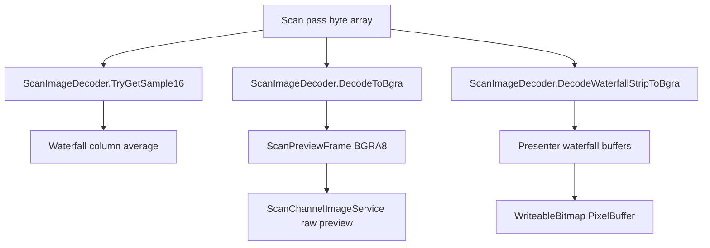

# 图像解码与预览

## Scope and non-responsibilities

本文只覆盖扫描缓冲区从原始 `byte[]` 到 16 位样本, 再到 BGRA 预览帧和瀑布预览的路径。范围包括解码器, 预览呈现器, 以及通道图像服务对单通道预览的调用边界。

不覆盖 RGB 合成色彩管理, DNG 导出, 采集控制协议, 或 OpenCV 通道配准。配准与合成在 `alignment-color-processing.md` 中单独说明。

## Functionality

解码器 `ScanImageDecoder` 是原始行缓冲解释的唯一核心实现。它读取 `ScanDebugConstants.BytesPerLine` 行宽, 跳过 `LineBufferMarginLeft` 和 `LineBufferMarginRight`, 按 `PackedGroupBytes` 读取两个像素, 产出 `PackedGroupPixels` 个 16 位样本。精确拆包由 `ReadPackedGroupSamples` 定义, `sample1 = byte0 << 8 | byte2`, `sample0 = byte1 << 8 | byte3`。

`DecodeToBgra` 把每个 16 位样本写成灰度 BGRA 像素, B, G, R 三个字节相同, alpha 固定为 255。`ConvertAdcSampleToGray` 可先按 `whiteLevel` 缩放到 `ushort.MaxValue`, 再按 `gamma` 做幂变换。未启用 gamma 时, 输出字节是 `normalizedSample / 256`。

`DecodeWaterfallStripToBgra` 把多行压缩成一条 BGRA strip。它先拒绝 `rows <= 0`，再为每个列像素累加所有行的 16 位样本, 用 `columnSums[x] / rows` 得到平均值, 最后调用 `WriteGrayPixel`。

`ScanPreviewPresenter` 负责把解码器产出的 BGRA 数据放入 `ScanPreviewFrame` 或 WinUI `WriteableBitmap`。普通帧按 `width * rows * 4` 排列。瀑布预览固定高度来自 `ScanDebugConstants.WaterfallPreviewHeight`, 新 strip 或新帧插入到顶部, 旧像素用 `Buffer.BlockCopy` 下移。

## Key entry points

| 角色 | 入口符号 | 作用 |
| --- | --- | --- |
| decoder | `ScanImageDecoder.GetDecodedPixelsPerLine` | 根据有效字节数和 packed group 计算每行解码像素数 |
| decoder | `ScanImageDecoder.TryGetSample16` | 按 `(x, y)` 从原始 `byte[]` 中读取一个 16 位样本 |
| decoder | `ScanImageDecoder.DecodeToBgra` | 把扫描缓冲区解码为整帧 BGRA |
| decoder | `ScanImageDecoder.DecodeWaterfallStripToBgra` | 把多行平均为一条瀑布 BGRA strip |
| presenter | `ScanPreviewPresenter.TryRender` | 在普通预览与瀑布预览之间分派 |
| presenter | `ScanPreviewPresenter.RenderFramePreviewFrame` | 生成可复用 `ScanPreviewFrame` |
| presenter | `ScanPreviewPresenter.RenderWaterfallPreviewFrame` | 维护瀑布像素缓存并返回帧 |
| channel image service | `ScanChannelImageService.TryBuildRawPreview` | 对齐归一化通道后调用预览呈现器 |

## Implementation mechanism

### raw byte[] 到 16 位 sample

`TryGetSample16` 先调用 `GetDecodedPixelsPerLine` 校验宽度, 再检查 `x`, `y`, `rows`, 以及 `lineBuffer.Length == rows * BytesPerLine`。定位公式由源码给出, `rowStart + LineBufferMarginLeft + ((x / PackedGroupPixels) * PackedGroupBytes)`。读取出的 even 和 odd 样本由最低位选择, `x & 1` 为 0 时取 even。

整帧解码 `DecodeToBgra(Span<byte>)` 使用相同行内布局。它要求目标长度等于 `width * rows * 4`, 先 `destination.Clear()`, 再逐行切片并写入 BGRA。

### 16 位 sample 到 BGRA

`WriteGrayPixel` 使用 `ConvertAdcSampleToGray` 得到灰度字节, 然后按 `B, G, R, A` 写入。该像素布局由 `ScanPreviewPixelFormat.Bgra8` 标记。

### 预览缓存与瀑布布局

`RenderFramePreviewFrame` 通过 `CanReuseFramePixels` 复用上一帧的 `byte[]`, 条件是格式, 宽高, stride 和总长度全部一致。WinUI 版本 `RenderFramePreview` 复用 `WriteableBitmap`, 但调用解码器的 stream overload, 该 overload 会先分配临时 `byte[] pixels`, 再写入 `PixelBuffer`。

瀑布预览有三个 presenter 级缓存: `_waterfallPixels`, `_waterfallFramePixels`, `_waterfallStripPixels`。`EnsureWaterfallBuffers` 在总长度变化时重建 `_waterfallPixels`, 并把 alpha 字节初始化为 255。压缩瀑布路径每次重用 `_waterfallStripPixels` 解码一条 strip, 再把 `_waterfallPixels` 下移一行。非压缩路径按 `insertRows = Math.Min(rows, previewHeight)` 解码多行到 `_waterfallFramePixels`, 再整体插入顶部。

## Control and data flow

单通道预览路径是 `ScanChannelImageService.TryBuildRawPreview` 调用 `ScanChannelAlignmentService.BuildAlignedNormalizedPassBuffers`, 在 typed result 可用时取对应 normalized pass buffer, 再用 `ScanPreviewRenderOptions(false, false, false, 1.0, false, 0)` 调用 `ScanPreviewPresenter.TryRender`。这条路径明确关闭瀑布, gamma 和 white level。

## Dependencies

| 模块 | 依赖 |
| --- | --- |
| decoder | `PRISM Utility.Core/Models/ScanDebugModels.cs` 中的 `ScanDebugConstants` |
| presenter | `IScanImageDecoder`, `ScanPreviewFrame`, WinUI `WriteableBitmap` |
| channel image service | `IScanChannelAlignmentService`, `IScanPreviewPresenter`, `IScanImageDecoder` |

相关源码路径: `PRISM Utility.Core/Services/ScanImageDecoder.cs`, `PRISM Utility/Services/ScanPreviewPresenter.cs`, `PRISM Utility/Services/ScanChannelImageService.cs`, `PRISM Utility.Core/Models/ScanPreviewModels.cs`, `PRISM Utility.Core/Models/ScanWorkflowModels.cs`。

## State and concurrency

`ScanImageDecoder` 本身没有可变实例状态。`ScanPreviewPresenter` 有 `_waterfallPixels`, `_waterfallFramePixels`, `_waterfallStripPixels`, `_nextFrameVersion` 四个可变字段。源码没有锁或调度器检查, 所以这些缓存按单 UI 调用方使用来理解。

解码和预览入口没有 `CancellationToken`。取消只能发生在调用者不再发起渲染时, 已经进入 `DecodeToBgra` 或 `DecodeWaterfallStripToBgra` 的循环不会被中途取消。

## Error handling

`ScanPreviewPresenter.TryRender` 先验证 gamma。压缩瀑布入口还会拒绝 `rows <= 0`，返回 `false`、保留传入输出并设置 waterfall row error。其它解码异常不会在 presenter 内转换为 `false`。

`ScanImageDecoder.DecodeToBgra` 对无效宽度, 非正 gamma, 输入长度不匹配, 目标长度不匹配分别抛出异常。`TryGetSample16` 采用无异常路径, 越界, 无效宽度, 或输入长度不匹配时返回 `false` 和样本 0。

## Test coverage

当前源码和测试清单包含 IMG-001 的 decoder 和 presenter 覆盖，证明 zero-row waterfall decode 被拒绝、presenter 压缩瀑布无效 rows 不覆盖既有输出、valid one-row BGRA 输出不变。其它 preview layout、allocation 和 UI bitmap 行为仍主要由源码审查和后续性能或 UI smoke 覆盖。

## Known issues and solutions

Issue-ID: IMG-PREVIEW-ZERO-ROWS

证据: `ScanImageDecoder.DecodeWaterfallStripToBgra` 现在在任何 buffer、width 或 division work 前拒绝 `rows <= 0`。`ScanPreviewPresenter` 的压缩瀑布分支也在调用 decoder 前检查 rows, 对无效 rows 返回错误并保留既有输出。IMG-001 tests 和 independent harness 证明 zero-row reject、malformed positive-row reject、stale output unchanged 和 valid output unchanged。

状态: 已关闭。继续把空扫描视为无效预览输入；后续性能和缓存成本由 IMG-PREVIEW-ALLOC-COPY 跟踪。

Issue-ID: IMG-PREVIEW-ALLOC-COPY

证据: `DecodeToBgra(Stream)` 每次分配 `new byte[width * rows * 4]` 后再写 stream。普通 `ScanPreviewFrame` 路径可复用 `reusableFrame.Pixels`, 但 `WriteableBitmap` 路径仍经过临时数组。瀑布路径用 `Buffer.BlockCopy` 移动缓存, 压缩模式每帧移动除首行外的全部瀑布字节。

补救: 对频繁 UI 预览优先使用 `ScanPreviewFrame` span 路径, 或为 bitmap 写入增加可复用中间缓冲。瀑布移动成本需要用帧率和高度数据确认后再改。

Registry links: IMG-PREVIEW-ZERO-ROWS -> [IMG-001](issues-and-remediation.md#img-001); IMG-PREVIEW-ALLOC-COPY -> [IMG-002](issues-and-remediation.md#img-002).

## Related source

`PRISM Utility.Core/Services/ScanImageDecoder.cs`

`PRISM Utility/Services/ScanPreviewPresenter.cs`

`PRISM Utility/Services/ScanChannelImageService.cs`

`PRISM Utility.Core/Models/ScanPreviewModels.cs`

`PRISM Utility.Core/Models/ScanWorkflowModels.cs`
