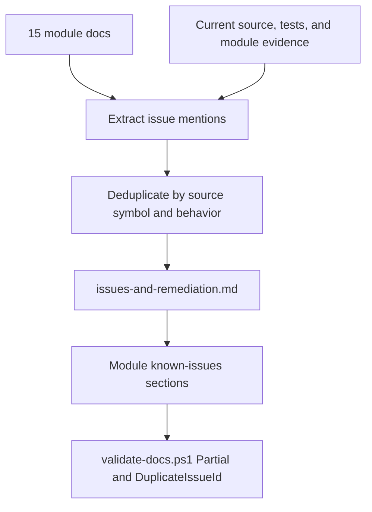

# 问题与整改目录

## Scope and non-responsibilities

本文汇总模块文档、当前源码、测试覆盖和模块证据，把重复问题合并为唯一登记项，并给每项分配稳定的 registry ID。本文只记录当前源码中的已验证缺陷、设计风险和测试缺口，不修改生产代码，不新增测试，也不把建议写成已经完成。

本文不覆盖系统总览、README 入口或完整构建验证。后续整改可以引用这些 ID 编写索引和总览。

## Functionality

登记项按严重性排序，同级内按模块族排序。每项都包含模块、精确源码路径和符号、当前行为、影响、严重性、置信度、短期止血、长期整改、验证建议和依赖。

严重性枚举只使用 `High`、`Medium`、`Low`。置信度枚举只使用 `Confirmed`、`Probable`。分类只使用已验证缺陷、已关闭缺陷、设计风险和测试缺口。

## Key entry points

| 入口 | 用途 |
| --- | --- |
| `Host Software/docs/architecture/app-lifecycle-and-di.md` | C1 启动、DI、关闭和顶层异常问题来源。 |
| `Host Software/docs/architecture/navigation-and-shell.md` | C1/C2 导航、Shell 和 Header 行为问题来源。 |
| `Host Software/docs/architecture/ui-mvvm.md` | C2 页面、ViewModel、缓存页面和 code-behind 问题来源。 |
| `Host Software/docs/architecture/viewmodel-lifecycle.md` | C2 lifecycle、无调用者清理和重复订阅风险来源。 |
| `Host Software/docs/architecture/settings-persistence.md` | C3 settings、路径分歧、并发持久化和 schema 风险来源。 |
| `Host Software/docs/architecture/logging-localization-theme.md` | C3 日志、本地化、主题和顶层异常重复来源。 |
| `Host Software/docs/architecture/usb-transport.md` | C4 USB 传输、端点和 StopBulkIn 来源。 |
| `Host Software/docs/architecture/scanner-session-and-access.md` | C4 会话所有权、lease 和锁内 delegate 来源。 |
| `Host Software/docs/architecture/scan-protocol-and-execution.md` | C5 协议执行、ACK 和回调问题来源。 |
| `Host Software/docs/architecture/scan-workflow-and-device-control.md` | C5 工作流、warm-up、motor interval 和 cleanup 问题来源。 |
| `Host Software/docs/architecture/image-decoding-preview.md` | C5 图像解码、瀑布预览和分配问题来源。 |
| `Host Software/docs/architecture/alignment-color-processing.md` | C5 对齐、合成、取消和 silent fallback 来源。 |
| `Host Software/docs/architecture/calibration-autofocus-film-profiles.md` | C5 校准、自动对焦和 profile 工作区问题来源。 |
| `Host Software/docs/architecture/dng-export-native-bridge.md` | C6 DNG 托管和原生桥接问题来源。 |
| `Host Software/docs/architecture/testing-and-build.md` | C6 测试矩阵、构建依赖和 Full QA 风险来源。 |

## Implementation mechanism

去重规则如下。

1. 同一源码符号的重复描述合并为一个 ID。例如 `App_UnhandledException` 同时出现在应用生命周期和日志文档中，登记为 `APP-001`。
2. 现象相同但影响层不同的条目保留独立 ID。例如日志 fire-and-forget 和设置 fire-and-forget 分属 `LOG-001` 与 `SET-005`。
3. 设计风险和测试缺口不和已验证缺陷合并，因为整改路径和验证建议不同。
4. 当前源码、测试覆盖和模块证据优先于早期模块措辞。例如路径分歧、ScanDebug RawUsb 直接测试缺口、`CleanupAsync` 无调用者和 DNG last-error `thread_local` 事实按对应源码和测试状态登记。

## Control and data flow

## Dependencies

| 依赖 | 说明 |
| --- | --- |
| 模块文档 | 提供原始问题条目。 |
| 当前源码、测试和模块证据 | 提供 registry 的源码事实、测试覆盖状态和模块边界。 |
| codegraph source verification | 验证重点符号的当前源码。 |
| `Host Software/docs/architecture/validate-docs.ps1` | 验证章节、链接、源码路径、Mermaid 和重复 issue ID。 |

## State and concurrency

Registry 是文档状态，不影响应用运行时。并发相关问题只按源码事实登记，例如 `_mutationGate` 持锁运行 delegate、settings 无锁字典、日志后台追加和图像处理无取消令牌。

## Error handling

每项短期方案只描述止血和排障手段，不声称错误已经修复。长期方案描述生产代码或测试的目标整改。验证建议说明后续如何证明整改完成。

## Test coverage

本文档验证范围覆盖 registry 结构、本地链接、源码路径、Mermaid 和重复 issue ID。测试缺口类条目不会由文档验证补齐，只记录后续应添加的测试类型。

## Known issues and solutions

### 高优先级 High

| ID | 分类 | 模块 | 源码路径和符号 | 当前行为 | 影响 | 严重性 | 置信度 | 短期止血 | 长期整改 | 验证建议 | 依赖 |
| --- | --- | --- | --- | --- | --- | --- | --- | --- | --- | --- | --- |
| APP-001 | 已关闭缺陷 | C1 应用生命周期, C3 日志 | `PRISM Utility/App.xaml.cs` `App_UnhandledException`, `PRISM Utility.Core/Services/UnhandledExceptionReporter.cs` | 处理器调用 `UnhandledExceptionReporter.Report`, 先尝试 Debug mirror, 失败时退到 Debug 和 Trace, 且没有设置 `Handled`。 | 顶层异常现在有结构化报告路径, 但 live WinUI 可控未处理事件 smoke 仍为 `ENVIRONMENT_BLOCKED`。 | High | Confirmed | 不把 live WinUI event smoke 记为通过, 继续把 LOG-001/LOG-002 作为独立日志条目, 不把关闭路径和顶层异常恢复策略混在一起。 | 如需更强恢复语义, 另行设计 handled 策略和用户可见 fatal error 呈现。 | `App001UnhandledExceptionBaselineTests.cs`, `UnhandledExceptionReporterTests.cs`, task 4 review 证明 reporter、no-throw、no-Handled；live WinUI smoke 需可用 UI harness 后再跑。 | `LOG-001` |
| UI-001 | 已关闭缺陷 | C1/C2 Shell | `PRISM Utility/Behaviors/NavigationViewHeaderBehavior.cs` `HeaderModeProperty` | `HeaderModeProperty` 已注册为 `typeof(NavigationViewHeaderMode)`, accessor 和 XAML `HeaderMode="Never"` 使用同一 enum。 | 原 bool/enum 类型不一致已关闭；真实页面视觉交互仍属于 WinUI smoke 覆盖。 | High | Confirmed | 保留 Scan/ScanDebug 页面 smoke 在发布清单中, 不把 source contract 当作视觉验证。 | 后续如处理 UI-004, 再收敛 `_current` 静态行为边界。 | `NavigationViewHeaderBehaviorUi001ContractTests.cs` 和 x64 XAML 编译输出验证 enum DP、setter cast 和页面 XAML。 | 无 |
| USB-001 | 已关闭缺陷 | C4 USB 传输 | `PRISM Utility.Core/Contracts/Services/IUsbService.cs`, `PRISM Utility.Core/Services/UsbService.cs` `StartBulkInAsync` | `StopBulkIn` API 已从接口、实现和测试 fake 退休；`StartBulkInAsync` 通过调用方 `CancellationToken` 驱动内部 runner 取消。 | 旧未实现停止入口已消失；真实 USB 硬件取消时序仍需硬件 smoke, 当前证据是可执行阻塞 fake。 | High | Confirmed | 不再要求调用 `StopBulkIn`; 调用方应取消传给 `StartBulkInAsync` 的 token。 | 如重新引入 Raw USB 后台读取, 必须先定义 API 所有权和取消语义。 | `Usb001ContractTests.cs` 证明 fake runner 的 Starting, Running, Stopping, Stopped 生命周期、fresh token restart 和 API retirement。 | 无 |
| IMG-001 | 已关闭缺陷 | C5 图像解码 | `PRISM Utility.Core/Services/ScanImageDecoder.cs` `DecodeWaterfallStripToBgra`, `PRISM Utility/Services/ScanPreviewPresenter.cs` | decoder 在 `rows <= 0` 时抛 `ArgumentOutOfRangeException`; presenter 压缩瀑布入口拒绝无效 rows 并保留既有输出。 | 零行除以 0 崩溃已关闭；有效一行 BGRA 输出保持不变。 | High | Confirmed | 调用方仍应避免把空扫描作为可显示帧。 | 后续性能和分配风险仍由 IMG-002 跟踪。 | `ScanImageDecoderImg001Tests.cs` 和独立 harness 覆盖 zero-row reject、malformed positive-row reject、stale output unchanged 和 valid output unchanged。 | 无 |
| SESSION-001 | 已关闭缺陷 | C4 扫描会话 | `PRISM Utility.Core/Services/ScannerDeviceSessionManager.cs` `UseConnectedSessionAsync`, `RunConnectedSessionStateAsync`, `DisposeAsync` | 会话 action 现在在 linked operation context 下运行, `_mutationGate` 只保护开始、完成、fault 和 cleanup 状态转换；dispose cleanup 取消活动 operation 并用 bounded wait 做 exact-once 清理。 | 旧锁内任意长 delegate 阻塞连接、断开、停止和释放的风险已关闭；`DisconnectAndReleaseAsync` cleanup fault 快照语义仍由 SESSION-002 跟踪。 | High | Confirmed | 不再把普通扫描或诊断 action 描述为持 `_mutationGate` 运行；继续要求 action 尊重传入的 operation cancellation token。 | 如需暴露更细的 cleanup fault 语义, 继续按 SESSION-002 设计。 | SESSION-001 相关 53 个 focused tests、409/409 managed tests、Core build 0 warnings/errors、x64 app build 0 errors 加既有 WindowsAppSDK warning, independent reviews CONFIRMED。 | `SESSION-002` |
| SCAN-001 | 已关闭缺陷 | C5 对齐和合成 | `PRISM Utility/Services/ScanChannelImageService.cs` `BuildRgbCompositeBufferAsync`, `SaveRgbImageAsync`, DNG export helpers, `PRISM Utility.Core/Services/ScanChannelAlignmentService.cs` `BuildAlignedNormalizedPassBuffers` | 合成、对齐、Task.Run worker、inner loops 和 UI/export 调用链传递 `CancellationToken`; 输出写入使用 task-owned temp transaction, publish 前取消不会替换目标, publish 失败会 rollback。 | 旧大图合成不可取消和输出半写风险已关闭；对齐 fallback 诊断可见性已由 SCAN-002 关闭, 图像分配成本仍由 IMG-002 跟踪。 | High | Confirmed | 文档只声称 managed cancellation 和文件事务证据, 不声称 live UI smoke 或物理 scanner 验证。 | 后续新增 alignment caller 继续按 SCAN-002 镜像 structured diagnostics。 | `Scan001CancellationTests.cs`, `Scan001OutputOwnershipTests.cs`, 409/409 managed tests、Core build 0 warnings/errors、x64 app build 0 errors 加既有 WindowsAppSDK warning, independent reviews CONFIRMED。 | `IMG-002`, `SCAN-002` |
| CAL-001 | 已关闭测试缺口 | C5 校准和自动对焦 | `PRISM Utility.Core/Services/ScanAutoCalibrationService.cs` `AutoCalibrateAsync`, `PRISM Utility.Core/Services/ScanAutoFocusService.cs` `AutoFocusAsync` | historical CAL-001 closure evidence 已用 15 个 deterministic fake tests 覆盖黑场和白场收敛、黑白振荡最佳采样回退、无效宽度和 ROI clamp、扫描失败、motion timeout、取消、warm-up cleanup、0/2 号焦点电机 all-path stop, 以及未归一化 Brenner 指标锁定。当前 Todo 15 software-gate snapshot 另覆盖 pending candidate review 和 calibration status。 | 关键算法边界已有 managed regression 证据；物理 scanner、真实照明、真实运动和硬件 smoke 仍为 `ENVIRONMENT_BLOCKED`。 | High | Confirmed | 不把 fake harness 或 Todo 15 software gate 结果写成硬件通过；保留 CAL-002 当前未归一化 Brenner 语义和独立状态。 | 物理硬件可用后再补 scanner smoke, 不把它并入 managed closure。 | historical/superseded CAL-001 closure evidence 是 `Cal001AutoCalibrationAndFocusTests.cs` 15 个 CAL001 tests 通过、full managed suite 555/555、Core/app builds 和 Full validator。current evidence 是 Todo 15 focused calibration status 104/104、parent focused gate 183/183 和 full Core suite 1034/1034。 | `CAL-002` |
| DNG-001 | 测试缺口 | C6 DNG 桥接 | `PRISM Utility.Core/Services/DngWriterService.cs` `WriteRawDng`, `DngSdkWarpper/PrismDngBridge.cpp` `PrismDngWriteFromBuffer` | managed validation/status seam 子范围已通过。测试覆盖托管请求验证、packed row stride、black level plane count equality、loader mappings for DllNotFound/BadImageFormat/EntryPointNotFound missing export、exact native ABI messages 和 status 1 到 5/unknown mapping。task 24 dependency probe 后来在 this task24 environment 证明 VS2022、v143、MSBuild 和 inspected Adobe_DNG_SDK/native wrapper dependency readiness 为 `PASS`，但 native build 是 `SKIP`/not run。native bridge runtime smoke 与 JXL stub runtime smoke 未执行。native C++ 仍有 `OPEN_UNVERIFIED_PRE_EXISTING_RISK`: 它没有独立强制 packed row-stride minimum 或 blackLevelPlaneCount equality。 | managed caller 风险已降低, 但真实 native bridge、Adobe DNG SDK 写入行为、JXL stub runtime 和 native parity 仍未验证。整体 DNG-001 是 `ENVIRONMENT_BLOCKED`, 不是 managed/native PASS。 | High | Confirmed | 可把 managedValidationStatusSeam 和 task24 native dependency probe 记为 `PASS`, 但 native build 必须记为 `SKIP`/not run, nativeBuildOrSmoke 和 jxlStubSmoke 必须记为 `ENVIRONMENT_BLOCKED`。不要把 Core tests、managed ABI layout tests 或 JXL stub source inspection 写成 native C++ `sizeof`、native smoke 或 JXL runtime smoke 通过。 | 有可加载 native artifact 和维护中的 runtime probes 后, 单独补 native build/smoke、JXL stub smoke 和 native parity enforcement 或 documented native validation decision。 | Task 23 evidence .omo/evidence/task-23-design-correction-repairs.json: initial RED 为 focused compile 18 missing-symbol errors, ABI TDD CS0117, layout 34 pass/1 fail expected 656 actual 664；final focused 36/36、full managed 591/591、Core build 0 warnings/errors、changed-file diagnostics clean、Oracle `MANAGED_SUBSCOPE_APPROVED`；新增 blackLevelPlanes length vs SamplesPerPixel seam-not-invoked test 是 green characterization of existing behavior, not fabricated RED。Task 24 evidence .omo/evidence/task-24-design-correction-repairs.json: layered runner managed 591/591 `PASS`, Core `PASS` 0 errors, x64 app `PASS` with existing WindowsAppSDK PublishSingleFile warning, native dependency probe `PASS`, native build `SKIP`, timeout and cleanup `PASS`, overall runner `PASS`/exit 0. | `DNG-002`, `DNG-003`, `TEST-001` |

### 中优先级 Medium

| ID | 分类 | 模块 | 源码路径和符号 | 当前行为 | 影响 | 严重性 | 置信度 | 短期止血 | 长期整改 | 验证建议 | 依赖 |
| --- | --- | --- | --- | --- | --- | --- | --- | --- | --- | --- | --- |
| APP-002 | 设计风险 | C1 应用生命周期 | `PRISM Utility/App.xaml.cs` `MainWindow_Closed` | 关闭清理是 `async void`, 失败只写 Debug。 | 硬件会话释放失败时用户可能看不到结果, 测试也难断言。 | Medium | Confirmed | 关闭路径记录结构化错误并保留一次性保护。 | 把硬件清理抽成可测试关闭协调器。 | 以 fake session manager 断言 shutdown 失败被记录。 | `SESSION-002` |
| APP-003 | 设计风险 | C1 DI | `PRISM Utility/App.xaml.cs` `ConfigureServices` | UI、Core、USB、扫描和 DNG 注册集中在一个方法, 缺少容器验证。 | 漏注册会到运行时才暴露。 | Medium | Confirmed | 增加启动自检清单或轻量容器解析冒烟。 | 按 C1 到 C6 分组注册扩展方法并建立契约测试。 | 测试解析所有 Page、ViewModel 和关键服务。 | 无 |
| APP-004 | 设计风险 | C1 UI 派发 | `PRISM Utility/Services/UiDispatcherService.cs` `TryEnqueue` | UI 派发失败只返回布尔值, 调用方未被强制处理。 | 后台事件更新 UI 时可能静默丢失状态。 | Medium | Confirmed | 调用方对 `false` 写诊断日志。 | 统一 UI 调度抽象, 提供可测试失败路径。 | fake dispatcher 返回 false, 断言调用方记录或降级。 | `LOG-003` |
| UI-002 | 已关闭设计风险 | C1/C2 导航 | `PRISM Utility/Contracts/Navigation/AppRoute.cs`, `PRISM Utility/Contracts/Services/INavigationService.cs`, `PRISM Utility/Contracts/Services/IPageService.cs`, `PRISM Utility/Helpers/NavigationHelper.cs`, `PRISM Utility/Services/PageService.cs`, `PRISM Utility/Services/NavigationViewService.cs` | 导航 route 已收敛为六值 `AppRoute`: `Main`, `Log`, `Scan`, `ScanDebug`, `Settings`, `DeviceConfiguration`。`INavigationService.NavigateTo` 和 `IPageService.GetPageType` 接受 typed route, `NavigationHelper.NavigateTo` 是 nullable enum attached property, `PageService` 对 enum 注册做 exhaustive 校验。 | 旧 ViewModel full-name route 字符串漂移风险已关闭；Page ViewModel host 契约风险已由 UI-003 关闭, 菜单项缺 route 的诊断边界仍由 UI-005 跟踪。 | Medium | Confirmed | 不再写 full-name route 字符串。Settings 通过 resolver seam 映射到 `AppRoute.Settings`; 普通菜单 unset route 不导航并写 diagnostic。 | 新增导航目标必须先扩展 `AppRoute`, 再更新 `PageService` registration、Shell route literal、exact Page host pair 和 route tests。 | UI-002 focused 16 个 tests 两次通过, UI-002+UI-003 focused 24 个 tests 通过, full managed suite 511/511 通过；Core/app builds 通过且只保留既有 app warning；older seven-route UIA/visual artifacts are historical inventory only and current source defines six routes。DeviceConfiguration 经 footer flyout 进入。Full doc validator 18/18 deliverables, 20 Mermaid。 | `UI-005` |
| UI-003 | 已关闭设计风险 | C1/C2 导航 | `PRISM Utility/Contracts/ViewModels/IPageViewModelHost.cs`, `PRISM Utility/Services/PageService.cs` `Configure<TPage, TViewModel>`, `PRISM Utility/Helpers/FrameExtensions.cs` `GetPageViewModel`, `PRISM Utility/Contracts/Navigation/NavigationLifecycleDispatcher.cs` | 当前 Page 的 ViewModel 通过 `IPageViewModelHost<TViewModel>` 编译期契约暴露。`PageService.Configure<TPage, TViewModel>` 要求 `TPage : Page, IPageViewModelHost<TViewModel>`，六个真实页面 `MainPage`, `LogPage`, `ScanPage`, `ScanDebugPage`, `SettingsPage`, `DeviceConfigurationPage` 都声明精确 ViewModel host pair。`FrameExtensions.GetPageViewModel` 直接读取 `IPageViewModelHost.ViewModel`，null content 返回 null，非 host content 抛 `InvalidOperationException`。 | 旧反射读取、缺属性返回 null 和导航感知回调静默跳过风险已关闭；UI-006 缓存页面 lifecycle、VM-001 cleanup caller 和 TEST-002 WinUI 自动化缺口仍独立开放。 | Medium | Confirmed | 新增 Page 必须同时声明精确 `IPageViewModelHost<TViewModel>`，并加入 `PageService` exact route/Page/ViewModel registration。 | 保持 `IPageViewModelHost<TViewModel>` 不变性和 `PageService` 泛型约束，新增导航目标必须扩展 compile-time contract 和 production metadata probe。 | UI-003 focused 8 个 tests 两次通过；negative compile harness 覆盖 missing host、wrong ViewModel pairing 和 invariance；production app metadata probe 验证真实路由 Page host metadata；direct `FrameExtensions` retrieval 覆盖 nonhost failure；lifecycle dispatcher 测试锁定 `OnNavigatedTo` before publish, successful navigation only then `OnNavigatedFrom`。UI-002+UI-003 focused 24 个 tests 通过, full managed suite 511/511 通过；older seven-route UIA/visual artifacts are historical inventory only。Full doc validator 通过。 | `UI-002` |
| UI-004 | 设计风险 | C1/C2 Shell | `PRISM Utility/Behaviors/NavigationViewHeaderBehavior.cs` `_current` callbacks | Header behavior 使用静态 `_current!`。 | 多 Shell、分离后属性变化或测试场景可能空引用或更新错实例。 | Medium | Confirmed | 回调检查 `_current` 并记录无当前实例。 | 移除静态全局状态, 通过依赖属性回调参数定位实例。 | 单元或 UI 测试覆盖 attach、detach、属性变化顺序。 | `UI-001` |
| UI-005 | 设计风险 | C1/C2 Shell | `PRISM Utility/Services/NavigationViewService.cs` `OnItemInvoked`, `PRISM Utility/Contracts/Navigation/NavigationViewRouteResolver.cs` `Resolve` | 普通菜单项缺少 `NavigationHelper.NavigateTo` 时不会导航，并通过 resolver 返回 diagnostic；当前只写入 `NavigationTimingLogger`。 | XAML 配置错误仍可能表现为用户点击无反应，定位依赖 Debug 诊断而非用户可见反馈。 | Medium | Confirmed | 对可点击但无 route 的项保留诊断日志。 | 建立 Shell XAML 菜单到 PageService 的验证测试，并决定是否需要用户可见反馈。 | 移除一个 route 的 fixture 应失败或产生可断言诊断。 | `UI-002` |
| UI-006 | 设计风险 | C2 UI/MVVM | `PRISM Utility/Views/ScanPage.xaml`, `PRISM Utility/Views/ScanDebugPage.xaml`, `PRISM Utility/ViewModels/ScanViewModel.cs`, `PRISM Utility/ViewModels/ScanDebugViewModel.cs` | Scan 和 ScanDebug 启用 NavigationCache 且持有较多 UI 状态副本；当前 ScanViewModel 仍拥有扫描执行命令、预览投影、settings/profile 投影和 cached output state。VM-001 extraction hard gate 当前为 `EXTRACTION_BLOCKED`，因为 ScanPage 缓存、Loaded/Unloaded 订阅和 ViewModel cleanup 所有权尚未明确。 | 离开和重进页面时容易出现 stale state 或重复订阅；当前证据只描述 source contract 和 blocker，不证明运行时安全。 | Medium | Confirmed | 把 Loaded/Unloaded 订阅路径列为变更检查项，task 20 必须走 blocked branch，不得把 characterization 写成修复。 | 先明确 lifecycle/cleanup ownership；在 gate 解除前，UI-006 只能做 characterization-only 证据，不执行 adapter、presenter 或 workspace extraction。 | UI-006 source characterization 15 个 focused tests 两次通过，VM-001 blocker 传播由 4 个 focused characterization tests 两次覆盖，full managed suite 520/520 通过，Core/app builds 通过且只保留既有 app warning。不得把 source-contract 证据写成运行时安全。 | `VM-001` |
| UI-007 | 设计风险 | C2 UI/MVVM | `PRISM Utility/Views/ScanDebugPage.xaml.cs`, `PRISM Utility/Views/ScanDebugPage.xaml`, `PRISM Utility/ViewModels/ScanDebugViewModel.cs` | 当前 code-behind 仍拥有 Canvas bitmap 创建和释放、预览 display sizing、初始 fit zoom、wheel/button/ComboBox zoom、ScrollViewer pan pointer、ROI drag pointer capture、cursor text、axis drawing、ROI overlay rectangle/label drawing、ContentDialog completion 和当前校准照明 TextBox/ComboBox 双向同步。ROI selection、overlay toggles、ROI input TextBox 和 apply/reset 命令仍在 ViewModel/XAML 绑定面。`ScanColumnRange.Clamp` 与 `ScanCalibrationRoiSettings.Clamp` 已有 Core 可执行覆盖。 | UI 编排边界较宽, 视觉行为难以单元测试；当前证据是 source-only characterization 和 Core clamp tests, 不证明 WinUI runtime pointer、Canvas render、dialog 或 dispatcher 安全。 | Medium | Confirmed | 保持 code-behind 只做 UI 编排, 不新增硬件调用；不得从 code-behind 调用 scan session、workflow、calibration、autofocus、illumination、channel image、parameter service 或 DNG export/picker。 | VM-001 和 UI-006 仍是 hard blockers, task 20 当前 outcome 是 `EXTRACTION_BLOCKED`。在 gate 解除前，UI-007 只能补 Canvas/ROI/display/pointer/overlay/dialog/text sync characterization，不能执行 production geometry/display extraction。task 21 必须走 blocked branch, 不能基于 UI-007 假定已提取。 | Task 20 historical broad-filter characterization 19 个 tests 两次通过，regression subset 9 个 tests 通过，full managed suite 534/534 通过，Core build 和 x64 app build 通过且只保留既有 app warning。证据没有生产 extraction、没有硬件调用、没有 runtime WinUI smoke, 只能支持 completion-as-blocked。 | `UI-006`, `VM-001`, `VM-002` |
| VM-001 | 设计风险 | C2 ViewModel 生命周期 | `PRISM Utility/Views/ScanPage.xaml`, `PRISM Utility/Views/ScanPage.xaml.cs`, `PRISM Utility/ViewModels/ScanViewModel.cs` `Activate`, `Deactivate`, `CleanupAsync`, `PRISM Utility/App.xaml.cs` `MainWindow_Closed` | `ScanPage.xaml` 是 cached ScanPage；`ScanViewModel` 构造函数调用 `Activate()`；`ScanPage.Loaded` 无 guard 执行 `ViewModel.PropertyChanged += OnViewModelPropertyChanged` 并再次调用 `Activate()`；`ScanPage.Unloaded` 只有一次 `PropertyChanged -=` 并调用 `Deactivate()`；`CleanupAsync` 当前 source caller graph 为零调用者；`_uiLifetimeCts` 只在 `CleanupAsync` 中取消；app close 只清理 settings、scanner session manager 和 log mirror，不调用 `CleanupAsync`。VM-001 hard gate outcome 是 `EXTRACTION_BLOCKED`，不是 closed 或 remediated。 | 应用关闭不能依赖 ViewModel cleanup；重复 Loaded 可能造成 Page 级 PropertyChanged 重复订阅；由于 cleanup 所有权未定义，不能声称当前运行时安全。 | Medium | Confirmed | 每个 `+=` 和 `-=` 对列入代码审查清单；继续把 VM-001 归类为 open design risk。 | 先明确 cached page lifecycle 和 cleanup ownership，再决定是否提取可测试 lifecycle adapter。gate 解除前不得做 adapter/extraction。 | Todo 18 completed as blocked evidence: evidence 4 focused characterization tests twice, full managed suite 515/515, source caller graph, and Oracle `CONFIRMED_BLOCKED` are sufficient for completion-as-blocked. Runtime probe is not required by the verdict, and evidence must not be written as runtime safety. | `UI-006` |
| VM-002 | 设计风险 | C2 ViewModel 生命周期 | `PRISM Utility/ViewModels/ScanDebugViewModel.cs` | ScanDebugViewModel 体量大, 生命周期、扫描调试、校准、预览和 profile 快捷入口集中。当前仍拥有 public binding surface、commands、`CalibrationPromptRequested`、`NoticeRequested`、`CalibrationSectionRequested`、Attach/Deactivate/Cleanup、session/workflow orchestration、preview queueing、ROI mutation、calibration/autofocus、film profile workspace projection 和 DNG export coordination。task 21 outcome 是 `SPLIT_BLOCKED`，不是生产拆分。 | 局部修改容易影响多个 UI 状态面；当前 source-contract evidence 不证明 runtime WinUI safety，也不关闭 VM-002。 | Medium | Confirmed | 保持 Attach、Deactivate、Cleanup、dialog event 和 film profile workspace projection 边界稳定。CAL-001 和 DNG-001 可进入 P3 测试补强，但不能假定 VM-002 已拆分。 | VM-001 -> UI-006 -> UI-007 blocked chain 解除前，VM-002 只能补行为 characterization，不能拆出预览、ROI、校准和 profile projection。 | task 21 completed as `SPLIT_BLOCKED`: VM002 focused source/projection tests 16/16 passed twice, UI007/UI006/VM001 regression subset 23/23 passed, FilmProfile regression 204/204 passed, final full managed suite 540/540 passed. Evidence freezes current responsibilities only. | `UI-007`, `CAL-001`, `DNG-001` |
| SET-001 | 已关闭缺陷 | C3 设置持久化 | `PRISM Utility/Services/LocalSettingsService.cs` `SaveSettingAsync`, `PRISM Utility.Core/Services/AtomicFileWriter.cs` | 非打包 settings 读取和保存共用 `_settingsGate`; 保存先更新内存快照, 再用 same-volume task-owned temp 文件、flush 和 replace/move 写入, 写入失败时 rollback 内存值并清理 temp。 | 旧无锁字典和整文件直接覆盖风险已关闭；SET-003 已另行关闭传输、色彩和校准分组 document 保存缺口。 | Medium | Confirmed | 不再建议调用方避开并发单 key 保存；强一致分组设置应继续按 SET-003 的 single document pattern 保存。 | 若新增持久化入口, 继续通过 `IAtomicFileWriter` 和同一 gate 或补等价测试。 | `Set001LocalSettingsAtomicPersistenceTests.cs` 七例覆盖 DI、same-volume atomic writer、32 并发保存、failure rollback 和 temp cleanup；409/409 managed tests、Core build 0 warnings/errors、x64 app build 0 errors 加既有 WindowsAppSDK warning。 | `SET-003` |
| SET-002 | 已关闭缺陷 | C3 设置持久化 | `PRISM Utility.Core/Helpers/ApplicationDataPathResolver.cs`, `PRISM Utility/Services/LocalSettingsService.cs`, `PRISM Utility/Services/DebugOutputMirrorService.cs` | settings 和日志都通过 shared compiled resolver 解析 application-data root; configured、null、empty、whitespace 和 custom roots 保持同一 root。 | 旧 underscore 和 space fallback 分歧已关闭；LOG-001 的文件追加 shutdown flush 也已作为独立日志生命周期项关闭。 | Medium | Confirmed | 排障文档按 shared resolver 解释 settings 与 log 路径, 不再描述当前分歧。 | 若未来新增持久化入口, 继续复用 resolver 或补等价路径测试。 | `Set002SettingsPathTests.cs` 六例运行时测试和 task 1 data probe 证明 settings/log root parity。 | `LOG-001` |
| SET-003 | 已关闭缺陷 | C3 设置持久化 | `PRISM Utility.Core/Services/ScanTransferSettingsService.cs` `SetSettingsAsync`, `PRISM Utility.Core/Services/ScanColorManagementSettingsService.cs` `SetSettingsAsync`, `PRISM Utility.Core/Services/ScanCalibrationProfileRepository.cs` `ReplaceAsync` | 传输、色彩和校准分组设置已改为 schema 1 versioned single documents, current document 优先于 legacy keys；legacy 只在 document 缺失时迁移, future、malformed 或 payload 无效 document 不回读 legacy, 也不发布 stale fallback。 | 旧多 key 部分持久化风险已关闭；保留 legacy keys 在当前 `LocalSettingsService` 下是惰性兼容状态, 因为生产设置服务没有 delete API。 | Medium | Confirmed | 不再提示用户因 SET-003 保存失败后人工复查分组一致性；继续把通用 settings schema/version 范围按 SET-004 跟踪, SET-005 已关闭 UI fire-and-forget 保存缺口。 | 新增强一致设置分组时使用单 document key, save 成功后再发布内存 generation；legacy cleanup 只能在底层实现 delete contract 后开启。 | SET-003 相关 18 个 focused tests 两次通过, combined 439/439 managed tests 通过；文件系统 harness 证明 transfer/color/calibration migration 幂等、save-before-publish、失败保留 durable hash 和内存状态。 | `SET-001`, `SET-004`, `SET-005` |
| SET-004 | 设计风险 | C3 设置持久化 | `PRISM Utility.Core/Helpers/Json.cs`, `PRISM Utility/Services/LocalSettingsService.cs` | 通用 settings 没有 schema/version envelope；film profile 当前为 schema 6，并继续读取和迁移 schema 5。 | 未来 settings 迁移容易和 profile 文档迁移混淆。 | Medium | Confirmed | 文档避免把 profile schema 说成所有 settings schema。 | 为 settings 引入明确版本包络或按 key 迁移表。 | 加旧 settings fixture 迁移或拒绝测试。 | 无 |
| SET-005 | 已关闭缺陷 | C3 设置持久化, C3 本地化 | `PRISM Utility.Core/Services/SettingsSaveCoordinator.cs`, `PRISM Utility/ViewModels/SettingsViewModel.cs`, `PRISM Utility/Views/SettingsPage.xaml`, `PRISM Utility/App.xaml.cs` | Settings 保存改为 owner-scoped `SettingsSaveCoordinator`; language、theme、debug、transfer 和 color 五个设置 family 都通过 per-scope 队列保存, failure result 先写 mirror diagnostic, 再经 UI dispatcher rollback 并汇总到既有 Settings persistence `InfoBar`。restore/default 命令也归同一 scope owner 管理。 | 旧未观察 fire-and-forget 保存和用户不可见失败风险已关闭；视觉证据只证明 normal/recovery 的 en/zh capture clean, rendered failure InfoBar/accessibility evidence 仍为 `HARNESS_BLOCKED`, 不能写成 error-state visual pass。 | Medium | Confirmed | 保持每个设置 scope 的失败、恢复和 stale result 边界, 不把通用 schema/version 问题并入本项；页面和 app teardown 继续使用 bounded flush/cancel。 | 新增设置 family 时必须注册到 coordinator owner, 提供 rollback 或 committed-state recovery, 并复用现有错误 InfoBar 呈现。 | SET-005 相关 29 个 focused tests 两次通过, combined 487/487 managed tests 通过；覆盖 coordinator serialization/cancel/release, per-scope error clearing, five settings families, restore defaults rollback, commit/rollback, UI dispatcher, bounded page/app teardown, existing InfoBar source contract, normal/recovery en/zh visual captures clean, rendered failure InfoBar/accessibility `HARNESS_BLOCKED`。 | `LOG-001` |
| LOG-001 | 已关闭缺陷 | C3 日志 | `PRISM Utility/Services/DebugOutputMirrorService.cs` `Mirror`, `FlushAsync`, `ShutdownAsync`; `PRISM Utility/App.xaml.cs` `MainWindow_Closed` | 文件日志 append admission 会被跟踪为 accepted append work；`FlushAsync` 等待调用时 snapshot 内的 accepted appends, `ShutdownAsync` 拒绝后续文件 append 并等待已接收工作, repeated shutdown idempotent 且调用者可用 cancellation bounding wait。关闭路径先启动 scanner cleanup, 再用 bounded async wait 关闭 log mirror, handler 内没有同步磁盘 flush 或 blocking wait。 | 旧最后日志可能完全无 flush hook 的风险已关闭；shutdown 后 `Mirror` 仍保留 recent entry、Debug/Trace 和 subscriber 通知, 但文件 append 会被拒绝并先写 failure safe diagnostic, 再完成对应 append work。same-thread per-instance reentrant shutdown guard 避免 diagnostic sink 回入时自锁。 | Medium | Confirmed | 不把 APP-001 顶层异常恢复策略混入本项, 不在异常 handler 中加入同步磁盘写入；排障时区分 shutdown 前 accepted appends 和 shutdown 后被拒绝的文件 append。 | 如果未来需要进程退出前更长的审计保证, 调整 caller timeout 或外层 shutdown 策略, 不改变 `Mirror` 同步调用语义。 | LOG-001 相关 19 个 focused tests 两次通过, combined 487/487 managed tests 通过；tests 覆盖 accepted append snapshot flush、queue admission ordering、diagnostic-before-completion、append failure diagnostics、same-thread reentrant shutdown guard、idempotent shutdown、caller-bounded wait、scanner-before-log close 和 post-shutdown file policy。 | `APP-001`, `LOG-002` |
| LOG-002 | 已关闭缺陷 | C3 日志 | `PRISM Utility/Services/DebugOutputMirrorService.cs` `Mirror`, `NotifySubscribers`, `ReportDiagnostic` | `Mirror` 先完成 recent entry、Debug/Trace 和文件 append admission, 再逐个通知 isolated subscribers; 订阅者异常进入 safe diagnostic sink, sink 本身异常不外逃。 | 旧订阅者阻断核心输出风险已关闭；LOG-001 另行证明 accepted append flush、shutdown wait 和 post-shutdown file policy。 | Medium | Confirmed | 不再要求订阅者本地 try/catch 来保护核心日志分支；排障时区分 accepted append、flush snapshot 和 shutdown 后被拒绝的文件 append。 | 如需更长关机审计等待, 调整 LOG-001 调用方 timeout, 不改变 LOG-002 subscriber isolation contract。 | `Log002DebugOutputMirrorTests.cs` 八例覆盖 core-first ordering、subscriber failure isolation、diagnostic sink failure safety、bounded reentry 和 append failure diagnostics；409/409 managed tests、Core build 0 warnings/errors、x64 app build 0 errors 加既有 WindowsAppSDK warning。 | `LOG-001` |
| LOG-003 | 设计风险 | C3 主题 | `PRISM Utility/MainWindow.xaml.cs` `Settings_ColorValuesChanged` | 系统主题变化回到 UI 线程时忽略 `TryEnqueue` 返回值。 | 窗口关闭或 dispatcher 不可用时标题栏颜色可能不同步。 | Medium | Confirmed | 关闭期间允许忽略, 其它情况写诊断。 | 把标题栏更新放进可测试 dispatcher 适配器。 | fake dispatcher 返回 false, 断言诊断或状态。 | `APP-004` |
| LOG-004 | 设计风险 | C3 本地化 | `PRISM Utility/Services/LanguageSelectorService.cs` `RefreshShellAsync` | 语言切换替换 Shell 并导航到 Settings。 | 正在进行的页面状态依赖各 ViewModel 自行清理或保留。 | Medium | Confirmed | 把语言切换视为完整 shell refresh, 避免扫描中切换。 | 设计保留或明确丢弃页面状态的策略。 | UI smoke 覆盖扫描页状态、语言切换和返回。 | `VM-001` |
| USB-002 | 设计风险 | C4 USB 传输 | `PRISM Utility.Core/Services/UsbDeviceCatalog.cs` `RunRefreshLoop` | 目录刷新异常只写 Debug, 用户层只能看到目标缺失或连接失败。 | 驱动权限和设备移除错误难定位。 | Medium | Confirmed | UI 排障文案列出驱动、权限、设备移除。 | 目录服务暴露最近一次刷新错误快照。 | fake catalog 抛错, 断言 access snapshot 包含最近错误。 | 无 |
| USB-003 | 设计风险 | C4 USB 传输 | `PRISM Utility.Core/Services/UsbBulkDuplexSession.cs` `ReadBulkInExactAsync` | 单次精确读只在进入 `_reader.Read` 前检查取消。 | 取消延迟最多取决于 LibUsbDotNet 超时。 | Medium | Confirmed | 扫描默认使用多缓冲读并保持合理超时。 | 扫描图像读取收敛到可取消 transfer 路径。 | fake blocking reader 测试取消延迟和超时文案。 | 无 |
| SESSION-002 | 设计风险 | C4 扫描会话 | `PRISM Utility.Core/Services/ScannerDeviceSessionManager.cs` `DisconnectAndReleaseAsync` | cleanup 前先把 `_session` 从 manager 清掉, cleanup 失败后异常向外抛出。 | 调用方看到失败时, manager 已进入清理后的状态。 | Medium | Confirmed | cleanup 失败记录为需要重建会话的故障。 | 引入 cleanup fault 快照, 区分设备断开和资源释放失败。 | fake session dispose 抛错, 断言 fault snapshot。 | `APP-002` |
| SCAN-002 | 已关闭缺陷 | C5 对齐和色彩 | `PRISM Utility.Core/Services/ScanChannelAlignmentService.cs` `BuildAlignedNormalizedPassBuffers`, `PRISM Utility/Services/ScanChannelImageService.cs` alignment callers | 对齐返回 typed `ScanChannelAlignmentResult`: `Aligned`, `Disabled`, `Fallback` 或 `Failed`; diagnostics 包含 kind、channel metadata 和 native OpenCV metadata。ECC 失败后转 mutual information 的 fallback 可见, fatal empty buffers 返回 failed 且无 usable buffers, fallback cases 保留 usable normalized buffers, cancellation 继续传播。所有调用者镜像 alignment diagnostics。 | 旧 silent normalized fallback 风险已关闭；SCAN-003 及后续扫描回调异常隔离仍保持开放, 不并入本项。 | Medium | Confirmed | 文档和 UI 只声明 typed outcome 与 diagnostic visibility, 不声称物理 scanner smoke 或未覆盖的回调 isolation。 | 新增 alignment caller 时必须镜像 diagnostics, 并保留 failed 与 fallback buffer 语义。 | SCAN-002 相关 26 个 focused tests 两次通过, combined 487/487 managed tests 通过；覆盖 disabled/fallback/failed/aligned outcomes, diagnostic kinds, native metadata, ECC to MI fallback visibility, fatal no buffers, usable fallback buffers, cancellation propagation 和 all caller diagnostic mirroring。 | `SCAN-001`, `SCAN-003` |
| SCAN-003 | 设计风险 | C5 协议执行 | `PRISM Utility.Core/Services/ScanExecutionRunner.cs` callback invocations | `onStatus`、`onDiagnostic` 和部分进度回调没有统一异常隔离。 | 调用方异常可能中断扫描路径或隐藏原始状态。 | Medium | Confirmed | 调用方回调保持轻量和无异常。 | 增加安全通知包装, 回调异常进入诊断但不破坏状态机。 | 回调抛错测试, 断言扫描状态机行为。 | `SCAN-005` |
| SCAN-004 | 设计风险 | C5 协议执行 | `PRISM Utility.Core/Services/ScanAckChannel.cs` `MonitorStartScanAcksAsync` | 未知异常返回 false, 不携带异常细节。 | 非 timeout 异常可见性弱。 | Medium | Confirmed | 保留安全失败语义, 同时记录外层诊断。 | 返回结构化失败原因或诊断文本。 | fake ACK channel 抛未知异常, 断言错误文本。 | 无 |
| SCAN-005 | 设计风险 | C5 工作流 | `PRISM Utility.Core/Services/ScanWorkflowService.cs` cleanup diagnostics | cleanup catch 中的 `onDiagnostic?.Invoke` 没有二次保护。 | 诊断消费者抛错可能覆盖 cleanup 诊断路径。 | Medium | Confirmed | 诊断消费者保持无异常。 | 提供安全诊断包装。 | 诊断回调抛错测试, 断言原始异常不被覆盖。 | `SCAN-003` |
| SCAN-006 | 已关闭缺陷 | C5 工作流 | `PRISM Utility.Core/Models/ScanWorkflowModels.cs` `WarmUpEnabled`, `PRISM Utility.Core/Services/ScanWorkflowService.cs` `ExecuteAsync` | workflow 读取 `WarmUpEnabled`; true 时先 enable warm-up, 成功后在 `finally` 用 `CancellationToken.None` disable, cleanup 失败只发 diagnostic。 | warm-up 所有权已由 workflow 管理；真实硬件 warm-up smoke 未声明通过。 | Medium | Confirmed | 硬件不可用时只引用 managed actual-service harness 和 fakes, 不声称物理 scanner 通过。 | 如需 UI 文案或硬件时序保证, 单独补硬件 smoke 和 UI 状态验证。 | `ScanWorkflowServiceTests.cs` 和 task 7 harness 覆盖 false inert、enable ordering、cancel/failure cleanup、diagnostic-only cleanup failure 和 resume。 | 无 |
| SCAN-007 | 已关闭缺陷 | C5 工作流 | `PRISM Utility.Core/Models/ScanWorkflowModels.cs`, `PRISM Utility.Core/Helpers/ScanMotorIntervalText.cs`, `PRISM Utility/ViewModels/ScanDebugViewModel.cs` | core, protocol 和 model storage 使用 `Ns`; UI boundary 才解析和格式化 whole microseconds, leading plus、fractional、negative、overflow 和 non-integral display 都拒绝。 | 旧错误微秒别名和非 UI `Us` aliases 已关闭；保留的 `*Us` 名称仅限 UI text/property 边界。 | Medium | Confirmed | 文档应按 core nanoseconds 和 UI microseconds boundary 描述, 不再说 core 字段是微秒。 | 未来协议或 profile 字段变更需继续保持单位命名和转换测试。 | `Scan007UnitContractsTests.cs`, `ScanMotorIntervalText.cs` harness 和 alias audit 证明 ns core/protocol 与 checked UI us conversion。 | 无 |
| SCAN-008 | 已关闭 | C5 工作流 | `PRISM Utility.Core/Services/ScanWorkflowService.cs` `ExecuteAsync` cleanup motor wait | `activeMotion` 保留当前 active pass 的服务解析 steps/interval；finally 用该 pass 的值停止并等待电机 idle。 | 后续 pass 失败时不再回退到第一 pass 或请求级 interval。 | Closed | Verified | Todo 12 focused transport/workflow tests 与多参数 cleanup 覆盖。 | 无。 | 设备物理 timing/backlash 仍需实机验证。 | `SCAN-005` |
| IMG-002 | 设计风险 | C5 图像预览 | `PRISM Utility.Core/Services/ScanImageDecoder.cs` `DecodeToBgra(Stream)`, `PRISM Utility/Services/ScanPreviewPresenter.cs` `UpdateWaterfallPixels` | Bitmap 路径分配临时数组, 瀑布预览每帧移动缓存。 | 高频预览可能产生分配和拷贝成本。 | Medium | Confirmed | 频繁 UI 预览优先使用可复用 `ScanPreviewFrame` 路径。 | 增加可复用中间缓冲, 或限制瀑布窗口。 | 性能基准覆盖普通预览和瀑布预览帧率。 | `SCAN-001` |
| IMG-003 | 设计风险 | C5 色彩处理 | `PRISM Utility.Core/Services/ScanChannelAlignmentService.cs`, `PRISM Utility.Core/Services/ScanCompositeImageProcessor.cs`, `PRISM Utility/Services/ScanChannelImageService.cs` | 对齐会分配 sample grids 并 clone buffer, 色彩管理会分配 XYZ、亮度和 BGRA 数组, bitmap 写入复制全图。 | 大图预览或导出前处理内存压力较高。 | Medium | Confirmed | 大图合成前显示忙状态并避免重复触发。 | 测量后考虑 tile 化、缓冲复用或 partial preview 限制。 | 基准测试记录分配字节和峰值内存。 | `IMG-002` |
| CAL-002 | 设计风险 | C5 自动对焦 | `PRISM Utility.Core/Services/ScanAutoFocusService.cs` focus metric helpers | sharpness 返回未归一化 Brenner 能量, 代码中保留归一化版本注释。 | 指标含义容易被 UI 或文档误解。 | Medium | Confirmed | 文档按当前行为记录为未归一化指标。 | 先用测试锁定目标指标, 再决定是否恢复归一化。 | 同一 ROI 不同亮度样本测试 metric 期望。 | `CAL-001` |
| CAL-003 | 设计风险 | C5 胶片配置 | `PRISM Utility.Core/Services/ScanFilmProfileWorkspace.cs` `BuildExportDocument` | 工作区导出补丁只在有选中通道时写入导出文档。 | 没有选中通道时临时校准补丁不会落到任何角色。 | Medium | Confirmed | 调用导出前确认 `SelectedCalibrationChannel` 表示当前调校通道。 | UI 阻止无选中通道补丁导出或显示明确提示。 | 无选中通道导出测试, 断言提示或无补丁语义。 | 无 |
| DNG-002 | 设计风险 | C6 DNG 桥接 | `DngSdkWarpper/DngSdkWarpper.vcxproj` | 原生构建依赖本机 Adobe DNG SDK 路径和 Visual C++ v143。 | 开发机或 CI 缺依赖时原生桥接不能构建。 | Medium | Confirmed | 把缺 SDK 分类为环境前置条件, 不说成普通构建通过。 | 准备 SDK 后分平台验证 Win32、x64、ARM64。 | CI job 显式探测 SDK, 缺失时报告 dependency blocked。 | `TEST-001` |
| DNG-003 | 设计风险 | C6 DNG 桥接 | `DngSdkWarpper/PrismDngJxlStubs.cpp` | JPEG XL 是 stub, `SupportsJXL` 返回 false, encode/decode 不可用。 | 用户或文档若期待 JXL 压缩会被误导。 | Medium | Confirmed | UI 和文档明确当前无 JXL 支持。 | 引入并测试 libjxl 后再更新功能声明。 | 原生 stub smoke 断言 JXL 不可用状态。 | `DNG-001` |
| TEST-001 | 测试缺口 | C6 测试和构建 | `PRISM Utility.sln`, `DngSdkWarpper/DngSdkWarpper.vcxproj` | Full solution build 依赖 WinUI、Windows App SDK、Visual C++ 和 Adobe DNG SDK 本机状态。 | 单一构建命令失败原因容易被误报为代码失败或 hung build。 | Medium | Confirmed | 分层记录 managed tests、app build、native build 的 exit code 和环境前提。 | CI 拆分 managed、app packaging 和 native bridge jobs。 | Full QA 中分别运行 Core test、Core build、solution build、native build dependency probe。 | `DNG-002` |
| TEST-002 | 测试缺口 | C6 测试和构建 | `PrismUtility.Core.Tests/PrismUtility.Core.Tests.csproj`, WinUI Page code-behind, existing native UIA evidence scripts | WinUI 视觉和交互仍主要靠 source contract、managed fakes、task-specific UIA captures 和手动 QA。UI-002/UI-003/VM-001/UI-006/UI-007/VM-002 source filters pass, ScanDebug film-profile source/localization/orchestration/workspace tests pass, SET-005 logic passes, and historical native UIA route/Settings/old editor/ScanDebug/CJK/export-picker captures exist, but they are not a maintained comprehensive UI automation suite. | NavigationCache lifecycle、ScanDebug Canvas pointer/ROI、file picker cancel/success、Settings save-error InfoBar render/accessibility、language switch state retention、window-close teardown 和 hardware-driven pages 仍可能回归。 | Medium | Confirmed | 发布前做手动 UI smoke；不把 Core tests、source contracts 或 task-specific UIA captures 写成完整 UI automation pass；当前用户选择是不新增 Appium/WinAppDriver/Playwright 或其它 UI framework。 | 只有团队明确选择引入依赖时，才加 UI automation 或等价 WinUI 测试工具；否则保持 TEST-002 blocked 并维护 source-contract inventory。 | 覆盖导航、NavigationCache leave/return, ScanDebug Canvas pointer/ROI, file picker cancel/success, Settings failure InfoBar accessibility, language switch state retention, window close and hardware-backed pages. | `UI-006`, `UI-007`, `VM-001`, `VM-002`, `LOG-004` |

### 低优先级 Low

| ID | 分类 | 模块 | 源码路径和符号 | 当前行为 | 影响 | 严重性 | 置信度 | 短期止血 | 长期整改 | 验证建议 | 依赖 |
| --- | --- | --- | --- | --- | --- | --- | --- | --- | --- | --- | --- |
| SET-006 | 设计风险 | C3 设置持久化 | `PRISM Utility.Core/Services/ScanCalibrationProfileRepository.cs` legacy migration | repository 只证实从 legacy `ScanParameterSnapshot` 字典迁移到 current profile 字典。 | 未来新增 schema 时容易把 normalize 误当多版本迁移。 | Low | Confirmed | 文档只写当前迁移边界。 | 新 schema 时写明版本号、字段和失败策略。 | 添加 legacy fixture 和未来 schema fixture。 | `SET-004` |
| SET-007 | 设计风险 | C3 胶片配置 | `PRISM Utility.Core/Services/ScanFilmProfileWorkspace.cs` `SnapshotChanged` | `SnapshotChanged?.Invoke(updated)` 不隔离订阅者异常。 | UI 订阅者异常可能中断状态更新调用者。 | Low | Confirmed | 订阅者保持无异常。 | 定义事件异常边界或安全通知。 | 订阅者抛错测试。 | 无 |
| LOG-005 | 设计风险 | C3 主题 | `PRISM Utility/Services/ActivationService.cs` `InitializeAsync`, `StartupAsync` | 启动主题由 ActivationService 加载和应用, 不是只在 `App.OnLaunched` 完成。 | 后续改启动顺序时可能漏验证 ActivationService。 | Low | Confirmed | 启动变更审查纳入 activation 服务。 | 为启动顺序建立 source-contract 测试。 | 断言 InitializeAsync 与 StartupAsync 顺序。 | 无 |
| LOG-006 | 设计风险 | C3 日志 | `PRISM Utility/Helpers/NavigationTimingLogger.cs` `Write` | NavigationTimingLogger 直接写 Debug, 绕过 DebugOutputMirrorService。 | 文件日志和 recent entries 不是全量诊断记录。 | Low | Confirmed | 排障文档区分 mirror 日志和直接 Debug 诊断。 | 如需统一日志, 接入 mirror 或统一 logger。 | 测试直接 Debug 诊断不进入 mirror, 或改后断言进入。 | `LOG-001` |
| SESSION-003 | 设计风险 | C4 访问协调 | `PRISM Utility.Core/Services/ScannerAccessCoordinator.cs` `ActivateAsync`, `GetActivationBlockedReason` | app 内 Raw USB diagnostics 当前不可用, 但外部 RawUsb active lease 仍会阻塞扫描模式。 | Raw USB 功能开关和扫描门禁语义容易混淆。 | Low | Confirmed | UI 文案区分 app 内不可用和外部占用。 | 如果恢复 Raw USB Debug, 接入同一 lease 模型。 | 补 ScanDebug 被 RawUsb lease 阻塞的直接测试。 | `USB-001` |
| SCAN-009 | 设计风险 | C5 协议边界 | `PRISM Utility.Core/Services/ScanProtocolService.cs`, [RP2040 CONTROL_INTERFACE.md](../../../100_Scanner_Firmware/Project_PRISM_RP2040/CONTROL_INTERFACE.md) | 主机普通扫描路径只依赖公开 opcode、payload 和状态码, 不依赖 debug passthrough 后的从板 opcode。 | 如果文档或 UI 使用从板 opcode, 会越过稳定边界。 | Low | Confirmed | 保持普通扫描只引用公开接口。 | 如需 passthrough, 单独建立不稳定协议文档和测试。 | 搜索普通扫描路径不得引用 `0xF0` 从板语义。 | 无 |

## Related source

| Registry ID | 模块文档来源 |
| --- | --- |
| APP-001, APP-002, APP-003, APP-004 | [app-lifecycle-and-di.md](app-lifecycle-and-di.md#known-issues-and-solutions), [logging-localization-theme.md](logging-localization-theme.md#known-issues-and-solutions) |
| UI-001, UI-002, UI-003, UI-004, UI-005 | [navigation-and-shell.md](navigation-and-shell.md#known-issues-and-solutions) |
| UI-006, UI-007, VM-001, VM-002 | [ui-mvvm.md](ui-mvvm.md#known-issues-and-solutions), [viewmodel-lifecycle.md](viewmodel-lifecycle.md#known-issues-and-solutions) |
| SET-001, SET-002, SET-003, SET-004, SET-005, SET-006, SET-007 | [settings-persistence.md](settings-persistence.md#known-issues-and-solutions), [logging-localization-theme.md](logging-localization-theme.md#known-issues-and-solutions) |
| LOG-001, LOG-002, LOG-003, LOG-004, LOG-005, LOG-006 | [logging-localization-theme.md](logging-localization-theme.md#known-issues-and-solutions) |
| USB-001, USB-002, USB-003, SESSION-001, SESSION-002, SESSION-003 | [usb-transport.md](usb-transport.md#known-issues-and-solutions), [scanner-session-and-access.md](scanner-session-and-access.md#known-issues-and-solutions) |
| SCAN-001, SCAN-002, SCAN-003, SCAN-004, SCAN-005, SCAN-006, SCAN-007, SCAN-008, SCAN-009 | [scan-protocol-and-execution.md](scan-protocol-and-execution.md#known-issues-and-solutions), [scan-workflow-and-device-control.md](scan-workflow-and-device-control.md#known-issues-and-solutions), [alignment-color-processing.md](alignment-color-processing.md#known-issues-and-solutions) |
| IMG-001, IMG-002, IMG-003 | [image-decoding-preview.md](image-decoding-preview.md#known-issues-and-solutions), [alignment-color-processing.md](alignment-color-processing.md#known-issues-and-solutions) |
| CAL-001, CAL-002, CAL-003 | [calibration-autofocus-film-profiles.md](calibration-autofocus-film-profiles.md#known-issues-and-solutions) |
| DNG-001, DNG-002, DNG-003, TEST-001, TEST-002 | [dng-export-native-bridge.md](dng-export-native-bridge.md#known-issues-and-solutions), [testing-and-build.md](testing-and-build.md#known-issues-and-solutions) |
