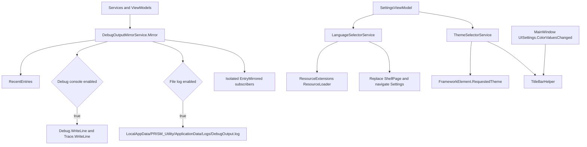

# 日志、本地化和主题架构

## Scope and non-responsibilities

本文覆盖 PRISM Utility 的调试输出镜像、本地化资源读取、扫描运行消息本地化、语言选择、主题选择和标题栏更新。来源限于当前源码，重点路径包括 `Host Software/PRISM Utility/Services/DebugOutputSettingsService.cs`、`Host Software/PRISM Utility/Services/DebugOutputMirrorService.cs`、`Host Software/PRISM Utility/Services/LanguageSelectorService.cs`、`Host Software/PRISM Utility/Services/ThemeSelectorService.cs`、`Host Software/PRISM Utility/Helpers/ResourceExtensions.cs`、`Host Software/PRISM Utility/Helpers/ScanRuntimeMessageLocalizer.cs`、`Host Software/PRISM Utility/Helpers/TitleBarHelper.cs`、`Host Software/PRISM Utility/MainWindow.xaml.cs`、`Host Software/PRISM Utility/App.xaml.cs`、`Host Software/PRISM Utility/Strings/en-us/Resources.resw` 和 `Host Software/PRISM Utility/Strings/zh-CN/Resources.resw`。

本文不覆盖 USB 协议日志内容本身。源码中的 `App_UnhandledException` 现在调用 `UnhandledExceptionReporter.Report`，先尝试 Debug mirror，再退到 Debug 和 Trace，并且不设置 `Handled`。本文也区分 `DebugOutputMirrorService` 覆盖的镜像输出和直接 `Debug.WriteLine` 诊断；`NavigationTimingLogger.Write` 直接写 Debug，不进入 mirror、Trace 或可选文件日志路径。

## Functionality

镜像日志输出由两个服务组成。`DebugOutputSettingsService` 从本地设置读取开关，`DebugOutputMirrorService` 将消息镜像到三个消费者: 最近内存列表、`Debug.WriteLine` 与 `Trace.WriteLine`、以及可选文件 `DebugOutput.log`。这不是所有诊断输出的总入口；例如 `NavigationTimingLogger.Write` 直接调用 `Debug.WriteLine`。

本地化使用 WinUI/Windows App SDK 的 `ResourceLoader`。`ResourceExtensions.GetLocalized` 和 `GetLocalizedOrFallback` 从 `ResourceLoader.GetString(resourceKey)` 读取字符串。缺失资源在 debug build 返回 `!!key!!`，release build 返回 key。带 fallback 的方法返回调用方传入的 fallback。

语言选择由 `LanguageSelectorService` 管理。它支持 `system`、`en-US` 和 `zh-CN`。`system` 会检查 `GlobalizationPreferences.Languages`，优先匹配 `zh` 或 `en`，否则回退 `en-US`。应用语言通过 `ApplicationLanguages.PrimaryLanguageOverride` 和 .NET `CultureInfo` 当前文化设置生效。

扫描运行消息本地化由 `ScanRuntimeMessageLocalizer` 完成。它把服务层英文状态字符串和部分正则形态映射到 `Scan_Runtime_` 或 `ScanDebug_Runtime_` 资源 key。未匹配文本原样返回。

主题由 `ThemeSelectorService` 管理。它读取和保存 `AppBackgroundRequestedTheme`，把 `ElementTheme` 应用到 `App.MainWindow.Content` 的 root element，然后调用 `TitleBarHelper.UpdateTitleBar` 更新标题栏按钮颜色。`MainWindow` 构造时设置窗口图标和标题，系统主题变化时通过 `UISettings.ColorValuesChanged` 派发到 UI 线程并调用 `TitleBarHelper.ApplySystemThemeToCaptionButtons`。

## Key entry points

- `DebugOutputSettingsService.InitializeAsync`，读取 console mirror 和 file log 开关。
- `DebugOutputSettingsService.SetDebugConsoleEnabledAsync` 和 `SetFileLogEnabledAsync`，保存日志开关。
- `DebugOutputMirrorService.Mirror`，接收 source 和 message，构建镜像条目。
- `DebugOutputMirrorService.RecentEntries` 和 `EntryMirrored`，提供内存消费者入口。
- `ResourceExtensions.GetLocalized`、`GetLocalizedOrFallback`、`GetLocalizedFormat`、`GetLocalizedFormatOrFallback`，提供资源读取扩展方法。
- `ResourceExtensions.ResetResourceLoader`，语言切换后重建 resource loader。
- `ScanRuntimeMessageLocalizer.LocalizeScanViewStatus` 和 `LocalizeScanDebugStatus`，映射运行状态消息。
- `LanguageSelectorService.InitializeAsync`、`ApplyLanguageAsync`、`SetLanguageAsync`，加载、应用和保存语言。
- `ThemeSelectorService.InitializeAsync`、`SetThemeAsync`、`SetRequestedThemeAsync`，加载和应用主题。
- `TitleBarHelper.UpdateTitleBar` 和 `ApplySystemThemeToCaptionButtons`，更新标题栏颜色。
- `App.OnLaunched`，启动时应用语言、初始化日志设置并调用 activation。
- `ActivationService.InitializeAsync` 和 `StartupAsync`，分别负责启动阶段主题加载和主题应用。
- `NavigationTimingLogger.Write`，直接写入 `Debug.WriteLine`，绕过 mirror、Trace 和文件日志。

## Implementation mechanism

`DebugOutputMirrorService.Mirror` 会忽略空白 message。非空 message 被格式化成 `[{timestamp:yyyy-MM-dd HH:mm:ss.fff}] [{source}] {message}`。服务先调用 `AddRecentEntry`，最多保留 500 条；如果 `IsDebugConsoleEnabled` 为 true，它同步写 `Debug` 和 `Trace`；如果 `IsFileLogEnabled` 为 true，它在通知订阅者前进入 append admission, 把已接收的文件写入记录为 append work, 再由后台路径执行 `AppendLineAsync(line)`；最后 `NotifySubscribers` 逐个通知 `EntryMirrored` 订阅者并隔离异常。`FlushAsync` 只等待调用时 snapshot 内已经 accepted 的 append work, 不等待之后才进入队列的 append。

文件日志路径在构造函数里通过 `ApplicationDataPathResolver.Resolve(LocalSettingsOptions.ApplicationDataFolder).DebugOutputLogPath` 生成。默认 application-data root 是 `PRISM_Utility/ApplicationData`，settings 和 log fallback 共用同一个 compiled resolver。`AppendLineAsync` 创建目录，进入 `_logFileGate` 后调用 `File.AppendAllTextAsync`。异常只写到 `Debug.WriteLine`。

`DebugOutputSettingsService` 有 `_initializeGate`，只初始化一次。两个开关分别从 `DebugConsoleMirrorEnabled` 和 `DebugFileLogEnabled` 读取 `bool?`，null 时默认 false。保存时先更新内存属性，再写本地设置。

`NavigationTimingLogger.Write` 是独立诊断路径。它格式化 `[NavigationTiming] {HH:mm:ss.fff} {message}` 并直接调用 `Debug.WriteLine`。该路径没有 `EntryMirrored`、`Trace.WriteLine` 或 `DebugOutput.log` 文件输出。

`ResourceExtensions` 用静态 `ResourceLoader` 和 `ResourceLoaderGate`。每次读取都在 lock 内调用 `ResourceLoader.GetString`。`ResetResourceLoader` 替换静态 loader，配合语言切换使用。`Host Software/PRISM Utility/Strings/en-us/Resources.resw` 和 `Host Software/PRISM Utility/Strings/zh-CN/Resources.resw` 都包含 `AppDisplayName`、`Settings_Theme.Text`、`Settings_Language.Text`、`Settings_Language_System`、`Settings_Language_English`、`Settings_Language_SimplifiedChinese`，也包含大量 `Scan_Runtime_` 和 `ScanDebug_Runtime_` key。

`LanguageSelectorService.SetLanguageAsync` 先 normalize 输入，再设置 `CurrentLanguage`、调用 `ApplyLanguage`、保存 `AppRequestedLanguage`，最后 `RefreshShellAsync`。`RefreshShellAsync` 将 `App.MainWindow.Content` 替换为新的 `ShellPage`，把标题设为 `"AppDisplayName".GetLocalized()`，重新应用主题，导航到 `SettingsViewModel`，然后激活窗口。

`ThemeSelectorService.LoadThemeFromSettingsAsync` 读取字符串并 `Enum.TryParse` 成 `ElementTheme`。保存时写入 `theme.ToString()`。`TitleBarHelper.UpdateTitleBar` 在 `ExtendsContentIntoTitleBar` 为 true 时，根据显式主题、系统背景或应用主题设置 caption button foreground、hover、pressed 和背景颜色。它还通过 `SendMessage` 触发标题栏刷新。

## Control and data flow

启动路径是 `App.OnLaunched` 先调用 `ILanguageSelectorService.InitializeAsync` 和 `ApplyLanguageAsync`，再初始化 `IDebugOutputSettingsService`，最后调用 `IActivationService.ActivateAsync`。`ActivationService.InitializeAsync` 调用 `_themeSelectorService.InitializeAsync` 加载主题，`StartupAsync` 调用 `_themeSelectorService.SetRequestedThemeAsync` 应用主题。设置页构造函数异步加载语言、日志、传输和色彩设置。用户切换语言时，服务刷新 culture、resource loader、Shell 和主题。用户切换主题时，服务立即修改 root requested theme 并保存设置。

镜像日志路径与 UI 设置解耦。任何调用 `Mirror` 的生产者不等待文件落盘。内存列表、Debug/Trace 和文件 append admission 在通知订阅者前完成，订阅者异常不会阻断后续订阅者或核心输出分支。已接收文件追加本体仍在后台 task 内完成, 但 `FlushAsync` 和 `ShutdownAsync` 可以等待已接收工作。`ShutdownAsync` 第一次调用会停止接收新的文件 append, repeated call 返回同一 shutdown task；调用方传入 cancellation token 时只限制自己的等待, 不取消 service 拥有的 cleanup。直接 `Debug.WriteLine` 诊断不经过这条路径，不能从 mirror recent entries 或文件日志中推断其存在。

## Dependencies

- `Host Software/PRISM Utility/App.xaml.cs` 注册日志、语言、主题和本地设置服务，并在启动时调用它们。
- `Host Software/PRISM Utility/ViewModels/SettingsViewModel.cs` 暴露日志开关、语言列表和主题命令。
- `Host Software/PRISM Utility/Services/DebugOutputSettingsService.cs` 依赖 `ILocalSettingsService`。
- `Host Software/PRISM Utility/Services/DebugOutputMirrorService.cs` 依赖 `IDebugOutputSettingsService` 和 `IOptions<LocalSettingsOptions>`。
- `Host Software/PRISM Utility/Services/LanguageSelectorService.cs` 依赖 `ILocalSettingsService`、`IThemeSelectorService`、`ShellPage`、`SettingsViewModel` 和 navigation service。
- `Host Software/PRISM Utility/Services/ThemeSelectorService.cs` 依赖 `ILocalSettingsService`、`App.MainWindow` 和 `TitleBarHelper`。
- `Host Software/PRISM Utility/Helpers/ResourceExtensions.cs` 依赖 `Microsoft.Windows.ApplicationModel.Resources.ResourceLoader`。
- `Host Software/PRISM Utility/Helpers/ScanRuntimeMessageLocalizer.cs` 依赖 `ResourceExtensions` 的 string extension methods。
- `Host Software/PRISM Utility/Helpers/TitleBarHelper.cs` 依赖 WinUI theme、`UISettings`、`AppWindow.TitleBar` 和 user32 `SendMessage`。
- `Host Software/PRISM Utility/Helpers/NavigationTimingLogger.cs` 依赖 `System.Diagnostics.Debug`，是 mirror 外的直接诊断输出。
- `Host Software/PRISM Utility/Services/ActivationService.cs` 依赖 `IThemeSelectorService`，负责 activation 前加载主题和 activation 后应用主题。
- `Host Software/PRISM Utility/Strings/en-us/Resources.resw` 与 `Host Software/PRISM Utility/Strings/zh-CN/Resources.resw` 是当前资源文件。

## State and concurrency

`DebugOutputMirrorService` 的内存列表由 `_recentEntriesGate` 保护，文件 append admission 和 shutdown 状态由 `_appendWorkGate` 保护，默认文件写入还用 `_logFileGate` 串行实际 disk append。因此单实例内部近期列表、accepted append tracking 和文件 append 是串行的。LOG-001 已关闭 shutdown flush 缺口: `FlushAsync` 等待 snapshot 内 accepted appends, `ShutdownAsync` 停止接收新文件 append 并等待已接收工作, shutdown 后 `Mirror` 仍保留 core output 和 subscriber notification, 但拒绝文件 append 并先写 diagnostic 再完成对应 append work。same-thread per-instance reentrant shutdown guard 避免 diagnostic sink 回入 shutdown 时自锁。LOG-002 已关闭订阅者异常外逃问题，失败订阅者会通过 safe diagnostic sink 记录，sink 抛错也不会传回 `Mirror`。

`DebugOutputSettingsService` 初始化用 `_initializeGate` 保护，但开关属性本身没有 volatile 或锁。UI 通常在 UI 线程修改，后台 mirror 同时读开关时可能读到旧值。当前影响是某条日志是否写到 Debug/Trace 或文件，源码没有更强一致性保证。

`ResourceExtensions` 对静态 `ResourceLoader` 的读取和重置使用同一 lock。`LanguageSelectorService` 的初始化也用 `_initializeGate`。语言切换后刷新 Shell 是较重操作，会替换 `App.MainWindow.Content` 并导航回 Settings。风险是正在进行的页面状态和订阅需要由各 ViewModel 生命周期自行处理，本文不声称 shell refresh 会保留所有页面状态。

`MainWindow.Settings_ColorValuesChanged` 注释说明回调来自非 UI 线程，所以用 dispatcher queue `TryEnqueue` 回到当前 app 线程。源码没有检查 `TryEnqueue` 返回值。

## Error handling

`DebugOutputMirrorService.AppendLineAsync` 的异常由 append observer 捕获, 并通过 `ReportDiagnostic("[DebugOutputMirror] Failed to append log file: ...")` 报告。由于 `Mirror` 不 await 文件 append, 该异常不会返回给 `Mirror` 调用者, 但会完成对应 append work, 让 `FlushAsync` 或 `ShutdownAsync` 不因失败 append 永久挂起。shutdown 后如果 `Mirror` 仍被调用, service 会跳过文件 append 并写入 skipped diagnostic。`NotifySubscribers` 获取 invocation list 后逐个调用订阅者，单个订阅者异常会进入 `ReportSubscriberFailure`，不会阻断后续订阅者，也不会传回 `Mirror`。`TryWriteDiagnostic` 还会吞掉 diagnostic sink 自身异常。

`ResourceExtensions.GetLocalized` 和 fallback 版本都捕获异常，写 `Debug` 和 `Trace` 后返回 missing fallback。缺失 key 也写 Debug/Trace。`GetLocalized` 对空白 key 抛 `ArgumentException`，这是调用方 contract。

`LanguageSelectorService.NormalizeLanguageTag` 对未知 language tag 回退 `en-US`。SET-005 后, `SettingsViewModel.OnSelectedLanguageChanged` 不再直接 fire and forget 调用 `SetLanguageAsync`; 它通过 `SettingsSaveCoordinator` 排队保存, latest failure 先写 `Settings.Persistence` diagnostic, 再经 UI dispatcher rollback language state 并显示既有 Settings persistence InfoBar。

`ThemeSelectorService.SetThemeAsync` 也没有本地 catch。SET-005 后, `SettingsViewModel.SwitchThemeCommand` await coordinator-backed operation result, failure 走同一 diagnostic、rollback 和 InfoBar 路径。debug、transfer 和 color settings 也使用同一 per-scope result model。

`App.App_UnhandledException` 调用 `UnhandledExceptionReporter.Report`，把异常送入 `DebugOutputMirrorService.Mirror`，并在 mirror 失败时退到 `Debug` 和 `Trace`。处理器不设置 `Handled`，APP-001 的 live WinUI controlled-event smoke 仍是 `ENVIRONMENT_BLOCKED`，不是通过证据。

## Test coverage

本文范围仍没有覆盖 `DebugOutputSettingsService`、`LanguageSelectorService`、`ThemeSelectorService` 或 `ResourceExtensions` 的专门测试文件。LOG-001 已由 `Log001DebugOutputMirrorLifecycleTests.cs` 覆盖 accepted append tracking、snapshot `FlushAsync`、idempotent `ShutdownAsync`、caller-bounded wait、diagnostic-before-completion、same-thread reentrant shutdown guard、append failure diagnostics、actual temp file ordered persistence、post-shutdown file policy 和 `MainWindow_Closed` scanner-before-log close。LOG-002 已由 `Log002DebugOutputMirrorTests.cs` 覆盖 core-first ordering、subscriber isolation、safe diagnostic sink、bounded reentry 和 append failure diagnostics。SET-002 已用 compiled resolver runtime tests 证明 settings/log fallback root parity；SET-005 focused 29 个 tests 覆盖 Settings persistence coordinator、per-scope InfoBar errors 和 bounded teardown；APP-001 已用 reporter tests 和 source contracts 证明顶层异常报告路径。LOG-001 focused 19 个 tests 两次通过, combined managed suite 为 487/487；文档源码引用检查和人工 source-backed 检查不能替代本地化 parity 测试或 live WinUI event smoke。

项目质量门应在发布前补充应用 UI smoke，至少覆盖日志开关、语言切换、主题切换和顶层异常呈现。文档验证流程覆盖本文件结构、Mermaid、本地链接和源码路径，并用 `MissingServiceCoverage` self-test 约束服务覆盖标记。

## Known issues and solutions

Issue-ID: LOGGING-LOCALIZATION-THEME-001

事实: LOG-001 已关闭。`Mirror` 仍不在调用线程等待磁盘写入, 但会在通知 subscribers 前完成文件 append admission 并跟踪 accepted append work。`FlushAsync` 等待调用时 snapshot 内 accepted appends；`ShutdownAsync` 停止接收新文件 append, 等待已接收 append, repeated call idempotent, caller cancellation 只限制调用方等待。应用关闭路径先等待 scanner cleanup, 再用 bounded async wait 调用 mirror shutdown, 没有在 handler 中做同步磁盘写入。shutdown 后的 `Mirror` 保留 recent entry、Debug/Trace 和 subscriber notification, 文件 append 被拒绝并先写 diagnostic 再完成对应 append work。same-thread per-instance reentrant shutdown guard 防止 diagnostic sink 回入 shutdown 自锁。

Issue-ID: LOGGING-LOCALIZATION-THEME-002

事实: LOG-002 已关闭。`Mirror` 先完成 recent entry、Debug/Trace 和文件 append admission，再通知 `EntryMirrored` subscribers；订阅者异常被隔离并送入 safe diagnostic sink，sink 失败也不会外逃。LOG-001 已单独关闭 accepted append flush 和 shutdown wait, 因此不要把 LOG-002 证据误写成文件落盘保证或顶层异常恢复策略。

Issue-ID: LOGGING-LOCALIZATION-THEME-003

事实: `App_UnhandledException` 已把顶层异常送入 reporter，reporter 尝试 debug mirror、Debug 和 Trace fallback，且不会向外抛出。APP-001 的 live WinUI controlled-event smoke 仍为 `ENVIRONMENT_BLOCKED`。建议: 后续如果需要用户可见 fatal error 或 handled 策略，应单独设计并验证。

Issue-ID: LOGGING-LOCALIZATION-THEME-004

事实: 语言切换会替换 Shell，并导航到 Settings。建议: 把此行为视为完整 shell refresh，记录用户状态丢失风险。不要把它描述为轻量热替换。

Issue-ID: LOGGING-LOCALIZATION-THEME-005

事实: SET-005 已关闭。`SettingsViewModel` 对语言和多个设置保存不再使用未观察 fire and forget 属性回调；owner-scoped `SettingsSaveCoordinator` 管理 language、theme、debug、transfer 和 color 五个 family 以及 restore/default 命令。latest failure 先写 mirror diagnostic, 再经 UI dispatcher rollback 并显示既有 Settings persistence InfoBar。normal/recovery en/zh visual captures clean；rendered failure InfoBar/accessibility evidence 为 `HARNESS_BLOCKED`, 不能写成 error-state visual pass。建议: 新增 setting family 时接入同一 coordinator 和 per-scope error model。

Issue-ID: LOGGING-LOCALIZATION-THEME-006

事实: `MainWindow.Settings_ColorValuesChanged` 忽略 `dispatcherQueue.TryEnqueue` 返回值。建议: 如果标题栏颜色一致性成为问题，应记录派发失败路径或在窗口关闭期间忽略。

Issue-ID: LOGGING-LOCALIZATION-THEME-007

事实: 启动时主题不是只由 `App.OnLaunched` 直接完成；`ActivationService.InitializeAsync` 加载主题，`ActivationService.StartupAsync` 应用主题。建议: 后续改启动顺序时把 activation 服务纳入验证范围。

Issue-ID: LOGGING-LOCALIZATION-THEME-008

事实: `NavigationTimingLogger.Write` 直接写 `Debug.WriteLine`，绕过 `DebugOutputMirrorService` 的内存、Trace 和文件输出。建议: 文档和排障步骤区分 mirror 日志与直接 Debug 诊断，不要把文件日志当作全量诊断记录。

Registry links: LOGGING-LOCALIZATION-THEME-001 -> [LOG-001](issues-and-remediation.md#log-001); LOGGING-LOCALIZATION-THEME-002 -> [LOG-002](issues-and-remediation.md#log-002); LOGGING-LOCALIZATION-THEME-003 -> [APP-001](issues-and-remediation.md#app-001); LOGGING-LOCALIZATION-THEME-004 -> [LOG-004](issues-and-remediation.md#log-004); LOGGING-LOCALIZATION-THEME-005 -> [SET-005](issues-and-remediation.md#set-005); LOGGING-LOCALIZATION-THEME-006 -> [LOG-003](issues-and-remediation.md#log-003); LOGGING-LOCALIZATION-THEME-007 -> [LOG-005](issues-and-remediation.md#log-005); LOGGING-LOCALIZATION-THEME-008 -> [LOG-006](issues-and-remediation.md#log-006).

## Related source

- `Host Software/PRISM Utility/Services/DebugOutputSettingsService.cs`
- `Host Software/PRISM Utility/Services/DebugOutputMirrorService.cs`
- `Host Software/PRISM Utility/Services/LanguageSelectorService.cs`
- `Host Software/PRISM Utility/Services/ThemeSelectorService.cs`
- `Host Software/PRISM Utility/Helpers/ResourceExtensions.cs`
- `Host Software/PRISM Utility/Helpers/ScanRuntimeMessageLocalizer.cs`
- `Host Software/PRISM Utility/Helpers/TitleBarHelper.cs`
- `Host Software/PRISM Utility/MainWindow.xaml.cs`
- `Host Software/PRISM Utility/App.xaml.cs`
- `Host Software/PRISM Utility/Services/ActivationService.cs`
- `Host Software/PRISM Utility/ViewModels/SettingsViewModel.cs`
- `Host Software/PRISM Utility/Helpers/NavigationTimingLogger.cs`
- `Host Software/PRISM Utility/Strings/en-us/Resources.resw`
- `Host Software/PRISM Utility/Strings/zh-CN/Resources.resw`
