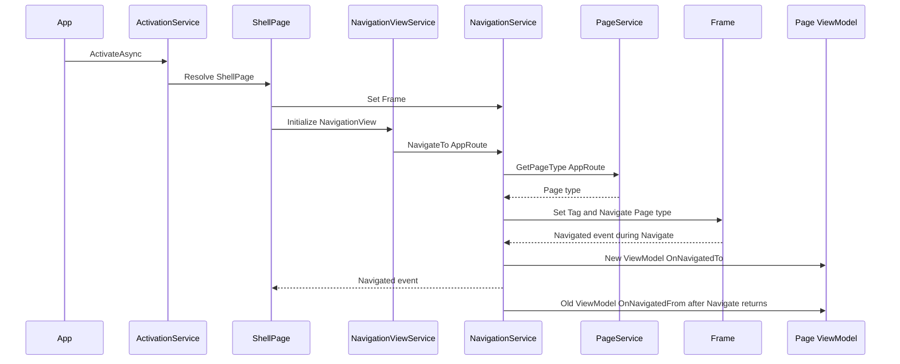

# 导航与 Shell

## 范围与非职责 Scope and non-responsibilities

本文覆盖 Shell 页面组合、`Frame` 导航、`NavigationView` 菜单调用、Page 与 ViewModel 映射、编译期 Page host 契约、标题栏和 Header 行为。范围对应 C1 的 Shell 基础设施和 C2 UI/MVVM 的导航边界。

本文不解释各业务页的扫描、设置、日志或胶片档案逻辑，也不把每个页面的 XAML 布局拆成单独说明。

## 功能 Functionality

Shell 由 `ActivationService` 解析 `ShellPage` 后放入主窗口。`ShellPage` 将 `NavigationFrame` 交给 `NavigationService`，并把 `NavigationViewControl` 交给 `NavigationViewService`。菜单项通过 `NavigationHelper.NavigateTo` 附加属性存放 nullable `AppRoute`，点击后由 `NavigationViewService` 经 resolver seam 调用 `NavigationService.NavigateTo`。

`PageService` 用七值 `AppRoute` 映射到 Page 类型。每个注册项通过 `Configure<TPage, TViewModel>` 约束 route、Page 和 ViewModel 的精确配对，其中 `TPage : Page, IPageViewModelHost<TViewModel>`。`NavigationService` 根据 typed route 找 Page，执行 `Frame.Navigate`，再通过 `FrameExtensions.GetPageViewModel` 直接读取 `IPageViewModelHost` 暴露的 ViewModel，触发 `INavigationAware` 回调。`ShellViewModel` 监听导航事件，维护返回按钮、选中菜单、Header 文本和扫描器连接状态。

## 关键入口 Key entry points

| 入口 | 源码证据 | 作用 |
| --- | --- | --- |
| `ShellPage.ShellPage` | `PRISM Utility/Views/ShellPage.xaml.cs` | 设置 `NavigationService.Frame`，初始化 `NavigationViewService`，绑定标题栏和卸载清理。 |
| `ShellPage.xaml` | `PRISM Utility/Views/ShellPage.xaml` | 定义 `NavigationViewControl`、`NavigationFrame` 和菜单项的 enum route `NavigationHelper.NavigateTo`。 |
| `ShellViewModel.ShellViewModel` | `PRISM Utility/ViewModels/ShellViewModel.cs` | 订阅 `NavigationService.Navigated` 和扫描器访问快照。 |
| `PageService.PageService` | `PRISM Utility/Services/PageService.cs` | 注册 7 个 ViewModel 到 Page 的映射。 |
| `NavigationService.NavigateTo` | `PRISM Utility/Services/NavigationService.cs` | 解析 Page 类型，执行 Frame 导航，记录导航耗时。 |
| `NavigationViewService.OnItemInvoked` | `PRISM Utility/Services/NavigationViewService.cs` | 根据菜单项附加属性导航，设置项通过 resolver seam 导航到 `AppRoute.Settings`。 |
| `FrameExtensions.GetPageViewModel` | `PRISM Utility/Helpers/FrameExtensions.cs` | 从 `IPageViewModelHost` 直接取得当前 Page 的 `ViewModel`，非 host 内容抛出明确异常。 |
| `NavigationViewHeaderBehavior.OnNavigated` | `PRISM Utility/Behaviors/NavigationViewHeaderBehavior.cs` | 导航后更新 NavigationView Header 与模板。 |

## 实现机制 Implementation mechanism

Page 映射是显式注册而不是运行时扫描。`PageService` 注册七个 `AppRoute` 到 Page 类型的闭合集合，并防止重复 route、重复 Page 类型和缺失 enum 值。当前 route 是 `Main`、`Log`、`Scan`、`ScanDebug`、`FilmProfileEditor`、`Settings` 和 `DeviceConfiguration`。

导航调用分为三层。第一层是 `NavigationViewService` 从 `NavigationViewItemInvokedEventArgs` 取得菜单项。第二层是 `NavigationService.NavigateTo` 用 `IPageService.GetPageType` 找 Page，先把 `clearNavigation` 写入 `Frame.Tag`，再调用 `Frame.Navigate`。第三层是 `NavigationService.OnNavigated` 在 `Frame.Navigate` 过程中处理 `Frame.Navigated` 事件：仅当 `Frame.Tag` 中的 `clearNavigation` 为 `true` 时清理 BackStack，然后调用新页面 ViewModel 的 `OnNavigatedTo`，再发布 `Navigated` 事件给 Shell 和 Header behavior。`Frame.Navigate` 返回后，`NavigateTo` 才对旧 ViewModel 调用 `OnNavigatedFrom`。

Page ViewModel 契约集中在 `IPageViewModelHost<TViewModel>` 和 `PageService.Configure<TPage, TViewModel>`。`IPageViewModelHost<TViewModel>` 继承非泛型 `IPageViewModelHost`，并通过显式接口实现把 typed `ViewModel` 暴露为 object。泛型接口保持不变性，因此 `IPageViewModelHost<DerivedViewModel>` 不能替代 `IPageViewModelHost<BaseViewModel>`。`PageService.Configure` 的泛型约束让缺少 host、错误 ViewModel 配对和 variance 误配在编译期失败。

Header 行为使用附加属性控制当前 Page 的 Header。`NavigationViewHeaderBehavior` 通过静态 `_current` 持有当前 behavior，并在 `DefaultHeaderProperty`、`HeaderModeProperty`、`HeaderContextProperty`、`HeaderTemplateProperty` 的回调中调用 `_current!.UpdateHeader()` 或 `_current!.UpdateHeaderTemplate()`。`HeaderModeProperty` 的 getter、setter 和依赖属性注册现在都使用 `NavigationViewHeaderMode`，`PRISM Utility/Views/ScanPage.xaml` 和 `PRISM Utility/Views/ScanDebugPage.xaml` 继续以 `HeaderMode="Never"` 使用 enum 字符串。UI-001 的 bool/enum 注册缺陷已由 source-contract tests 和 x64 XAML 编译输出关闭。

PageMapping: MainPage -> MainViewModel; LogPage -> LogViewModel; ScanPage -> ScanViewModel; ScanDebugPage -> ScanDebugViewModel; FilmProfileEditorPage -> FilmProfileEditorViewModel; SettingsPage -> SettingsViewModel; DeviceConfigurationPage -> DeviceConfigurationViewModel. All seven real pages implement the exact matching `IPageViewModelHost<TViewModel>` contract.

## 主要控制/数据流 Control and data flow

1. `ActivationService` 解析 `ShellPage` 并设置 `App.MainWindow.Content`。
2. `ShellPage` 构造函数把 `NavigationFrame` 写入 `NavigationService.Frame`。
3. `ShellPage` 调用 `NavigationViewService.Initialize(NavigationViewControl)` 订阅返回和菜单点击。
4. 用户点击菜单项或设置项。
5. `NavigationViewService.OnItemInvoked` 读取 `NavigationHelper.NavigateToProperty`，或对设置项解析为 `AppRoute.Settings`。
6. `NavigationService.NavigateTo` 通过 `PageService.GetPageType` 得到目标 Page 类型。
7. `NavigationService.NavigateTo` 将 `clearNavigation` 写入 `Frame.Tag`，保存旧页面 ViewModel，然后调用 `Frame.Navigate`。
8. `Frame.Navigate` 过程中触发 `Frame.Navigated`，`NavigationService.OnNavigated` 读取 `Frame.Tag`；只有该值为 `true` 时才清空 BackStack。
9. 同一个 `OnNavigated` 处理器对新页面 ViewModel 调用 `OnNavigatedTo(e.Parameter)`，再发布 `Navigated`。
10. `ShellViewModel.OnNavigated` 更新返回状态、选中项和 Header 文本。
11. `NavigationViewHeaderBehavior.OnNavigated` 根据附加属性更新 Header。
12. `Frame.Navigate` 返回后，如果导航成功，`NavigateTo` 更新 `_lastParameterUsed`，再对旧 ViewModel 调用 `OnNavigatedFrom`。

## 依赖关系 Dependencies

| 上游 | 下游 | 证据 |
| --- | --- | --- |
| `ShellPage` | `ShellViewModel`、`INavigationService`、`INavigationViewService` | `PRISM Utility/Views/ShellPage.xaml.cs` |
| `ShellViewModel` | `INavigationService`、`INavigationViewService`、`IScannerAccessCoordinator`、`IUiDispatcher` | `PRISM Utility/ViewModels/ShellViewModel.cs` |
| `NavigationViewService` | `INavigationService`、`IPageService`、`NavigationHelper` | `PRISM Utility/Services/NavigationViewService.cs` |
| `NavigationService` | `IPageService`、`FrameExtensions`、`INavigationAware` | `PRISM Utility/Services/NavigationService.cs` |
| `PageService` | Page 类型和 ViewModel 类型 | `PRISM Utility/Services/PageService.cs` |
| `NavigationViewHeaderBehavior` | `INavigationService`、`NavigationView` 附加属性 | `PRISM Utility/Behaviors/NavigationViewHeaderBehavior.cs` |

## Mermaid

## 状态与并发 State and concurrency

`NavigationService` 保存 `_frame` 和 `_lastParameterUsed`，并在设置新 Frame 前注销旧 Frame 的 `Navigated` 事件。`Frame.Tag` 临时保存 `clearNavigation`，`OnNavigated` 读取后只有在该值为 `true` 时才清空 BackStack。生产导航生命周期顺序是先捕获旧页面的 `INavigationAware`，`Frame.Navigate` 触发 `OnNavigated`，新页面先执行 `OnNavigatedTo(parameter)`，随后发布 `Navigated` 给 Shell 和 Header behavior；`Frame.Navigate` 返回成功后才更新 `_lastParameterUsed` 并调用旧页面 `OnNavigatedFrom()`。`GoBack` 使用同一个 dispatcher 顺序，并且只有成功导航才调用旧页面 `OnNavigatedFrom()`。

`PageService` 的 `_pages` 字典在注册和读取时都用 `lock (_pages)` 保护。由于注册只在构造函数中发生，运行期主要是读路径。

`NavigationViewService` 保存 `_navigationView` 并订阅 `BackRequested`、`ItemInvoked`。`ShellPage.OnUnloaded` 调用 `UnregisterEvents`，同时让 `ShellViewModel.UnregisterNavigation` 解除导航和扫描器快照订阅。

`ShellViewModel.OnScannerAccessSnapshotChanged` 使用 `IUiDispatcher.TryEnqueue` 回到 UI 线程更新状态。`ShellPage` 使用 `DispatcherQueueTimer` 刷新运行中扫描器状态图标，并在卸载时停止计时器。

## 错误处理 Error handling

`PageService.GetPageType` 找不到 route 时抛出 `ArgumentException`，重复 route 或重复 Page 类型会在配置阶段抛出，缺少 enum 值会在 `ValidateExhaustiveRoutes` 抛出。`NavigationService.NavigateTo` 的重复导航抑制是空值敏感的：只有目标 Page 类型不同，或请求参数非 null 且不等于 `_lastParameterUsed` 时才会导航；因此同页请求传入 null 参数会返回 `false`，即使上一次成功导航保存的 `_lastParameterUsed` 是非 null。`NavigationViewService.OnItemInvoked` 对缺少 `NavigationHelper.NavigateTo` 的普通项不导航，并通过 resolver seam 返回 diagnostic。

`FrameExtensions.GetPageViewModel` 对 null content 返回 null；对非 null 但未实现 `IPageViewModelHost` 的内容抛出 `InvalidOperationException`，错误文本包含 `must implement IPageViewModelHost`。`GetNavigationAwareViewModel` 只在 host 的 ViewModel 实现 `INavigationAware` 时返回实例。`NavigationViewHeaderBehavior` 的依赖属性回调使用 `_current!`，如果附加属性变化发生在 behavior 附加之前或分离之后，存在空引用风险。

## 测试覆盖 Test coverage

当前测试清单包含 UI-001 的 `NavigationViewHeaderBehavior` source-contract 覆盖，证明 `HeaderModeProperty` 注册为 `NavigationViewHeaderMode`，并且 Scan/ScanDebug XAML 仍使用 `HeaderMode="Never"`。x64 XAML 编译输出也证明生成的 XAML member 和 setter cast 使用 enum。UI-002 由 16 个 focused tests 两次覆盖 `AppRoute` 七值闭集、`INavigationService` 和 `IPageService` typed signatures、nullable enum `NavigationHelper.NavigateTo`、无 full-name route 字符串、`PageService` duplicate/missing/invalid route 拒绝、transition decider 和 resolver seam。UI-003 由 8 个 focused tests 两次覆盖 `IPageViewModelHost<TViewModel>`、`PageService` exact route/Page/ViewModel constraint、七个真实 Page host 声明、negative compile missing host、wrong pairing 和 invariance、real app metadata probe、direct `FrameExtensions` retrieval 和 nonhost failure、production navigation 无反射以及 lifecycle callback order。UI-002+UI-003 合计 24 个 focused tests 通过，full managed suite 511/511 通过。Core/app builds 通过且只保留既有 app warning。real-app harness、fresh seven-route/back/same-route UIA 和 dual visual QA 均记录导航行为 GOOD，DeviceConfiguration 经 footer flyout 进入。导航图和源码路径由 `validate-docs.ps1 -Mode Full` 的章节、路径、链接和 Mermaid 检查覆盖。

Task 25 reran the current UI-002/UI-003 source-contract filter and it passed 24/24. The older `.omo/harness/task-16-ui002-route-harness.ps1` is now stale because it expects the previous `new(AppRoute.X, typeof(Page))` PageService source shape, while current source uses `Configure<TPage,TViewModel>(AppRoute.X)`. Historical native UIA navigation summaries remain inventory only; TEST-002 is still blocked for maintained end-to-end navigation, language switch state retention and window-close teardown automation.

## 已知问题与解决方案 Known issues and solutions

| ID | 问题 | 证据 | 影响 | 短期方案 | 长期方案 |
| --- | --- | --- | --- | --- | --- |
| C1-NAV-001 | typed route contract 已关闭 full-name route 字符串风险。 | `AppRoute` 定义七个 route；`INavigationService.NavigateTo`、`IPageService.GetPageType`、`NavigationHelper.NavigateTo` 和 `PageService` 都使用 typed route；production navigation source 不再包含 ViewModel `FullName` route 字符串。 | route 字符串漂移风险已关闭；UI-005 的 unset item 诊断仍独立开放。 | 新增导航目标必须同步 `AppRoute`、`PageService`、Shell literal 和 route tests。 | 保持 route source-contract、runtime harness、real-app harness、UIA 和 doc Full validator 作为回归门。 |
| C1-NAV-002 | compile-time Page host contract 已关闭 runtime ViewModel lookup 风险。 | `IPageViewModelHost<TViewModel>` 暴露 typed `ViewModel`；`PageService.Configure<TPage, TViewModel>` 约束 `TPage : Page, IPageViewModelHost<TViewModel>`；七个真实 Page 都声明精确 host pair；`FrameExtensions.GetPageViewModel` 直接读取 `IPageViewModelHost` 并对非 host 内容抛出明确异常。 | 页面缺 host、错误 ViewModel 配对和 variance 误配会在编译期或 contract probe 中失败，导航感知回调不会因缺 host 被静默跳过。 | 新增页面必须同时添加 `AppRoute`、`PageService` registration、Page host 声明和 UI-003 contract coverage。 | 保持 UI-003 focused tests、negative compile harness、production metadata probe、lifecycle ordering test、real-app metadata、UIA/visual QA 和 Full validator 作为回归门。 |
| C1-SHELL-001 | Header behavior 使用静态 `_current!`。 | `PRISM Utility/Behaviors/NavigationViewHeaderBehavior.cs` 的依赖属性回调调用 `_current!.UpdateHeader()`。 | 多 Shell、分离后属性变化或测试场景可能触发空引用或错误实例更新。 | 在回调中检查 `_current` 并记录无当前实例的情况。 | 移除静态全局状态，把 behavior 实例通过依赖属性回调参数定位。 |
| C1-SHELL-002 | 普通菜单项缺少导航附加属性时仍缺少用户可见反馈。 | `NavigationViewRouteResolver.Resolve` 对 unset item 返回 diagnostic，`NavigationViewService.OnItemInvoked` 写入 `NavigationTimingLogger` 后不导航。 | XAML 配置错误仍可能表现为点击无反应，定位依赖 Debug 诊断。 | 对可点击但无 route 的项保留诊断日志。 | 建立 Shell XAML 菜单到 PageService 的验证测试，并决定是否需要用户可见反馈。 |
| C1-SHELL-003 | `HeaderModeProperty` 注册类型已与访问器和使用方一致。 | `PRISM Utility/Behaviors/NavigationViewHeaderBehavior.cs` 的 `GetHeaderMode`、`SetHeaderMode` 和 `HeaderModeProperty` 都使用 `NavigationViewHeaderMode`；`PRISM Utility/Views/ScanPage.xaml` 和 `PRISM Utility/Views/ScanDebugPage.xaml` 使用 `HeaderMode="Never"`。 | 原 bool/enum 解析风险已关闭；真实页面视觉交互仍需要 WinUI smoke。 | 保留 Scan/ScanDebug 页面加载 smoke, 但不再把 HeaderMode enum 注册作为当前缺陷。 | 后续若处理 `_current` 静态风险, 给 attach、detach 和属性变化顺序补测试。 |

Registry links: C1-NAV-001 -> [UI-002](issues-and-remediation.md#ui-002); C1-NAV-002 -> [UI-003](issues-and-remediation.md#ui-003); C1-SHELL-001 -> [UI-004](issues-and-remediation.md#ui-004); C1-SHELL-002 -> [UI-005](issues-and-remediation.md#ui-005); C1-SHELL-003 -> [UI-001](issues-and-remediation.md#ui-001).

## 相关源码 Related source

| 路径 | 关键符号 |
| --- | --- |
| `PRISM Utility/Services/PageService.cs` | `PageService`、`GetPageType`、`Configure<TPage,TViewModel>` |
| `PRISM Utility/Services/NavigationService.cs` | `NavigationService`、`NavigateTo`、`GoBack`、`OnNavigated` |
| `PRISM Utility/Services/NavigationViewService.cs` | `NavigationViewService`、`Initialize`、`OnItemInvoked`、`GetSelectedItem` |
| `PRISM Utility/Views/ShellPage.xaml` | `NavigationViewControl`、`NavigationFrame`、菜单 `NavigationHelper.NavigateTo` |
| `PRISM Utility/Views/ShellPage.xaml.cs` | `ShellPage`、`OnUnloaded`、`OnKeyboardAcceleratorInvoked` |
| `PRISM Utility/ViewModels/ShellViewModel.cs` | `ShellViewModel`、`OnNavigated`、`UnregisterNavigation` |
| `PRISM Utility/Helpers/FrameExtensions.cs` | `GetPageViewModel`、`GetNavigationAwareViewModel` |
| `PRISM Utility/Contracts/ViewModels/IPageViewModelHost.cs` | `IPageViewModelHost`、`IPageViewModelHost<TViewModel>` |
| `PRISM Utility/Contracts/Navigation/NavigationLifecycleDispatcher.cs` | `CaptureNavigationAware`、`NotifyNavigatedToThenPublish`、`NotifyNavigatedFromAfterFrameResult` |
| `PRISM Utility/Helpers/NavigationHelper.cs` | `NavigateToProperty` |
| `PRISM Utility/Behaviors/NavigationViewHeaderBehavior.cs` | `NavigationViewHeaderBehavior`、`HeaderModeProperty` |
