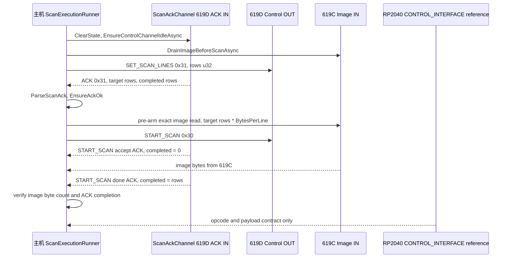

# 扫描协议与执行

## Scope and non-responsibilities

本文只说明主机端扫描协议封装和一次扫描执行路径。主机实现来自 `Host Software/PRISM Utility.Core/Services/ScanProtocolService.cs`、`Host Software/PRISM Utility.Core/Services/ScanAckChannel.cs`、`Host Software/PRISM Utility.Core/Services/ScanExecutionRunner.cs`、`Host Software/PRISM Utility.Core/Services/ScanSessionService.cs` 和 `Host Software/PRISM Utility.Core/Models/ScanDebugModels.cs`。

固件语义只引用 RP2040 已发布的 [CONTROL_INTERFACE.md](../../../100_Scanner_Firmware/Project_PRISM_RP2040/CONTROL_INTERFACE.md)。本文不审计固件内部、PIO 时序、板 100 到板 102 的 UART 细节，也不把调试 passthrough 后面的从板命令当作稳定主机 API。

## Functionality

扫描协议层有三类责任。

1. `ScanProtocolService` 生成主机到设备的 `0xA5` 命令帧，解析设备到主机的 `0x5A` 响应帧，并把状态码映射成可读文本。
2. `ScanAckChannel` 独占控制 IN 读循环，把普通 ACK 入队，把 motion complete event 路由到电机事件缓存和 `MotionEventReceived` 回调。
3. `ScanExecutionRunner` 按 `SET_SCAN_LINES -> START_SCAN -> done ACK` 顺序协调 619D 控制通道和 619C 图像通道，保证图像读取在开始扫描前预 arm。

协议参考说明 USB 控制接口使用 `VID 0x1D50`、`PID 0x619D`，命令帧格式为 `0xA5, opcode, payload_len_le, payload`，响应帧格式为 `0x5A, opcode, status, payload_len_le, payload`。主机常量在 `ScanDebugConstants` 中对应 `HostFrameSof = 0xA5`、`DeviceFrameSof = 0x5A`、`BulkOutPid = 0x619D`、`BulkInPid = 0x619C`、`BulkInEndpoint = 0x82`、`BulkOutEndpoint = 0x01`、`BulkOutAckEndpoint = 0x81`。

## Key entry points

| Entry point | 作用 | 关键边界 |
| --- | --- | --- |
| `ScanProtocolService.BuildSetScanLinesCommand(int rows)` | 构造 `0x31` 帧，payload 是 little endian `u32 rows` | 只编码主机帧，不发送 USB |
| `ScanProtocolService.BuildStartScanCommand()` | 构造 `0x30` START_SCAN 空 payload 帧 | 不等待 ACK |
| `ScanProtocolService.ParseScanAck(ScanControlFrame frame)` | 从 8 字节 payload 解析 target 和 completed | payload 长度不符抛 `IOException` |
| `ScanProtocolService.EnsureAckOk(ScanAck ack, int expectedRows, string commandName)` | 校验 `status == 0x00` 和 target 行数 | 状态码或行数不符抛 `IOException` |
| `ScanAckChannel.Start(IUsbBulkDuplexSession controlSession, CancellationToken ct)` | 启动控制 ACK 读循环 | 生命周期绑定连接 token |
| `ScanAckChannel.ReadAckForCommandAsync(...)` | 按 expected opcode 等待 ACK | 可忽略 foreign command |
| `ScanAckChannel.MonitorStartScanAcksAsync(...)` | 监听 START_SCAN accept ACK 和 done ACK | BUSY 会退避，取消返回 false |
| `ScanExecutionRunner.StartScanAsync(...)` | 单段扫描入口 | 返回 `ScanStartResult`，不向外抛普通失败 |
| `ScanExecutionRunner.StartSegmentedScanAsync(...)` | 超出单次读取上限时分段扫描 | 每段单独执行协议序列 |
| `ScanSessionService.StartScanAsync(...)` | 对外 session API | 未连接时直接返回失败结果 |

## Implementation mechanism

主机发送帧时，`ScanProtocolService` 固定写入 `HostFrameSof` 和 opcode，再用 little endian 写 payload 长度。`BuildSetScanLinesCommand` 分配 8 字节并写入 `UsbCmdSetScanLines = 0x31`，`BuildStartScanCommand` 分配 4 字节并写入 `UsbCmdStartScan = 0x30`，`BuildStopScanCommand` 对应 `0x32`。

主机接收帧时，`TryDequeueControlFrame` 在字节缓冲里寻找 `DeviceFrameSof`，要求响应头至少 5 字节，读取 payload 长度并限制在 `ControlFrameMaxPayloadBytes` 内，然后弹出 `ScanControlFrame(Opcode, Status, Payload)`。这和协议参考的设备响应帧一致，但主机上限来自 `ScanDebugConstants.ControlFrameMaxPayloadBytes = 64`，不是固件文档里参数写 payload 的 32 字节说明。

`ScanAckChannel.RunControlAckReadLoopAsync` 从 619D ACK IN 端点持续读取小块数据。读到完整帧后，先调用 `TryRouteMotionEvent`。如果 opcode 是 `UsbEvtMotionComplete = 0x58` 或 `UsbCmdMotionGetState = 0x50`，状态为 OK，payload 长度为 14 字节，就调用 `ParseMotionEventPayload` 并更新 `_latestMotionEvents`。其他帧进入 `_ackQueue`，由 `ReadAckForCommandAsync` 和 START_SCAN monitor 消费。

`ScanExecutionRunner.ExecuteScanSegmentAsync` 是扫描执行的核心。

1. 发送 `SET_SCAN_LINES`，等待 `0x31` ACK，解析 `ScanAck`，并用 `EnsureAckOk` 校验 status 和 target 行数。
2. 调用 `ArmImageReadAsync`，在 619C 图像通道上预先启动 `ReadBulkInExactAsync` 或 `ReadBulkInExactMultiBufferedAsync`。
3. 发送 `START_SCAN`，同时启动 `MonitorStartScanAcksAsync` 等待 accept ACK 和 done ACK。
4. 等图像读取任务返回，校验字节数等于 `rows * BytesPerLine`。
5. 等 START_SCAN done ACK。若未及时收到，执行失败收尾路径。

Protocol: SET_SCAN_LINES -> START_SCAN -> done ACK

## Control and data flow

分段扫描复用同一段内流程。`StartSegmentedScanAsync` 先计算总字节数和段数。每段调用 `ExecuteScanSegmentAsync`，但传入单次读取模式和该段的行数。段完成后把 image chunk 复制到总 buffer，并通过 `UsbBulkDuplexSession.ReportCompletedWholeRows` 把累计完成行通知给 `onRowsAvailable`。

## Dependencies

扫描执行依赖这些边界。

| Dependency | 用途 |
| --- | --- |
| `IUsbBulkDuplexSession` | 控制 OUT、控制 ACK IN、图像 IN 的实际 USB 读写 |
| `IScanTransferSettingsService` | 选择 single request、multi-buffer 和 raw IO 读取方式 |
| `ScanDebugConstants` | opcode、VID/PID、端点、payload 长度、超时、每行字节数 |
| `ScanProtocolService` | 帧构造、ACK 解析、状态码解释 |
| `ScanAckChannel` | 控制响应多路复用和 motion event 分发 |
| RP2040 control interface reference | 固件对 opcode、payload、状态码的公开约定 |

## State and concurrency

`ScanAckChannel` 有三个共享状态区。`_ackReadBuffer` 保存尚未组帧的控制字节，`_ackQueue` 保存普通 ACK，`_latestMotionEvents` 保存每个电机最近一次完成事件。对应访问使用 `lock` 和 `SemaphoreSlim` 协调。`ClearState` 会清空缓冲、队列、motion event 和信号计数，扫描开始前和 session 断开时都会使用。

图像读取和 START_SCAN ACK 监听并行进行。主机先预 arm 图像读取，随后发送 START_SCAN，再让 ACK monitor 观察 accept ACK 和 done ACK。这样避免固件已经开始向 619C 输出数据时主机还没有提交读取请求。

回调边界如下。

| Callback | 调用位置 | 异常边界 |
| --- | --- | --- |
| `Action<string>? onStatus` | 扫描状态、BUSY、完成、错误文字 | 调用方异常没有统一捕获 |
| `Action<string>? onDiagnostic` | 诊断 run id 和耗时标记 | 调用方异常没有统一捕获 |
| `Action<int, int>? onProgress` | 字节进度 | 传给 USB 读取实现，本文不假设其内部捕获 |
| `ScanRowsAvailableHandler? onRowsAvailable` | 图像读取过程或分段累计行 | 由 USB 读取或分段汇报路径触发 |
| `MotionEventReceived` | motion event 路由后同步触发 | `RunControlAckReadLoopAsync` 外层 catch 会吞掉异常并继续读循环 |

## Error handling

`ScanExecutionRunner.StartScanAsync` 和 `StartSegmentedScanAsync` 把 `OperationCanceledException` 转成 `ScanStartResult(false, "Scan stopped.", null)`。其他异常转成失败结果并带上 elapsed milliseconds。`StopScanAsync` 也把异常转成 `ScanStopResult(false, ...)`。

ACK 错误分三层处理。`ReadAckForCommandAsync` 超时会抛 `IOException`。`ParseScanAck` 负责 payload 长度。`EnsureAckOk` 负责 status 和 target 行数。START_SCAN monitor 额外处理 `USB_STATUS_DEVICE_BUSY = 0xE6`，按指数退避重试，超过 `StartScanBusyMaxCount` 后返回 false。

图像读取成功但 done ACK 没到时，`FinalizeAfterFailedImageReadAsync` 先给 ACK task 一个 grace wait，再尝试发送 `STOP_SCAN` 并等待 ACK，最后 drain pending ACK。这个路径用诊断回调记录失败，不把 STOP_SCAN 收尾失败伪装成成功。

取消边界也有限制。正常扫描使用调用方 token。失败收尾的 STOP_SCAN 发送使用 `CancellationToken.None`，目的是在外部取消后仍尽量让设备回到空闲。session 断开时，`DisconnectSessionsInternalAsync` 取消连接 token、等待 ACK loop、释放两个 USB session、清空 ACK 状态。

## Test coverage

可定位的相关测试包括 `Host Software/PrismUtility.Core.Tests/ScanSessionServiceUsbRefreshTests.cs` 对 session/USB 刷新的覆盖，以及 `Host Software/PrismUtility.Core.Tests/ScanWorkflowServiceTests.cs` 对工作流选择和 pass 行为的覆盖。建议的产品级验证还应覆盖真实设备或 fake USB 的 ACK、取消和失败收尾路径。

本文档的可执行检查由 `Host Software/docs/architecture/validate-docs.ps1` 覆盖，Partial 模式要求本文件具备标准章节、可解析 Mermaid、本地链接和有效源码路径。`-SelfTest MissingProtocolStep` 会把 fixture 中的 `done ACK` 移除，并确认协议步骤缺失会被拒绝。

## Known issues and solutions

Issue-ID: SCAN-PROTOCOL-001

已验证事实：`onStatus`、`onDiagnostic` 和部分进度回调没有在 `ScanExecutionRunner` 内统一捕获异常。建议调用方保持回调轻量，或后续把回调调用包装成不会中断扫描状态机的通知层。

Issue-ID: SCAN-PROTOCOL-002

已验证事实：`MonitorStartScanAcksAsync` 对未知异常返回 false，但不携带异常细节。现有诊断对 BUSY 和 timeout slices 有记录，非 timeout 异常的可见性较弱。建议保留当前安全失败语义，并在后续增加非 timeout 异常诊断文本。

Issue-ID: SCAN-PROTOCOL-003

已验证事实：主机实现只依赖公开 opcode、payload 和状态码。不要在主机普通扫描路径中依赖 `0xF0` debug passthrough 后面的从板 opcode。

Registry links: SCAN-PROTOCOL-001 -> [SCAN-003](issues-and-remediation.md#scan-003); SCAN-PROTOCOL-002 -> [SCAN-004](issues-and-remediation.md#scan-004); SCAN-PROTOCOL-003 -> [SCAN-009](issues-and-remediation.md#scan-009).

## Related source

- `Host Software/PRISM Utility.Core/Services/ScanProtocolService.cs`
- `Host Software/PRISM Utility.Core/Services/ScanAckChannel.cs`
- `Host Software/PRISM Utility.Core/Services/ScanExecutionRunner.cs`
- `Host Software/PRISM Utility.Core/Services/ScanSessionService.cs`
- `Host Software/PRISM Utility.Core/Models/ScanDebugModels.cs`
- [RP2040 CONTROL_INTERFACE.md](../../../100_Scanner_Firmware/Project_PRISM_RP2040/CONTROL_INTERFACE.md)
