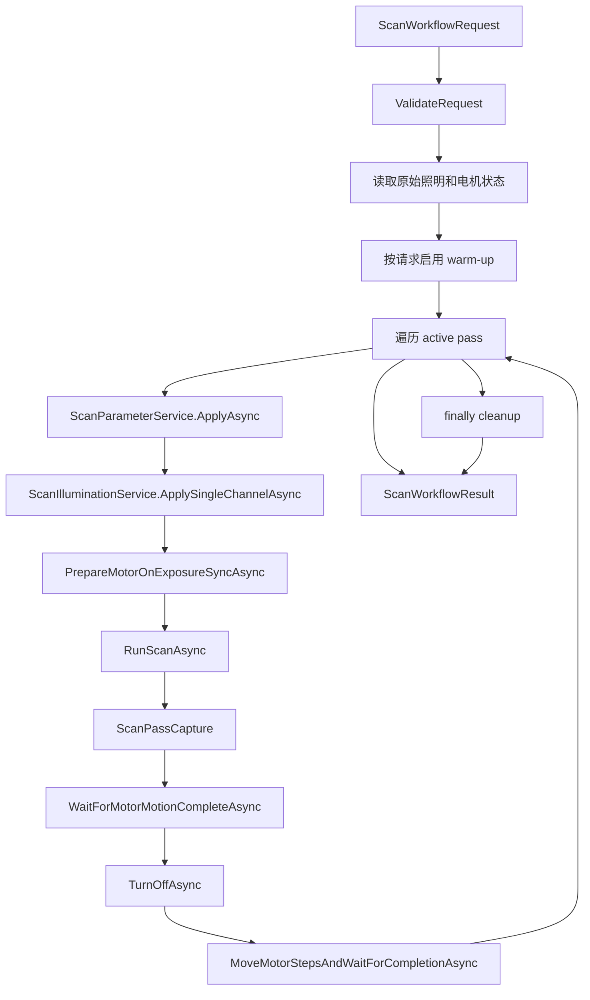
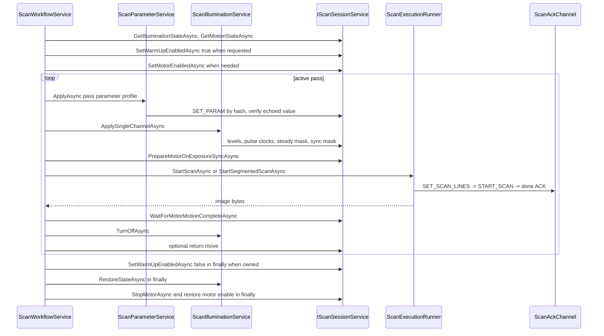

# 扫描工作流与设备控制

## Scope and non-responsibilities

本文说明主机端多 pass 扫描工作流、参数写入、照明控制、电机预备、扫描调用和 cleanup。主机实现来自 `Host Software/PRISM Utility.Core/Services/ScanWorkflowService.cs`、`Host Software/PRISM Utility.Core/Services/ScanParameterService.cs`、`Host Software/PRISM Utility.Core/Services/ScanIlluminationService.cs`、`Host Software/PRISM Utility.Core/Helpers/ScanTimingMath.cs`、`Host Software/PRISM Utility.Core/Models/ScanWorkflowModels.cs`、`Host Software/PRISM Utility.Core/Models/ScanDebugModels.cs` 和 `Host Software/PRISM Utility.Core/Services/ScanSessionService.cs`。

固件命令和 payload 含义只引用 RP2040 的 [CONTROL_INTERFACE.md](../../../100_Scanner_Firmware/Project_PRISM_RP2040/CONTROL_INTERFACE.md)。本文不复制固件内部实现，也不审查板 102 motion/illumination subordinate 协议。

## Functionality

`ScanWorkflowService.ExecuteAsync` 把一次用户层扫描拆成若干活动 pass。每个活动 pass 对应一个通道角色、一个 LED index、一个 CCD 参数 profile、一个电机方向和一次图像捕获。工作流可以启用或关闭 warm-up、自动照明和电机输片。

工作流覆盖以下主机行为。

1. 请求校验，确认行数、连接状态、LED 数量、pass role 数量、参数 profile 数量、电机 id、最小 interval 和系统时钟。
2. 保存原始照明状态和目标电机状态。
3. 如果 `WarmUpEnabled` 为 true, 扫描前启用 warm-up；只有启用成功后才在 finally 中禁用。
4. 如需输片且电机未启用，先启用目标电机。
5. 对每个活动 pass 应用参数、设置单通道照明、预备电机在 `EXPOSURE_SYNC` 时启动、运行扫描、等待电机完成、关闭照明，并按配置决定是否反向归位。
6. 在 finally 中禁用 workflow 拥有的 warm-up、停止未完成运动、恢复照明、恢复本次临时启用的电机状态。

## Key entry points

| Entry point | 作用 | 关键边界 |
| --- | --- | --- |
| `ScanWorkflowService.ExecuteAsync(...)` | 多 pass 工作流入口 | 抛出异常给调用方，finally 做设备 cleanup |
| `ScanWorkflowService.RunScanAsync(...)` | 按行数和传输设置选择单段或分段扫描 | 调用 session 的扫描 API |
| `ScanParameterService.ApplyAsync(...)` | 依次写 exposure、ADC offset/gain、system clock | 每个 SET_PARAM 后解析 echo 并比对 |
| `ScanIlluminationService.ApplySingleChannelAsync(...)` | 只打开当前 pass 对应 LED | sync 和 steady 都未启用时回退到 steady 单灯 |
| `ScanIlluminationService.TurnOffAsync(...)` | 关闭 sync 和 steady illumination | pass 结束后调用 |
| `ScanIlluminationService.RestoreStateAsync(...)` | 恢复原始 levels、steady mask、sync mask、pulse clocks | finally 中使用 `CancellationToken.None` |
| `ScanTimingMath.ComputeMotorStepsPerPass(...)` | 根据行数、曝光、系统时钟和电机 interval 估算步数 | 至少返回 1 步 |
| `ScanSessionService.PrepareMotorOnExposureSyncAsync(...)` | 写 `0x57` prepare motion on sync | 清除旧 motion event 后发送命令 |
| `ScanSessionService.WaitForMotorMotionCompleteAsync(...)` | 等 `0x58` 事件，超时片段内轮询 motion state | 最终超时抛 `IOException` |

## Implementation mechanism

`ScanWorkflowRequest` 是工作流输入模型，包含 `Rows`、`WarmUpEnabled`、`LedLevels`、`PassChannelRoles`、`PassParameterProfiles`、`ScanMotorId`、`MotorIntervalNs`、方向策略、曝光和系统时钟。`ScanWorkflowResult` 返回总行数、`ScanPassCapture` 列表、每 pass 计算出的电机步数、nanosecond interval、曝光和系统时钟。

活动 pass 由 `GetActivePassIndices` 从 `PassChannelRoles` 中筛选，角色为 `Unused` 的通道不扫描。`GetDirectionForPass` 根据 `AlternateMotorDirection` 决定方向。如果启用交替方向，pass index 偶数使用起始方向，奇数使用相反方向。如果不交替，扫描后用 `MoveMotorStepsAndWaitForCompletionAsync` 反向归位。

参数设置使用 hash API。`ScanParameterService` 对 `prism.exposure_ticks`、`prism.adc1.offset`、`prism.adc1.gain`、`prism.adc2.offset`、`prism.adc2.gain` 和 `prism.sys_clock_khz` 计算 FNV-1a hash，再调用 `BuildSetParamByHashCommand`。U16 和 U32 响应分别通过 `ParseU16ParamPayload` 和 `ParseU32ParamPayload` 验证 key hash、类型、长度和 echo 值。

照明设置先构造 `ScanFilmAcquisitionSettings`。`ApplySingleChannelAsync` 只给当前 LED 写入亮度，计算该 LED 的 sync mask 和 steady mask。如果两者都为 0，主机会把 steady mask 设成该 LED，确保采集时至少有当前通道照明。`TurnOffAsync` 先 `ConfigureExposureLightingAsync(0)`，再 `SetSteadyIlluminationAsync(0)`。

电机设置在扫描前用 `PrepareMotorOnExposureSyncAsync` 发送 `0x57`，让固件在下一次有效 `EXPOSURE_SYNC` 周期启动运动。主机的 motion complete 来源是 `ScanAckChannel` 路由的 `0x58` 事件，也可在等待片段超时时用 `GetMotionStateAsync` 兜底确认 motor idle。

## Control and data flow

`RunScanAsync` 根据 `rows > session.SingleTransferMaxRows` 和传输设置决定路径。如果当前设置不是 raw multi-buffer 的 full start read path，超出单次行数时调用 `StartSegmentedScanAsync`。否则直接调用 `StartScanAsync`。这让上层多 pass 不需要知道 619C 单次传输上限。

## Dependencies

| Dependency | 用途 |
| --- | --- |
| `IScanSessionService` | 统一承载参数、照明、电机和扫描命令 |
| `IScanParameterService` | 参数 parse、display、load、apply |
| `IScanIlluminationService` | 保存、应用、关闭、恢复照明状态 |
| `IScanTransferSettingsService` | 决定大行数时使用分段还是 full start read path |
| `ScanTimingMath` | 曝光时间、行时间、电机步数和速度换算 |
| `ScanDebugConstants` | 通道数量、最小系统时钟、最小电机 interval、payload 长度 |
| RP2040 control interface reference | 参数 API、照明命令、motion 命令和 motion complete event 的公开语义 |

## State and concurrency

工作流状态主要是局部变量。`originalIllumination` 和 `originalMotorState` 是 cleanup 依据。`motionStarted` 表示已经发出运动准备或归位命令但还未确认 idle。`warmUpEnabledForWorkflow` 表示本次工作流成功启用了 warm-up，finally 只在这个条件成立时禁用。`enabledMotorForWorkflow` 表示本次工作流临时启用了扫描电机，finally 只在这个条件成立时恢复禁用。

进度回调分两层。`ScanWorkflowProgress` 汇报 pass、总 pass、LED、方向和阶段。字节进度回调把单 pass 的 transferred bytes 映射到工作流总字节数。行可用回调通过 `QueueWorkflowRowsAvailable` 投递到 ThreadPool，避免图像行通知阻塞扫描流程。该投递函数捕获回调异常并写入 Debug 输出。

取消使用调用方传入的 `CancellationToken`。pass 开头调用 `ct.ThrowIfCancellationRequested`。参数、照明、电机和扫描调用也透传同一个 token。finally 的设备恢复使用 `CancellationToken.None`，这是主机端恢复策略，不代表固件会忽略已经到达的 stop 或 restore 命令。

## Error handling

请求校验失败会在扫描开始前抛 `ArgumentException`、`ArgumentOutOfRangeException` 或 `InvalidOperationException`。参数 SET_PARAM 失败会抛 `IOException`，包括 status 非 OK、payload 类型不符、长度不符或 echo 值不一致。照明和电机命令经 `ScanSessionService.SendControlCommandAndEnsureOkAsync` 校验 status 和 payload 长度。

单个 pass 的扫描结果如果 `Success` 为 false 或 `ImageBytes` 为 null，工作流抛出 `IOException`，消息包含 pass 序号和底层扫描失败消息。电机等待先读 motion complete event。如果每 500 ms 片段内没有事件，会查询 motion state，看到目标 motor `Running = false` 且 `RemainingSteps = 0` 时也视为完成。最终超时消息包含 steps、interval、预估 travel time、timeout 和最后一次观测状态。

cleanup 先处理 workflow 拥有的 warm-up：如果 disable 返回失败或抛异常，只通过 guarded diagnostic 报告，不把成功扫描转换为失败。之后 cleanup 处理三段设备恢复。第一段在 `motionStarted` 为 true 时尝试 `StopMotorAsync` 并等待 idle。第二段恢复原始照明。第三段如果本次工作流临时启用了电机，就尝试禁用。设备恢复 catch 后通过 `onDiagnostic` 记录，不覆盖原始异常。

## Test coverage

`Host Software/PrismUtility.Core.Tests/ScanWorkflowServiceTests.cs` 覆盖工作流请求校验、active pass、参数和照明调用、分段扫描选择、电机方向、warm-up ownership 和 cleanup 等行为。SCAN-006 focused tests 与 independent harness 覆盖 false inert、enable before first capture、success/cancel/capture-failure cleanup、enable failure abort、diagnostic-only cleanup failure、throwing diagnostic observer isolation 和 resume。`Host Software/PrismUtility.Core.Tests/ScanTimingMathTests.cs` 覆盖曝光和电机换算。`Host Software/PrismUtility.Core.Tests/ScanSessionServiceUsbRefreshTests.cs` 覆盖 session 在 USB 刷新下的连接边界。

本文档的可执行检查由 `Host Software/docs/architecture/validate-docs.ps1` 的 Partial 模式负责。它验证标准章节、Mermaid、本地链接和源码路径。`-SelfTest MissingProtocolStep` 用于确认协议文档缺少 `SET_SCAN_LINES -> START_SCAN -> done ACK` 时会失败。

## Known issues and solutions

Issue-ID: SCAN-WORKFLOW-001

已关闭事实：`ScanWorkflowRequest.WarmUpEnabled` 现在由 `ScanWorkflowService.ExecuteAsync` 读取。true 请求在第一帧 capture 前调用 `SetWarmUpEnabledAsync(true, ct)`，成功后在 `finally` 用 `CancellationToken.None` 调用 disable。disable 失败只进入 diagnostic，不把成功 workflow 转成失败。false 请求不发 warm-up 命令。

Issue-ID: SCAN-WORKFLOW-002

已关闭事实：`ScanWorkflowRequest`、`ScanWorkflowResult`、protocol payload 和 core timing 路径使用 `MotorIntervalNs` 或 `intervalNs`。UI 输入输出通过 `ScanMotorIntervalText` 在边界执行 checked whole-microsecond conversion；非 UI `Us` aliases 不应回归。

Issue-ID: SCAN-WORKFLOW-003

已验证事实：warm-up cleanup diagnostics 使用 guarded reporting，诊断消费者抛异常不会把成功 workflow 转成失败。其它 cleanup diagnostic paths 仍按 SCAN-005 跟踪，诊断消费者应保持无异常，或后续提供通用安全通知包装。

Registry links: SCAN-WORKFLOW-001 -> [SCAN-006](issues-and-remediation.md#scan-006); SCAN-WORKFLOW-002 -> [SCAN-007](issues-and-remediation.md#scan-007); SCAN-WORKFLOW-003 -> [SCAN-005](issues-and-remediation.md#scan-005); cleanup motor wait sizing risk -> [SCAN-008](issues-and-remediation.md#scan-008).

## Related source

- `Host Software/PRISM Utility.Core/Services/ScanWorkflowService.cs`
- `Host Software/PRISM Utility.Core/Services/ScanParameterService.cs`
- `Host Software/PRISM Utility.Core/Services/ScanIlluminationService.cs`
- `Host Software/PRISM Utility.Core/Helpers/ScanTimingMath.cs`
- `Host Software/PRISM Utility.Core/Models/ScanWorkflowModels.cs`
- `Host Software/PRISM Utility.Core/Models/ScanDebugModels.cs`
- `Host Software/PRISM Utility.Core/Services/ScanSessionService.cs`
- [RP2040 CONTROL_INTERFACE.md](../../../100_Scanner_Firmware/Project_PRISM_RP2040/CONTROL_INTERFACE.md)
