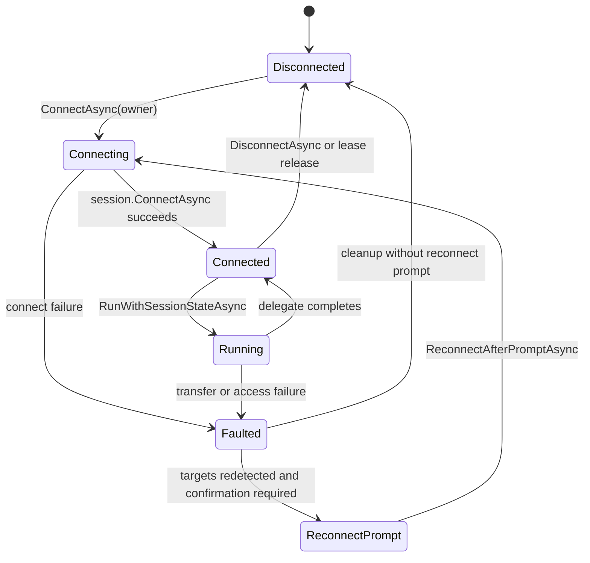
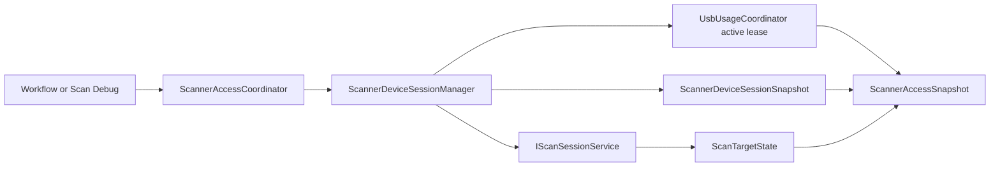

# 扫描会话与访问协调

## Scope and non-responsibilities

本文说明扫描会话所有权、租约、目标状态、快照、重连提示和访问协调器如何让 Scan Workflow、Scan Debug 与 Raw USB 互斥。范围覆盖 `ScannerDeviceSessionManager`、`UsbUsageCoordinator`、`ScannerAccessCoordinator` 以及工作流和调试协调器的上位机边界。

本文不描述固件内部协议实现，不规定 UI 最终文案，也不修改扫描执行、USB 传输或页面逻辑。

## Functionality

扫描仪访问层解决三个问题。

1. 谁拥有扫描仪，所有需要改变设备状态的入口必须通过 `ScannerSessionOwner`、lease id 和 `UsbUsageCoordinator` 租约。
2. 当前处于什么状态，`ScannerDeviceSessionSnapshot` 记录 `Disconnected`、`Connecting`、`Connected`、`Running`、`Faulted`、`ReconnectPrompt`，并带有设备 ID、活动 owner、fault 和重连提示。
3. 用户能否启动某个模式，`ScannerAccessCoordinator` 聚合扫描会话快照、USB active lease 和目标设备状态，返回 active mode、availability 和 blocked reason。

Raw USB 观察语义和互斥语义不同。`CanObserveReadOnly` 总是返回 true，不占用所有权；源码中 `GetActivationBlockedReason` 的 RawUsb 分支会阻塞 Scan Workflow 和 Scan Debug 激活，但现有直接测试只覆盖 ScanWorkflow 被阻塞。

## Key entry points

| 入口 | 作用 |
| --- | --- |
| `PRISM Utility.Core/Services/ScannerDeviceSessionManager.cs` | 拥有长生命周期 `IScanSessionService`，处理连接、断开、运行态、故障和 lease 释放。 |
| `PRISM Utility.Core/Services/UsbUsageCoordinator.cs` | 提供全局 USB active lease，阻止 Scanner 和 RawUsb 的 mutating owner 并发。 |
| `PRISM Utility.Core/Services/ScannerAccessCoordinator.cs` | 给 UI 或上层调用者提供 active mode、availability、blocked reason 和激活路由。 |
| `PRISM Utility.Core/Services/ScanWorkflowSessionCoordinator.cs` | 工作流模式的扫描仪会话协调入口。 |
| `PRISM Utility.Core/Services/ScanDebugSessionCoordinator.cs` | Scan Debug 模式的扫描仪会话协调入口。 |
| `PRISM Utility.Core/Models/ScannerSessionLifecycleModels.cs` | owner、operation、fault、observer permission 和 snapshot 模型。 |
| `PRISM Utility.Core/Models/UsbUsageLeaseModels.cs` | USB lease snapshot 和 acquire result 模型。 |
| `PRISM Utility.Core/Models/ScannerAccessModels.cs` | access mode、availability 和 access snapshot 模型。 |

## Implementation mechanism

`UsbUsageCoordinator` 只允许一个 mutating active lease。成功获取时会生成 `UsbUsageLeaseSnapshot`，其中包含 owner id、owner type、operation、获取时间和 release token。释放时必须匹配 release token；旧 token 不能清掉更新的同 owner lease。`ForceReleaseAsync` 只在 owner id 和 owner type 同时匹配时取消并清理。

`ScannerDeviceSessionManager` 在扫描领域之上再建一层 session ownership。`AcquireLeaseAsync` 先验证 owner id 和 lease id，再向 `UsbUsageCoordinator` 申请 Scanner 或 RawUsb 类型的 USB lease。已有 owner 的时候，相同 lease id 可复用，其他 lease id 会被拒绝。连接成功后，manager 保留同一个 session，短生命周期客户端释放不会销毁底层连接。

扫描和诊断 action 通过 `UseSessionAsync`、`RunWithSessionStateAsync`、`RunConnectedSessionStateAsync` 执行。这些方法先在 `_mutationGate` 下建立 `ActiveOperationContext`、linked cancellation token 和 Running 或 Diagnostics 快照，然后释放 gate 执行 action body。action 完成、失败或取消后，manager 再进入 internal mutation 完成 active operation、发布 terminal snapshot，并唤醒等待者。

`ScannerAccessCoordinator` 不拥有设备，它只聚合状态并路由激活。Scan Workflow 和 Scan Debug 激活会转给对应 coordinator。Raw USB diagnostics 在当前 PRISM Utility app 中返回不可用，但如果外部 RawUsb lease 已存在，access snapshot 会显示 `UsbDebugRaw` 和 `BlockedByUsbDebug`。

Endpoint mapping: 619C IN 0x82; 619D OUT 0x01; 619D ACK IN 0x81

## Control and data flow

## Dependencies

| 依赖 | 用途 |
| --- | --- |
| `IScanSessionServiceFactory` | 懒创建底层扫描会话，避免 transient 客户端直接拥有设备生命周期。 |
| `IScanSessionService` | 提供目标状态、连接、断开、扫描、停止、照明、运动和控制命令。 |
| `IUsbUsageCoordinator` | 提供跨模式 USB mutating 访问互斥。 |
| `IScanWorkflowSessionCoordinator` | 工作流模式激活和断开。 |
| `IScanDebugSessionCoordinator` | Scan Debug 模式激活和断开。 |

## State and concurrency

`ScannerDeviceSessionManager` 有两个锁。`_stateGate` 保护 `_snapshot`、`_ownership`、`_pendingReconnect`、`_session`、`_activeOperation`、`_teardownCompletion` 和 `_disposeCleanup`。`_mutationGate` 串行化连接、断开、停止、operation begin/complete、release cleanup 和 dispose cleanup 的状态转换，但不包住扫描或诊断 action body。

非等待型 mutating 操作在 gate 或 active operation 忙时返回 busy 结果。等待型会话 action 会等待 active operation 或 teardown completion, bounded wait 可避免 dispose 和 disconnect cleanup 无限等待。测试覆盖了 `UseSessionAsync` 与 `RunWithSessionStateAsync` 的等待、非等待 busy、logical snapshot dispatch reentry 和 dispose cleanup exact-once。

目标状态来自底层 `ScanSessionService.Targets`。manager 监听 session 的 `TargetsChanged`，先转发自身 `TargetsChanged`，再异步进入 `HandleTargetsChangedAsync`。如果已连接但目标丢失，会发布 `DeviceDisconnected` fault 并释放会话；如果 fault 后目标重新出现且允许重连提示，会进入 `ReconnectPrompt`。

Observer permission 是只读语义。`GrantObserverPermission` 调用 `CanObserveReadOnly`，当前实现总是允许请求 scope，不会获取 mutating lease，也不会改变 active lease。

## Error handling

已验证的错误和补救如下。

| 场景 | 当前处理 | 风险或补救 |
| --- | --- | --- |
| 竞争 owner 获取 lease | 返回或抛出已有 owner 和 operation 信息 | 上层应显示 blocked reason，而不是重试抢占。 |
| release token 过期 | `ReleaseAsync` 返回 false，保留新的 active lease | 防止旧释放清掉新 owner。 |
| release 时取消 | 等待 `_mutationGate` 的 release 可被取消，所有权保留 | 调用方应在安全时用未取消 token 再释放。 |
| action body outside gate | `_mutationGate` 只保护 operation start/complete；action 使用 linked operation token 运行 | action 仍必须尊重 cancellation token，不能同步阻塞 UI 或做无进度工作。 |
| delegate 期间断开后失败 | finally 根据 session 连接状态清掉 active owner，允许后续重连 | 测试证明可再次连接并运行。 |
| disconnect cleanup 失败 | session 已从 manager 脱离，cleanup 异常会向外抛 | 调用方要把清理失败视为需要人工恢复或重新初始化。 |
| `DisposeAsync` cleanup | 只启动一次 `_disposeCleanup` worker；worker 取消 active operation，bounded wait 后断开、释放 lease，并发布 Disconnected | 若 cleanup 操作卡住，bounded wait 避免重复 cleanup；cleanup fault 快照语义仍由 SESSION-002 跟踪。 |

## Test coverage

| 测试 | 覆盖点 |
| --- | --- |
| `PrismUtility.Core.Tests/UsbUsageCoordinatorLeaseTests.cs` | active lease 元数据、竞争阻塞、只读观察、错误 token、双重释放、force release 和 stale token。 |
| `PrismUtility.Core.Tests/ScannerDeviceSessionManagerTests.cs` | transient 客户端不会销毁会话、并发 mutating 操作、取消 release、operation body outside gate、logical snapshot dispatch、dispose cleanup exact-once、运行态快照、断开清理和后续重连。 |
| `PrismUtility.Core.Tests/ScannerAccessCoordinatorTests.cs` | 工作流和调试激活路由、Raw USB 直接阻塞 ScanWorkflow、Running 时不能 deactivate、快照事件；ScanDebug RawUsb 阻塞由 `GetActivationBlockedReason` 源码分支支持，但缺少直接测试。 |
| `PrismUtility.Core.Tests/ScanSessionServiceUsbRefreshTests.cs` | 底层扫描会话连接前刷新 USB 目标，并打开两个 USB 会话。 |

## Known issues and solutions

Issue-ID: SCANNER-SESSION-001

现象：SESSION-001 已关闭。会话 action body 现在在 `ActiveOperationContext` 下运行，`_mutationGate` 只保护 operation begin、snapshot publish、fault、complete 和 cleanup 状态转换。影响：旧锁内长 delegate 阻塞连接、断开、停止、释放和 dispose cleanup 的问题已退出当前缺陷状态。剩余方案：调用方仍必须遵守传入的 linked cancellation token；cleanup fault 快照语义继续由 SESSION-002 跟踪。

Issue-ID: SCANNER-SESSION-002

现象：`DisconnectAndReleaseAsync` 会先把 `_session` 从 manager 清掉，再执行底层 disconnect 和 dispose；如果 cleanup 失败，异常会抛出，但 session 已脱离。影响：调用方可能看到失败，同时 manager 快照已经进入清理后的状态。短期方案：把 cleanup 失败记录为需要重建会话的故障。长期方案：引入 cleanup fault 快照，明确区分设备断开成功和资源释放失败。

Issue-ID: SCANNER-SESSION-003

现象：`ScannerAccessCoordinator` 当前拒绝 app 内 Raw USB diagnostics 激活，但仍尊重外部 RawUsb active lease。影响：Raw USB 调试能力和扫描访问门禁不是同一个功能开关。短期方案：文档和 UI 文案区分 app 内不可用与外部 Raw USB 正在占用。长期方案：如果恢复 Raw USB Debug 页面，应接入同一个 lease 模型。

Registry links: SCANNER-SESSION-001 -> [SESSION-001](issues-and-remediation.md#session-001); SCANNER-SESSION-002 -> [SESSION-002](issues-and-remediation.md#session-002); SCANNER-SESSION-003 -> [SESSION-003](issues-and-remediation.md#session-003).

## Related source

| 路径 | 说明 |
| --- | --- |
| `PRISM Utility.Core/Services/ScannerDeviceSessionManager.cs` | 会话生命周期、租约、快照、mutation gate 和 cleanup。 |
| `PRISM Utility.Core/Services/UsbUsageCoordinator.cs` | 全局 USB active lease 和 release token 语义。 |
| `PRISM Utility.Core/Services/ScannerAccessCoordinator.cs` | access snapshot、blocked reason 和激活路由。 |
| `PRISM Utility.Core/Services/ScanWorkflowSessionCoordinator.cs` | Scan Workflow owner。 |
| `PRISM Utility.Core/Services/ScanDebugSessionCoordinator.cs` | Scan Debug owner。 |
| `PRISM Utility.Core/Models/ScannerSessionLifecycleModels.cs` | session state、owner、fault 和 observer permission。 |
| `PRISM Utility.Core/Models/UsbUsageLeaseModels.cs` | USB lease snapshot。 |
| `PRISM Utility.Core/Models/ScannerAccessModels.cs` | access mode 和 availability。 |
