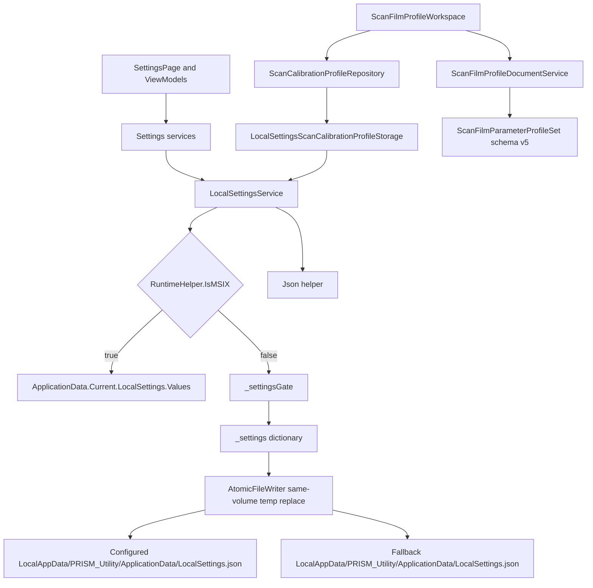

# 设置持久化架构

## Scope and non-responsibilities

本文覆盖 PRISM Utility 的本地设置、JSON 持久化门面、扫描设置门面、校准 profile repository、film profile 文档 schema 和 workspace 状态边界。来源限于当前源码，重点路径包括 `Host Software/PRISM Utility/Services/LocalSettingsService.cs`、`Host Software/PRISM Utility/Models/LocalSettingsOptions.cs`、`Host Software/PRISM Utility/appsettings.json`、`Host Software/PRISM Utility.Core/Services/FileService.cs`、`Host Software/PRISM Utility.Core/Helpers/Json.cs`、`Host Software/PRISM Utility.Core/Services/ScanCalibrationProfileRepository.cs`、`Host Software/PRISM Utility.Core/Services/ScanFilmProfileDocumentService.cs` 和 `Host Software/PRISM Utility.Core/Services/ScanFilmProfileWorkspace.cs`。

本文不声称设置损坏会被自动恢复，也不把 profile 导入验证写成通用迁移系统。源码只显示局部默认值回退、局部 normalize、局部 legacy profile 迁移和调用方自己处理的异常。

## Functionality

`LocalSettingsService` 是应用层持久化入口。它实现 `ILocalSettingsService.ReadSettingAsync<T>` 和 `SaveSettingAsync<T>`，以 `RuntimeHelper.IsMSIX` 选择两条路径。打包运行时，它把每个值序列化成字符串，写入 `ApplicationData.Current.LocalSettings.Values[key]`。非打包运行时，它把所有 key/value 字符串放入 `_settings` 字典，在 `_settingsGate` 下读取和保存，再通过 `IAtomicFileWriter` 写到本地 JSON 文件。

默认文件位置来自 shared compiled resolver。`appsettings.json` 的 `LocalSettingsOptions.ApplicationDataFolder` 为 `PRISM_Utility/ApplicationData`，`LocalSettingsFile` 为 `LocalSettings.json`。`LocalSettingsService` 和 `DebugOutputMirrorService` 都调用 `ApplicationDataPathResolver.Resolve(...)`；配置为 null、empty 或 whitespace 时回退到同一个 application-data root，custom nonblank root 也被两者共同保留。历史上的 underscore 和 space fallback divergence 已由 SET-002 关闭。

上层设置门面把业务状态拆成固定 key。`DebugOutputSettingsService` 使用 `DebugConsoleMirrorEnabled` 和 `DebugFileLogEnabled`。`ThemeSelectorService` 使用 `AppBackgroundRequestedTheme`。`LanguageSelectorService` 使用 `AppRequestedLanguage`。Core 设置服务还包括 `ScanTransferSettingsService`、`ScanDeviceSettingsService`、`ScanColorManagementSettingsService` 和 `ScanDngGeometrySettingsService`。SET-003 已把传输设置和色彩管理设置收敛为 schema 1 versioned single documents, key 分别是 `ScanTransferSettingsDocument` 和 `ScanColorManagementSettingsDocument`。SET-005 已把 Settings 页面的 language、theme、debug、transfer 和 color 五个 family 保存接入 owner-scoped `SettingsSaveCoordinator`, 包括 restore/default 命令。

校准 profile 由 `LocalSettingsScanCalibrationProfileStorage` 适配到同一个本地设置接口。SET-003 后 current document key 是 `ScanCalibrationProfileSettingsDocument`, payload 同时包含 profile 字典和 selected channel。`ProfilesKey` `ScanChannelParameterProfiles` 与 `SelectedChannelKey` `ScanCalibrationSelectedChannel` 只作为 legacy 读取来源保留。`ScanCalibrationProfileRepository` 在 current document 之上提供初始化、快照、保存、清除、替换和选中通道操作。

Film profile 的导入导出由 `ScanFilmProfileDocumentService` 和 `ScanFilmProfileWorkspace` 处理。源码证实当前 schema 版本是 `ScanFilmProfileDocumentService.CurrentSchemaVersionValue = 5`。文档模型是 `ScanFilmParameterProfileSet`，包含 `SchemaVersion`、`ProfileName`、`SavedAtUtc`、`ChannelProfiles`、`SelectedCalibrationChannel`、可选 `AcquisitionSettings` 和可选 `ScanRecipeSettings`。

## Key entry points

- `LocalSettingsService.ReadSettingAsync<T>`，读取单个设置 key。
- `LocalSettingsService.SaveSettingAsync<T>`，保存单个设置 key。
- `FileService.Read<T>` 和 `AtomicFileWriter.Write`，提供非打包 JSON 文件读取和原子写入。
- `Json.ToObjectAsync<T>` 和 `Json.StringifyAsync`，封装 Newtonsoft.Json 序列化。
- `ScanTransferSettingsService.InitializeAsync` 和 `SetSettingsAsync`，读写 bulk IN 传输选项。
- `ScanDeviceSettingsService.InitializeAsync` 和 `SetSettingsAsync`，读写设备步进设置。
- `ScanColorManagementSettingsService.InitializeAsync` 和 `SetSettingsAsync`，读写色彩管理设置。
- `ScanDngGeometrySettingsService.InitializeAsync` 和 `SetSettingsAsync`，读写 DNG 几何设置。
- `ScanCalibrationProfileRepository.InitializeAsync`、`SaveProfileAsync`、`ClearProfileAsync`、`ReplaceAsync`、`SetSelectedChannelAsync`，管理校准 profile 字典和选中通道。
- `ScanFilmProfileDocumentService.Parse`、`Build`、`Serialize`、`MigrateLegacyLocalProfiles`，管理 film profile JSON 文档。
- `ScanFilmProfileWorkspace.InitializeAsync`、`StageImport`、`ApplyStagedImportAsync`、`BuildExportDocument`、`MarkExported`，管理当前草稿、基线、staged import 和 dirty 状态。
- `SettingsSaveCoordinator.EnqueueAsync`、`WhenIdleAsync`、`CancelPendingOperations` 和 owner handles, 管理 Settings UI 保存的 per-scope 排队、取消、结果和 teardown。

ServiceCoverage: ScanFilmProfileWorkspace

## Implementation mechanism

`LocalSettingsService` 的构造函数调用 `ApplicationDataPathResolver.Resolve(_options.ApplicationDataFolder, _options.LocalSettingsFile)`，再把 `RootPath` 和 `LocalSettingsFileName` 存入 `_applicationDataFolder` 与 `_localsettingsFile`。非打包初始化和保存都进入 `_settingsGate`。初始化时 `InitializeUnderGateAsync` 只在 `_isInitialized` 为 false 时调用 `_fileService.Read<IDictionary<string, object>>(_applicationDataFolder, _localsettingsFile)`。之后 `SaveSettingAsync` 把 `Json.StringifyAsync(value)` 的字符串放入 `_settings[key]`，序列化当前字典副本，并交给 `_atomicFileWriter.Write`。

`AtomicFileWriter.Write` 先创建目录，再在同一目录创建 `.{fileName}.{guid}.tmp`，用 UTF-8 no BOM 和 `FileOptions.WriteThrough` 写入并 flush 到磁盘。目标存在时用 `File.Replace(temp, target, null)`，目标不存在时用 `File.Move(temp, target)`。finally 会删除未发布 temp。`LocalSettingsService.SaveSettingAsync` 若写入抛错，会把 `_settings` 中的 key 恢复为旧值，或移除新 key。

`Json` helper 使用 Newtonsoft.Json 默认设置。`StringifyAsync` 调用 `JsonConvert.SerializeObject(value)`，`ToObjectAsync<T>` 调用 `JsonConvert.DeserializeObject<T>(value)`。源码没有自定义版本字段、类型绑定器或设置级迁移表。

设置门面通常有一个 `_initializeGate` 或 `_settingsGate`，读入本地设置后把 `_isInitialized` 置为 true。SET-003 覆盖的传输和色彩门面按 group gate 串行初始化和保存。保存时先 normalize, 再把完整 payload 写入 schema 1 document key；只有 `SaveSettingAsync` 成功后才发布内存 `Settings` generation。`ScanTransferSettingsService.SetSettingsAsync` 不再顺序保存 `ScanBulkInReadMode`、`ScanBulkInRequestBytes`、`ScanBulkInOutstandingReads`、`ScanBulkInTimeoutMs` 和 `ScanBulkInRawIoEnabled` 五个独立 key。

`ScanCalibrationProfileRepository` 有两个 gate。`_initializeGate` 保护初始化，`_writeGate` 保护保存、清除、替换和选中通道写入。初始化优先读 schema 1 current document。只有 current document 缺失时才读 legacy profile 字典和 legacy selected channel，并经 `MigrateLegacyProfiles` 把 `ScanParameterSnapshot` 转成 `ScanChannelCalibrationProfile`，ROI 使用 `ScanCalibrationRoiSettings.CreateDefault().Normalize()`。如果 current document 是 future schema、malformed 或 payload 无效，repository 保持空 state, 不回读 legacy, 不发布 stale fallback。保存、清除、替换和 selected channel 变更都写回一个 current document, 保存成功后才通过 `Volatile` snapshot 发布新 generation。源码没有证据显示旧 schema 文件的多版本迁移链。

`ScanFilmProfileDocumentService.Parse` 先用 `JObject.Load` 检查 JSON，再验证 `SchemaVersion`、`ProfileName`、`SavedAtUtc`、`ChannelProfiles`。`SchemaVersion` 必须等于 5。通过基本检查后，服务反序列化成 `ScanFilmParameterProfileSet`，再交给 `ScanFilmProfileDocumentNormalization.NormalizeParsedDocument`。`Build` 只从 draft 构建当前版本文档。

`ScanFilmProfileWorkspace` 以 `ScanFilmProfileWorkspaceSnapshot` 持有 `CurrentDraft`、`BaselineDraft`、`IsDirty` 和 `StagedImport`。它用 `Volatile.Read` 读 `_snapshot`，用 `Interlocked.Exchange` 或 `Interlocked.CompareExchange` 替换快照，并通过 `SnapshotChanged` 发布变更。

## Control and data flow

典型读取路径是 ViewModel 调用门面 `InitializeAsync`，门面调用 `ReadSettingAsync<T>`，本地设置服务按运行形态选择 MSIX local settings 或非打包 JSON 文件，JSON helper 反序列化字符串。典型写入路径是 Settings ViewModel 属性变化或 restore/default 命令把 operation 放入 owner-scoped coordinator。coordinator 按 owner 和 scope 产生 result, 门面更新内存状态后调用 `SaveSettingAsync<T>`，非打包路径在 `_settingsGate` 下更新内存字典并通过 atomic writer 发布文件。失败 result 先 mirror diagnostic, 再通过 UI dispatcher rollback visible state 并更新既有 Settings persistence InfoBar；成功 result 清除同 scope error。

校准 profile 路径多一层 repository。应用层注册 `IScanCalibrationProfileStorage` 为 `LocalSettingsScanCalibrationProfileStorage`，repository 优先读 current document, 只在缺失时迁移 legacy 字典和 selected channel。workspace 初始化时从 repository hydrate 默认 draft。导入 JSON 时，workspace 先 stage，再由 `ApplyStagedImportAsync` 调用 repository `ReplaceAsync` 写回一个 current document。

## Dependencies

- `Host Software/PRISM Utility/App.xaml.cs` 注册 `ILocalSettingsService`、各设置门面、profile storage、repository、document service 和 workspace。
- `Host Software/PRISM Utility/Models/LocalSettingsOptions.cs` 定义配置对象。
- `Host Software/PRISM Utility/appsettings.json` 提供默认文件夹和文件名配置。
- `Host Software/PRISM Utility.Core/Contracts/Services/ILocalSettingsService.cs` 定义 read/save contract。
- `Host Software/PRISM Utility.Core/Services/FileService.cs` 负责非打包 JSON 文件读取。
- `Host Software/PRISM Utility.Core/Services/AtomicFileWriter.cs` 负责非打包 JSON 文件原子写入。
- `Host Software/PRISM Utility.Core/Helpers/Json.cs` 负责序列化。
- `Host Software/PRISM Utility/Services/LocalSettingsScanCalibrationProfileStorage.cs` 把 profile repository 接到 settings key。
- `Host Software/PRISM Utility.Core/Models/ScanFilmParameterProfileSet.cs` 定义 schema v5 文档字段。
- `Host Software/PRISM Utility.Core/Services/ScanFilmProfileDocumentNormalization.cs` 定义 profile、recipe、selected channel 的 normalize 规则。

## State and concurrency

`LocalSettingsService` 的 `_settings` 是普通 `Dictionary<string, object>`，但非打包读写都通过 `_settingsGate` 串行化。多个门面并发调用 `SaveSettingAsync` 时会按 gate 顺序更新内存字典和写入 JSON 文件。SET-001 的无锁字典和直接覆盖写风险已关闭。

`_isInitialized` 只在 `_settingsGate` 内读取和写入，因此基础 settings 文件的首次读取和后续保存共用同一 gate。多个设置门面和 repository 仍保留各自 `_initializeGate`，用于保护业务层初始化。

本地 settings 文件写入已由 `AtomicFileWriter` 使用同目录 temp、flush 和 replace/move 完成。写入失败时, `LocalSettingsService` 会 rollback 当前 key 的内存值并重新抛出异常。本文不把它描述为通用损坏恢复, 也不声称能修复已经存在的 malformed JSON。

`ScanCalibrationProfileRepository` 的写入路径有 `_writeGate`，能串行化 repository 内部写入；底层 `ILocalSettingsService` 也会串行化单 key 写入。SET-003 覆盖的传输、色彩和校准分组现在都以一个 document key 为持久化单位, save 失败不会发布新的内存 generation。repository snapshot 通过 `Volatile.Read` 读取, 写入成功后以完整克隆 generation 发布, 并发读者只能看到旧完整 generation 或新完整 generation。legacy keys 在当前生产 `LocalSettingsService` 下是惰性 retained 状态, 因为它没有 delete API；只有底层实现 `ILocalSettingsLegacyCleanupService` 时才会尝试 cleanup, cleanup 失败也发生在 document commit 之后。`ScanFilmProfileWorkspace` 使用不可变快照和 interlocked 交换，降低 UI 读写交错风险，但 `SnapshotChanged` 是同步 invoke，订阅者异常会沿调用栈冒泡。

`SettingsSaveCoordinator` 用 owner handle 隔离 Settings 页面实例, 并用 owner plus scope 判断 latest result。language、theme、debug、transfer 和 color 的属性保存与 restore/default 命令都走相同队列。stale failure 不会覆盖较新的 visible state, failed latest result 才 rollback 并记录 per-scope error。Settings page unload 先 bounded flush, 再 cancel owner work 和 dispose owner；app close 也会 bounded wait global coordinator idle, cancel pending work, 再 dispose coordinator。

## Error handling

`LocalSettingsService.ReadSettingAsync` 没有捕获 JSON 反序列化异常。`ScanDeviceSettingsService.InitializeAsync` 捕获读取异常并回退到默认值，同时写 `Debug` 和 `Trace`。`ScanDngGeometrySettingsService.InitializeAsync` 捕获异常后回退，但不记录异常。其他门面多以 null 或非法值回退到当前默认值。

`ScanFilmProfileDocumentService.Parse` 捕获 malformed JSON 和 Newtonsoft.Json 反序列化异常，返回 `ScanFilmProfileValidationResult`。它对 schema 版本不匹配返回 `UnsupportedSchemaVersion`。`ScanFilmProfileWorkspace.ApplyStagedImportAsync` 捕获取消和普通异常，返回 `Canceled` 或 `Failed`，但不自动修复 repository 或设置文件。

`ScanCalibrationProfileRepository.InitializeAsync` 若 schema 1 current document 存在且有效，会 normalize 后作为当前 state。若 current document 缺失且 legacy profiles 存在，会迁移到 current document 形状并保存。future、malformed 或 payload 无效 document 会被拒绝, 不回退到 legacy, 也不发布旧 state。这个行为是已知 legacy key 到 schema 1 document 的迁移，不是通用损坏恢复。

Settings UI 保存失败由 coordinator result 表达。失败先进入 Debug mirror diagnostic, 再派发到 UI thread 执行 rollback 和 InfoBar 更新；dispatcher 不可用或页面 teardown 时走 bounded wait, 不挂住 unload 或 app close。per-scope error 恢复后只清除该 scope, 不清除其它 setting family 的错误。

## Test coverage

当前仓库包含和 settings/profile 持久化直接相关的测试文件，包括 `Host Software/PrismUtility.Core.Tests/Set001LocalSettingsAtomicPersistenceTests.cs`、`Host Software/PrismUtility.Core.Tests/Set003TransferSettingsTests.cs`、`Host Software/PrismUtility.Core.Tests/Set003ColorManagementSettingsTests.cs`、`Host Software/PrismUtility.Core.Tests/Set003CalibrationProfileRepositoryTests.cs`、`Host Software/PrismUtility.Core.Tests/Set003LocalSettingsMigrationHarnessTests.cs`、`Host Software/PrismUtility.Core.Tests/Set005SettingsSaveCoordinatorTests.cs`、`Host Software/PrismUtility.Core.Tests/Set005SettingsViewModelBehaviorTests.cs`、`Host Software/PrismUtility.Core.Tests/ScanCalibrationProfileRepositoryTests.cs`、`Host Software/PrismUtility.Core.Tests/ScanCalibrationProfileRepositoryCharacterizationTests.cs`、`Host Software/PrismUtility.Core.Tests/ScanFilmProfileDocumentServiceTests.cs`、`Host Software/PrismUtility.Core.Tests/ScanFilmProfileWorkspaceTests.cs` 和 `Host Software/PrismUtility.Core.Tests/ScanFilmProfileCompatibilityTests.cs`。SET-003 focused 18 个 tests 两次通过, SET-005 focused 29 个 tests 两次通过, combined managed suite 为 487/487。SET-005 visual evidence 只证明 normal/recovery en/zh captures clean；rendered failure InfoBar/accessibility evidence 为 `HARNESS_BLOCKED`, 不是 visual pass。

文档验证流程覆盖本文件的结构、Mermaid、本地链接和源码路径。建议的实现级验证方式是运行上述 profile 持久化单元测试，并保留 `MissingServiceCoverage` self-test 作为文档覆盖守卫。

## Known issues and solutions

Issue-ID: SETTINGS-PERSISTENCE-001

事实: SET-001 已关闭。`LocalSettingsService` 非打包模式用 `_settingsGate` 串行化初始化、读取和保存；保存通过 `AtomicFileWriter` 在同目录写 temp、flush、replace/move，失败时 rollback 当前 key 的内存值并清理 temp。SET-003 已关闭传输、色彩和校准分组 document 保存缺口；settings/log 路径继续通过 shared resolver 保持一个权威来源。

Issue-ID: SETTINGS-PERSISTENCE-002

事实: `appsettings.json`、`LocalSettingsService` 和 `DebugOutputMirrorService` 现在通过 `ApplicationDataPathResolver` 使用同一个 application-data root。configured、null、empty、whitespace 和 custom roots 已由 `Set002SettingsPathTests.cs` 的运行时测试锁定。建议: 新增持久化入口时复用 resolver，避免重新引入设置和日志根目录不一致。

Issue-ID: SETTINGS-PERSISTENCE-006

事实: SET-003 已关闭。`ScanTransferSettingsService`、`ScanColorManagementSettingsService` 和 `ScanCalibrationProfileRepository` 分别使用 schema 1 versioned single documents 保存完整分组。读取时 current document 优先；legacy 只在 document 缺失时迁移；future、malformed 或 payload 无效 document 不回读 legacy, 也不发布 stale fallback。保存时先写 document, 成功后才发布内存 generation。当前生产 `LocalSettingsService` 没有 delete API, 因此旧 legacy keys 是惰性 retained 状态, 不再参与 current document 存在后的读取。

Issue-ID: SETTINGS-PERSISTENCE-003

事实: `Json` helper 和 settings service 没有通用 schema/version envelope。只有 film profile 文档有 `SchemaVersion = 5`。建议: 文档和测试都应避免把 film profile schema 说成所有 settings 的 schema。

Issue-ID: SETTINGS-PERSISTENCE-004

事实: `ScanCalibrationProfileRepository` 只证实从 legacy `ScanParameterSnapshot` 字典迁移到 `ScanChannelCalibrationProfile` 字典。建议: 未来新增 schema 时，把版本号、迁移前后字段和失败策略写入源码和文档，不要把 current normalize 误当作多版本迁移。

Issue-ID: SETTINGS-PERSISTENCE-005

事实: workspace 的 `SnapshotChanged?.Invoke(updated)` 没有隔离订阅者异常。建议: 若订阅者增多，应明确异常边界，否则 UI 订阅者异常可能中断状态更新调用者。

Issue-ID: SETTINGS-PERSISTENCE-007

事实: SET-005 已关闭。Settings UI 保存由 owner-scoped `SettingsSaveCoordinator` 管理, language、theme、debug、transfer 和 color 五个 family 以及 restore/default 命令都按 scope 返回 result。latest failure 先写 mirror diagnostic, 再经 UI dispatcher rollback visible state 并显示既有 Settings persistence InfoBar；success 只清除同 scope error。页面 unload 和 app close 都有 bounded flush/cancel。建议: 新增 setting family 时接入同一 owner 和 per-scope error 模型, 不恢复 fire-and-forget 保存。

Registry links: SETTINGS-PERSISTENCE-001 -> [SET-001](issues-and-remediation.md#set-001); SETTINGS-PERSISTENCE-002 -> [SET-002](issues-and-remediation.md#set-002); SETTINGS-PERSISTENCE-006 -> [SET-003](issues-and-remediation.md#set-003); SETTINGS-PERSISTENCE-003 -> [SET-004](issues-and-remediation.md#set-004); SETTINGS-PERSISTENCE-004 -> [SET-006](issues-and-remediation.md#set-006); SETTINGS-PERSISTENCE-005 -> [SET-007](issues-and-remediation.md#set-007); SETTINGS-PERSISTENCE-007 -> [SET-005](issues-and-remediation.md#set-005).

## Related source

- `Host Software/PRISM Utility/Services/LocalSettingsService.cs`
- `Host Software/PRISM Utility/Models/LocalSettingsOptions.cs`
- `Host Software/PRISM Utility/appsettings.json`
- `Host Software/PRISM Utility.Core/Services/FileService.cs`
- `Host Software/PRISM Utility.Core/Helpers/Json.cs`
- `Host Software/PRISM Utility/Helpers/SettingsStorageExtensions.cs`
- `Host Software/PRISM Utility/Services/LocalSettingsScanCalibrationProfileStorage.cs`
- `Host Software/PRISM Utility.Core/Services/ScanTransferSettingsService.cs`
- `Host Software/PRISM Utility.Core/Services/ScanDeviceSettingsService.cs`
- `Host Software/PRISM Utility.Core/Services/ScanColorManagementSettingsService.cs`
- `Host Software/PRISM Utility.Core/Services/ScanDngGeometrySettingsService.cs`
- `Host Software/PRISM Utility.Core/Services/ScanCalibrationProfileRepository.cs`
- `Host Software/PRISM Utility.Core/Services/ScanFilmProfileDocumentService.cs`
- `Host Software/PRISM Utility.Core/Services/ScanFilmProfileDocumentNormalization.cs`
- `Host Software/PRISM Utility.Core/Services/ScanFilmProfileWorkspace.cs`
- `Host Software/PRISM Utility.Core/Models/ScanFilmParameterProfileSet.cs`
- `Host Software/PRISM Utility.Core/Models/ScanFilmProfileWorkspaceModels.cs`
