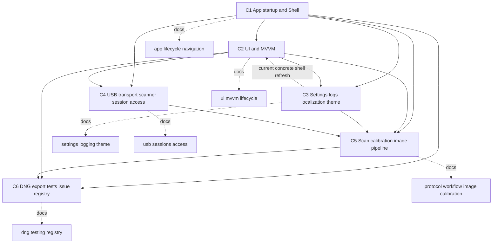
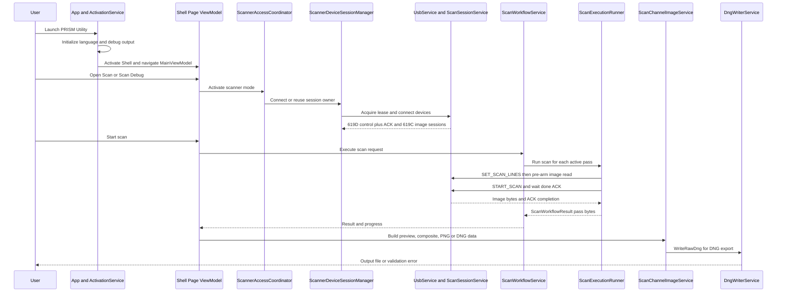

# 系统总览

## Scope and non-responsibilities

本文说明 PRISM Utility Host Software 的 C1 到 C6 架构切分、依赖方向，以及用户从启动、连接、扫描、处理到导出的端到端路径。它把 16 篇专题文档和问题登记目录连成一个系统视图。

本文不替代专题文档，不审计固件、硬件、机械结构，也不把环境阻塞的 smoke 写成通过。源码事实以当前文档集和可定位入口为准，关键路径包括 `Host Software/PRISM Utility/App.xaml.cs`、`Host Software/PRISM Utility/Services/ActivationService.cs`、`Host Software/PRISM Utility.Core/Services/ScanSessionService.cs`、`Host Software/PRISM Utility.Core/Services/ScannerDeviceSessionManager.cs`、`Host Software/PRISM Utility.Core/Services/ScanWorkflowService.cs`、`Host Software/PRISM Utility.Core/Services/ScanExecutionRunner.cs`、`Host Software/PRISM Utility/Services/ScanChannelImageService.cs` 和 `Host Software/PRISM Utility.Core/Services/DngWriterService.cs`。

## Functionality

Host Software 是一个 WinUI 3 桌面应用。C1 建立应用 Host、Shell 和导航。C2 把 Page、ViewModel 和 UI 生命周期连到服务层。C3 提供设置、profile 工作区、日志、本地化和主题。C4 发现 USB 设备，打开 619C 和 619D 两个 USB 功能，并用 lease 和 session manager 管理扫描仪所有权。C5 执行扫描协议、工作流、校准、自动对焦、解码、预览、对齐和合成。C6 负责 DNG 输出、原生桥接、构建测试边界和问题登记。

启动到导出的主路径如下。

1. `App.OnLaunched` 初始化语言和调试输出设置，再调用 `ActivationService.ActivateAsync`。
2. `ActivationService` 解析 `ShellPage`，默认导航到 `MainViewModel`。
3. 用户导航到 Scan 或 Scan Debug 后，ViewModel 通过 access coordinator 请求扫描仪访问。
4. `ScannerDeviceSessionManager` 经 `UsbUsageCoordinator` 获取 mutating lease，并让 `ScanSessionService.ConnectAsync` 刷新 USB 目标和打开控制、图像会话。
5. `ScanWorkflowService.ExecuteAsync` 或 Scan Debug 编排参数、照明、电机和扫描请求。
6. `ScanExecutionRunner` 按 `SET_SCAN_LINES -> START_SCAN -> done ACK` 执行 619D 控制和 619C 图像读取。
7. 图像结果进入解码、预览、对齐、色彩合成和 DNG 或 PNG 导出路径。

## Key entry points

| 层 | 入口 | 作用 | 详情文档 |
| --- | --- | --- | --- |
| C1 | `Host Software/PRISM Utility/App.xaml.cs` `App.OnLaunched` | 启动语言、调试输出和激活链 | [Application lifecycle and dependency injection](app-lifecycle-and-di.md) |
| C1 | `Host Software/PRISM Utility/Services/ActivationService.cs` `ActivateAsync` | 创建 Shell，运行默认导航，应用主题 | [Navigation and shell](navigation-and-shell.md) |
| C2 | `Host Software/PRISM Utility/Services/PageService.cs` `PageService` | 建立七个 `AppRoute` 到 Page type 的 typed 导航映射，并校验 route 闭集 | [UI and MVVM structure](ui-mvvm.md) |
| C2 | `Host Software/PRISM Utility/ViewModels/ScanViewModel.cs` `Activate` | 缓存页面运行时订阅与扫描页状态投影 | [ViewModel lifecycle](viewmodel-lifecycle.md) |
| C3 | `Host Software/PRISM Utility/Services/LocalSettingsService.cs` `ReadSettingAsync<T>` | 本地设置读写入口 | [Settings persistence](settings-persistence.md) |
| C3 | `Host Software/PRISM Utility/Services/DebugOutputMirrorService.cs` `Mirror` | 日志镜像到近期内存、Debug、Trace 和可选文件 | [Logging, localization, and theme](logging-localization-theme.md) |
| C4 | `Host Software/PRISM Utility.Core/Services/UsbDeviceCatalog.cs` `RequestRefresh` | 维护 USB 设备目录和 watcher 刷新 | [USB transport](usb-transport.md) |
| C4 | `Host Software/PRISM Utility.Core/Services/ScannerDeviceSessionManager.cs` `ConnectAsync` | 扫描仪所有权、连接、快照和释放 | [Scanner session and access coordination](scanner-session-and-access.md) |
| C5 | `Host Software/PRISM Utility.Core/Services/ScanExecutionRunner.cs` `StartScanAsync` | 执行 SET_SCAN_LINES、START_SCAN、图像读和 done ACK | [Scan protocol and execution](scan-protocol-and-execution.md) |
| C5 | `Host Software/PRISM Utility.Core/Services/ScanWorkflowService.cs` `ExecuteAsync` | 多 pass 参数、照明、电机和 cleanup 工作流 | [Scan workflow and device control](scan-workflow-and-device-control.md) |
| C5 | `Host Software/PRISM Utility.Core/Services/ScanImageDecoder.cs` `DecodeToBgra` | 原始行缓冲到 BGRA 预览 | [Image decoding and preview](image-decoding-preview.md) |
| C5 | `Host Software/PRISM Utility.Core/Services/ScanCompositeImageProcessor.cs` `TryBuildRgbComposite` | RGB 合成和色彩管理 | [Alignment, color processing, and composite preview](alignment-color-processing.md) |
| C5 | `Host Software/PRISM Utility.Core/Services/ScanAutoCalibrationService.cs` `AutoCalibrateAsync` | 黑场、白场校准和 profile 保存 | [Calibration, autofocus, and film profiles](calibration-autofocus-film-profiles.md) |
| C6 | `Host Software/PRISM Utility.Core/Services/DngWriterService.cs` `WriteRawDng` | 托管 DNG 请求验证和原生 DLL 调用 | [DNG export and native bridge](dng-export-native-bridge.md) |
| C6 | `Host Software/docs/architecture/validate-docs.ps1` `Full` | 文档结构、链接、源码路径和 Mermaid 检查 | [Testing and build](testing-and-build.md) |
| C6 | `Host Software/docs/architecture/issues-and-remediation.md` | 去重问题登记和整改路线 | [Issues and remediation](issues-and-remediation.md) |

## Implementation mechanism

组件边界按主要依赖方向排列。当前源码不是绝对单向：`LanguageSelectorService.RefreshShellAsync` 属于 C3 本地化服务，但会直接解析 C2 的 `ShellPage`，并导航到 `SettingsViewModel`。因此图中的 contract/event/ViewModel 投影方向是期望边界和后续整改目标，不是当前所有调用的绝对事实。

C1 owns composition. `App.App` builds the Generic Host and registers application services, Core services, pages and ViewModels. `ActivationService` resolves the Shell, initializes theme state, runs activation handlers and shows the window.

C2 owns user interaction and state projection. Pages construct their ViewModel through `App.GetService<T>()`, then XAML bindings and Page events drive ViewModel commands. Cached Scan and Scan Debug pages attach and detach runtime subscriptions in Loaded and Unloaded.

C3 owns persisted local state and user-visible infrastructure. Settings services read and write fixed keys through `ILocalSettingsService`. Film profile workspace and calibration repository maintain profile state. Logging, localization and theme services update diagnostics, resources and title bar state.

C4 owns transport and exclusive hardware access. USB discovery feeds `ScanSessionService`, while `ScannerDeviceSessionManager`, `UsbUsageCoordinator` and `ScannerAccessCoordinator` protect mutating scanner access across Scan Workflow, Scan Debug and Raw USB ownership.

C5 owns scanner behavior and image data. Protocol execution runs control and image channels, workflow wraps parameters, illumination and motor transport, then image services decode, preview, align, color-manage and composite the results. Calibration and autofocus reuse the same session and decoder boundary.

C6 owns export and quality boundaries. `ScanChannelImageService` builds PNG or DNG requests. `DngWriterService` validates, pins and calls the C ABI. Testing and build docs explain managed coverage, WinUI gaps, native bridge prerequisites and issue registry checks.

## Control and data flow

The connect path requires both USB functions. `ScanSessionService.ConnectAsync` refreshes devices, then selects FIFO Buffer `VID 0x1D50 PID 0x619C IN 0x82` and Control Interface `VID 0x1D50 PID 0x619D OUT 0x01 plus ACK IN 0x81`. The scan path requires `SET_SCAN_LINES -> START_SCAN -> done ACK`, with image read armed before `START_SCAN` so 619C data is not missed.

The process path splits into two families. Raw preview uses `ScanImageDecoder` and `ScanPreviewPresenter`. Composite preview uses `ScanChannelAlignmentService`, `ScanCompositeImageProcessor` and `ScanChannelImageService`. Export uses `ScanChannelImageService` for PNG or DNG request construction, then `DngWriterService` and the native bridge for DNG.

## Dependencies

| Direction | Meaning | Examples |
| --- | --- | --- |
| C1 to C2-C6 | Composition root registers and activates services | `App.App`, `ActivationService.ActivateAsync`, `PageService.PageService` |
| C2 to C3-C6 | UI and ViewModels call services but should not own transport or native details | `ScanViewModel`, `ScanDebugViewModel`, `SettingsViewModel` |
| C3 to C5 | Settings and profile state feed scan behavior and image processing | `ScanTransferSettingsService`, `ScanCalibrationProfileRepository`, `ScanFilmProfileWorkspace` |
| C4 to C5 | USB sessions and scanner ownership enable protocol execution | `ScanSessionService`, `ScannerDeviceSessionManager`, `UsbUsageCoordinator` |
| C5 to C6 | Processed scan data becomes PNG or DNG output and testable quality evidence | `ScanChannelImageService`, `DngWriterService`, `validate-docs.ps1` |

The desired source boundary is one-way at the system level, but current code still has a known reverse concrete coupling: `LanguageSelectorService.RefreshShellAsync` resolves `ShellPage` and navigates to `SettingsViewModel`. Treat contract, event and ViewModel projection as the target direction for future cleanup, not as a claim that every current dependency already follows it. C5 services depend on C4 sessions and C3 settings. UI code in C2 depends on contracts and services. C6 DNG export is called after scan data exists, not during scanner ownership arbitration. The issue registry depends on module documents and source evidence, but application runtime does not depend on the registry.

## State and concurrency

Global application state starts in C1 with `App.Host`, `App.MainWindow` and Shell content. UI state in C2 lives in Page instances, ViewModels, `ObservableCollection` values and cached page subscriptions. C3 state includes local settings dictionaries, debug mirror recent entries, static resource loader, profile repository snapshots and film profile workspace snapshots. C4 state includes USB catalog snapshots, active USB lease, scanner session snapshot and reconnect prompt state. C5 state is mostly per operation, such as active pass result, ACK buffers, image buffers, alignment matrices and preview caches. C6 state includes pinned DNG pixel arrays during the native call and thread local native last-error text.

Concurrency boundaries come from documented gates rather than a single global scheduler. `ScannerDeviceSessionManager` uses state and mutation gates. `UsbUsageCoordinator` uses release tokens. `ScanAckChannel` separates ACK queue and motion event state. `ScanFilmProfileWorkspace` uses immutable snapshots and interlocked exchange. UI changes must return to the dispatcher through `IUiDispatcher` or page `DispatcherQueue`.

## Error handling

Errors cross the architecture in different forms. Startup and navigation failures may reach WinUI top-level exception handling, where `App_UnhandledException` now reports through `UnhandledExceptionReporter` to Debug mirror, Debug and Trace without setting `Handled`; live WinUI controlled-event smoke remains environment-blocked. Settings and logging often use fallback or fire-and-forget paths, so failures may be diagnostic only, but settings/log application-data fallback roots now share `ApplicationDataPathResolver`. USB and scanner access return structured blocked reasons, snapshots, exceptions or failed result models depending on boundary. Raw Bulk IN stopping uses `StartBulkInAsync` cancellation because the old `StopBulkIn` API is retired. Scan execution converts cancellation and scan failures to result objects at `ScanExecutionRunner`, while workflow setup and device control can throw to callers. Workflow now owns warm-up enable/disable when requested, and uses diagnostic-only warm-up cleanup failure reporting. DNG export validates early in managed code, then maps native status and last-error text into managed exceptions.

The canonical list of current defects, design risks and test gaps is [Issues and remediation](issues-and-remediation.md). This overview only summarizes cross-component behavior.

## Test coverage

Managed tests cover much of C4 and C5, especially USB leases, scanner session lifecycle, workflow behavior, warm-up ownership, film profile services, timing helpers, composite processing, image zero-row rejection and alignment. C1 and C2 now include source-contract coverage for APP-001, UI-001, closed UI-002 typed routes and closed UI-003 compile-time Page host contracts. UI-002 adds 16 focused tests twice. UI-003 adds 8 focused tests twice for `IPageViewModelHost<TViewModel>`, exact route/Page/ViewModel registration, negative compile missing/wrong/invariance cases, production metadata, direct nonhost failure and lifecycle callback order. UI-002+UI-003 focused coverage is 24 tests and protects the current six-route/six-page host set; older seven-route UIA and visual artifacts are historical inventory only. That closes the full-name route string risk and the runtime ViewModel lookup contract risk without claiming unrelated lifecycle or visual automation closure. UI-006 remains open: 15 focused source characterization tests twice, VM-001 4 focused characterization tests twice, full managed suite 520/520 and Core/app builds document `EXTRACTION_BLOCKED`, ScanViewModel ownership and no production extraction, not a runtime safety fix. C6 has documented gaps around DNG native status mapping, missing DLL behavior, JPEG XL stubs and true WinUI, live USB or native smoke coverage.

The architecture document set is checked by `Host Software/docs/architecture/validate-docs.ps1`. Partial mode is used for targeted edits. Full mode checks the 18 deliverables, local links, source paths, Mermaid fenced blocks and issue ID duplication. Self-tests such as `BrokenLink` create damaged temporary fixtures and require cleanup after rejection.

## Known issues and solutions

This overview does not introduce new issue IDs. It routes cross-cutting risks to the registry:

| Area | Registry examples |
| --- | --- |
| Startup and Shell | [APP-001](issues-and-remediation.md), [UI-001](issues-and-remediation.md) |
| UI lifecycle and cached pages | [UI-006](issues-and-remediation.md), [VM-001](issues-and-remediation.md) |
| Settings and logging | [SET-001](issues-and-remediation.md), [LOG-001](issues-and-remediation.md) |
| USB and scanner ownership | [USB-001](issues-and-remediation.md), [SESSION-001](issues-and-remediation.md) |
| Scan and image processing | [SCAN-001](issues-and-remediation.md), [IMG-001](issues-and-remediation.md), [CAL-001](issues-and-remediation.md) |
| DNG and QA | [DNG-001](issues-and-remediation.md), [TEST-001](issues-and-remediation.md) |

Short term, use the registry as a review checklist before touching a component. Long term, retire entries by adding focused tests, production fixes and updated module docs in separate implementation changes.

## Related source

| Path | Symbols |
| --- | --- |
| `Host Software/PRISM Utility/App.xaml.cs` | `App`, `OnLaunched`, `MainWindow_Closed`, `App_UnhandledException` |
| `Host Software/PRISM Utility/Services/ActivationService.cs` | `ActivationService`, `ActivateAsync`, `InitializeAsync`, `StartupAsync` |
| `Host Software/PRISM Utility/Services/PageService.cs` | `PageService`, `Configure<VM,V>`, `GetPageType` |
| `Host Software/PRISM Utility/ViewModels/ScanViewModel.cs` | `ScanViewModel`, `Activate`, `Deactivate` |
| `Host Software/PRISM Utility/ViewModels/ScanDebugViewModel.cs` | `ScanDebugViewModel`, `AttachRuntimeBindings`, `DeactivateAsync` |
| `Host Software/PRISM Utility.Core/Services/ScanSessionService.cs` | `ScanSessionService`, `ConnectAsync`, `StartScanAsync` |
| `Host Software/PRISM Utility.Core/Services/ScannerDeviceSessionManager.cs` | `ScannerDeviceSessionManager`, `ConnectAsync`, `UseSessionAsync` |
| `Host Software/PRISM Utility.Core/Services/ScanWorkflowService.cs` | `ScanWorkflowService`, `ExecuteAsync`, `RunScanAsync` |
| `Host Software/PRISM Utility.Core/Services/ScanExecutionRunner.cs` | `ScanExecutionRunner`, `StartScanAsync`, `ExecuteScanSegmentAsync` |
| `Host Software/PRISM Utility.Core/Services/ScanImageDecoder.cs` | `ScanImageDecoder`, `TryGetSample16`, `DecodeToBgra` |
| `Host Software/PRISM Utility.Core/Services/ScanCompositeImageProcessor.cs` | `ScanCompositeImageProcessor`, `TryBuildRgbComposite`, `TryBuildPartialRgbComposite` |
| `Host Software/PRISM Utility/Services/ScanChannelImageService.cs` | `ScanChannelImageService`, `TryBuildRgbComposite`, `ExportDngChannelsAsync` |
| `Host Software/PRISM Utility.Core/Services/DngWriterService.cs` | `DngWriterService`, `WriteRawDng` |
| `Host Software/docs/architecture/validate-docs.ps1` | `Partial`, `Full`, `BrokenLink` |
