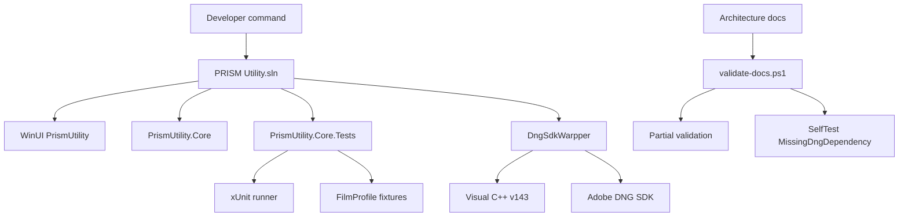

# 测试和构建

## Scope and non-responsibilities

本文覆盖 Host Software 的解决方案结构、核心测试项目、代表性测试覆盖矩阵、构建前提、文档验证器、WinUI 和原生 DNG 缺口，以及错误路径缺口。

本文记录测试和构建边界，不把缺口写成已补齐，也不声称原生 DNG 构建在没有 Adobe DNG SDK 的环境中普遍可用。

## Functionality

Host Software 的入口解决方案是 `Host Software/PRISM Utility.sln`。它包含 WinUI 应用 `PrismUtility`、核心库 `PrismUtility.Core`、xUnit 测试项目 `PrismUtility.Core.Tests` 和原生动态库项目 `DngSdkWarpper`。`Host Software/README.md` 记录了 Windows 10 1809 或更高版本、.NET 8 SDK、Visual Studio 2022 with WinUI and Windows App SDK tooling，以及兼容的命令行 MSBuild 环境。

测试项目 `Host Software/PrismUtility.Core.Tests/PrismUtility.Core.Tests.csproj` 目标框架是 `net8.0-windows10.0.19041.0`，启用 nullable 和 preview 语言版本，引用 xUnit、Microsoft.NET.Test.Sdk、coverlet，并链接 WinUI 项目中的 `FilmProfileEditorModels.cs` 和 `FilmProfileEditorViewModel.cs`。胶片配置 fixture 会从 Fixtures\FilmProfile 下的 JSON 文件复制到输出目录。

文档验证器是 `Host Software/docs/architecture/validate-docs.ps1`。Partial 模式接收指定文件，Full 模式检查交付清单。主题文档必须有 scope、functionality、key entry points、implementation、control and data flow、dependencies、state and concurrency、error handling、test coverage、known issues and solutions、related source 等章节，并且除 README 外需要 Mermaid fenced block。验证器还检查本地链接、反引号中的源路径、重复 Issue ID，以及自测 fixture 是否能拒绝损坏文档。

## Key entry points

1. `Host Software/PRISM Utility.sln` 连接托管应用、核心库、测试项目和原生 DNG 动态库。
2. `Host Software/PrismUtility.Core.Tests/PrismUtility.Core.Tests.csproj` 定义测试运行框架、包、项目引用和 fixture 复制。
3. `Host Software/docs/architecture/validate-docs.ps1` 定义文档交付清单、标准章节、Mermaid、源路径、链接和自测规则。
4. `Host Software/README.md` 定义主机构建和运行前提。
5. `Host Software/DngSdkWarpper/DngSdkWarpper.vcxproj` 定义原生 DNG bridge 的 v143、Win32、x64 和 ARM64 动态库配置。

## Implementation mechanism

测试覆盖主要集中在核心服务和源契约。测试项目没有引用 WinUI UI 自动化框架，也没有在测试中构建或加载 `DngSdkWarpper.dll`。因此测试能很好地保护扫描会话协调、USB 租约、工作流顺序、胶片配置状态、JSON schema、编辑器视图模型逻辑和 DNG 托管验证/status seam，但不能证明 WinUI 视觉交互、真实 USB 硬件、真实扫描电机运动或原生 DNG 写入都已通过。

解决方案中的原生项目使用 Visual Studio 17 生成的 `.vcxproj`，每个 Debug 和 Release 配置都使用 `PlatformToolset` v143，平台包括 Win32、x64、ARM64。`.sln` 把 x86 映射到 Win32，把 x64 映射到 x64，把 arm64 映射到 ARM64。项目引用 Adobe DNG SDK、libjxl include 路径和 zlib 源路径，并排除 `dng_jxl`、`dng_validate`、`dng_update_meta` 等 SDK 源。没有这些 SDK 文件时，原生项目不能被当成普通可用构建路径。

文档验证器本身是 PowerShell 脚本。`Invoke-SelfTest` 会在系统临时目录下创建 `prism-doc-validator-<guid>` fixture，损坏指定规则，确认验证器拒绝损坏内容，最后删除临时目录并输出 `Self-test temp fixture cleaned: True`。这确认了 temp cleanup 行为，但它只验证文档检查器，不验证应用代码。

## Control and data flow

PageMapping: build and test command -> PRISM Utility.sln -> project configurations -> application, core, tests, native bridge.

ServiceCoverage: ScanFilmProfileWorkspace

## Dependencies

1. Host app build requires Windows 10 1809 or later, .NET 8 SDK, Visual Studio 2022 with WinUI and Windows App SDK tooling, or compatible command line MSBuild.
2. Core tests require `Microsoft.NET.Test.Sdk` 17.11.1, xUnit 2.9.2, xUnit runner 2.8.2 and coverlet.collector 6.0.2 from the existing test project.
3. Native DNG build requires Visual C++ v143 and local Adobe DNG SDK files referenced by `DngSdkWarpper.vcxproj`.
4. The architecture docs validator requires PowerShell and direct filesystem access to source paths listed in backticks.
5. Real scanner validation requires PRISM hardware and USB devices described elsewhere in the repository, so it is outside the current unit test matrix.

## State and concurrency

The tests use in-memory doubles for repositories, sessions, coordinators and services. Several tests intentionally create concurrent calls, such as workspace initialization and scanner lifecycle arbitration, but the suite does not run a full WinUI app or live USB stack.

The document validator creates temporary fixtures only for self-test mode and deletes them in finally. Partial validation of existing docs is read-only. The testing and build module itself should remain a normal architecture document, not a completion record.

## Error handling

The test suite has strong coverage for managed error states in services: cancellation, failed repository writes, malformed JSON, future schema, invalid enum values, invalid acquisition settings, scanner access denial, USB lease conflicts and lifecycle disconnect handling. It has weaker coverage for DNG native error statuses, WinUI runtime failures, actual hardware timeouts and hung build processes.

The build story should treat native dependency failure as a first-class expected environment issue. Missing Adobe DNG SDK is not an application bug by itself; it is a build prerequisite gap. Final gates must run managed tests and the Core build. They should also attempt the full solution or native build with a bounded timeout when tooling is available. Missing v143 targets, Adobe DNG SDK inputs, or native artifacts must be recorded as `ENVIRONMENT_BLOCKED`, not success. A hung build is a CI risk, so validation must time it out, stop leftover build processes, and record the cleanup. For DNG-001, task 23 records managedValidationStatusSeam as `PASS`, nativeBuildOrSmoke as `ENVIRONMENT_BLOCKED`, jxlStubSmoke as `ENVIRONMENT_BLOCKED`, and dng001OverallStatus as `ENVIRONMENT_BLOCKED`. Task 24 later proved VS2022, v143, MSBuild and inspected Adobe_DNG_SDK dependency readiness in this task24 environment, but native build remained `SKIP`/not run and native/JXL runtime smoke remained absent.

## Test coverage

Representative files in the current test project are listed below.

| Area | Representative files | What they cover | Main gaps |
| --- | --- | --- | --- |
| Film profile editor | `Host Software/PrismUtility.Core.Tests/FilmProfileEditorViewModelTests.cs`, `Host Software/PrismUtility.Core.Tests/FilmProfileEditorSourceContractTests.cs`, `Host Software/PrismUtility.Core.Tests/FilmProfileEditorLocalizationAccessibilityContractTests.cs` | Editor commands, source contracts, localization and accessibility contracts. | Real WinUI rendering, keyboard focus and visual QA. |
| Film profile services | `Host Software/PrismUtility.Core.Tests/ScanFilmProfileDocumentServiceTests.cs`, `Host Software/PrismUtility.Core.Tests/ScanFilmProfileWorkspaceTests.cs`, `Host Software/PrismUtility.Core.Tests/ScanCalibrationProfileRepositoryTests.cs` | Schema 5 parsing, malformed and future documents, workspace dirty state, import staging, repository migration and write failures. | Hardware produced calibration values and full UI file picker flow. |
| CAL-001 calibration and autofocus | `Host Software/PrismUtility.Core.Tests/Cal001AutoCalibrationAndFocusTests.cs` | 15 deterministic fake tests cover dark/white convergence, black/white oscillation best restore, invalid decoded width, ROI clamp, scan failures, motion timeout, cancellation, warm-up cleanup, focus motor IDs 0/2 stop on all paths and unnormalized Brenner metric lock. | Physical scanner, real illumination, real focus motion and hardware smoke remain `ENVIRONMENT_BLOCKED`. |
| Scan workflow and sessions | `Host Software/PrismUtility.Core.Tests/ScanWorkflowServiceTests.cs`, `Host Software/PrismUtility.Core.Tests/ScanWorkflowSessionCoordinatorTests.cs`, `Host Software/PrismUtility.Core.Tests/ScannerLifecycleIntegrationRegressionTests.cs` | Illumination off before returns, motor transport disabled, progress metadata, warm-up ownership and cleanup, coordinator lifecycle and integration regressions. | Live scanner timing, physical warm-up behavior and hung motion behavior on real firmware. |
| USB access | `Host Software/PrismUtility.Core.Tests/UsbBulkDuplexSessionTests.cs`, `Host Software/PrismUtility.Core.Tests/UsbUsageCoordinatorLeaseTests.cs`, `Host Software/PrismUtility.Core.Tests/UsbDeviceCatalogTests.cs`, `Host Software/PrismUtility.Core.Tests/Usb001ContractTests.cs` | Bulk duplex behavior, lease arbitration, catalog filtering, retired `StopBulkIn` API and `StartBulkInAsync` fake cancellation lifecycle. | Real driver stack, cable removal, endpoint stalls and hardware cancellation timing. |
| Image processing | `Host Software/PrismUtility.Core.Tests/ScanCompositeImageProcessorTests.cs`, `Host Software/PrismUtility.Core.Tests/ScanChannelAlignmentServiceTests.cs`, `Host Software/PrismUtility.Core.Tests/ScanImageDecoderImg001Tests.cs` | Composite pixels, partial rows, alignment service behavior, zero-row waterfall rejection and valid output preservation. | DNG packing service, native writer output validation and UI bitmap rendering. |
| DNG-001 managed seam | `Host Software/PrismUtility.Core.Tests/DngWriterServiceValidationTests.cs`, `Host Software/PrismUtility.Core.Tests/DngWriterServiceNativeStatusTests.cs`, `Host Software/PrismUtility.Core.Tests/DngWriterServiceNativeAbiLayoutTests.cs` | Managed request validation, DllNotFound/BadImageFormat/EntryPointNotFound missing export mapping, exact native ABI message mapping, status 1 to 5/unknown mapping and x64 ABI header contract. | Managed tests do not expose a JXL request or runtime probe. Task 24 dependency probe passed in this task24 environment, but native C++ build was `SKIP`/not run. Native bridge smoke, JXL stub runtime smoke, Adobe DNG SDK write path behavior and native parity enforcement remain `ENVIRONMENT_BLOCKED` or open risk until maintained runtime evidence exists. |
| Utility math and text | `Host Software/PrismUtility.Core.Tests/ScanTimingMathTests.cs`, `Host Software/PrismUtility.Core.Tests/InvariantNumericTextTests.cs`, `Host Software/PrismUtility.Core.Tests/ScanMotorDistanceTextTests.cs`, `Host Software/PrismUtility.Core.Tests/ScanChannelRoleHelperTests.cs`, `Host Software/PrismUtility.Core.Tests/Scan007UnitContractsTests.cs` | Timing conversion, invariant numeric formatting, checked UI microsecond conversion, nanosecond protocol/model contracts, motor distance text and role counting. | Localized UI integration beyond source contracts. |

Durable project quality gate matrix:

| Gate | Purpose | Pass criterion | Known limitation |
| --- | --- | --- | --- |
| Full validator | Protect the 18 document deliverables, required sections, source paths, local links, issue links, Mermaid fences and duplicate issue IDs. | `validate-docs.ps1 -Mode Full` reports all deliverables valid and cleans Mermaid render temp output. | It validates documentation structure and references, not production code behavior. |
| Partial validator | Check targeted document edits without weakening the Full deliverable contract. | `validate-docs.ps1 -Mode Partial -Files ...` reports the named documents valid. | It covers only the supplied files, so it is not a substitute for Full validation. |
| xUnit managed tests | Protect managed Core services, scanner lifecycle contracts, film profile behavior, image processing and utility math. | `PrismUtility.Core.Tests` completes with all expected tests passing. | The suite uses fakes and source contracts, so it does not prove WinUI rendering, real USB hardware or native DNG writing. |
| CAL-001 managed closure | Prove calibration and autofocus algorithm boundaries without scanner hardware. | `Cal001AutoCalibrationAndFocusTests.cs` reports 15/15 focused tests and the full managed suite reports 555/555 with Core/app builds passing. | This closes only the managed CAL-001 test gap. P2 blocked split outcomes do not invalidate it, and CAL-002 remains unchanged. |
| DNG-001 managed seam | Prove managed DNG validation and status mapping without requiring Adobe DNG SDK. | Focused DNG managed tests report 36/36, the full managed suite reports 591/591, Core build reports 0 warnings/errors, changed-file diagnostics are clean, and Oracle reports `MANAGED_SUBSCOPE_APPROVED`. The added blackLevelPlanes length vs SamplesPerPixel seam-not-invoked test was green characterization of existing behavior, not a fabricated RED. | This is not native/JXL PASS. Managed ABI layout tests are hardcoded x64 header-contract checks, not proof of native C++ `sizeof` without a native build. Native C++ packed row-stride minimum and blackLevelPlaneCount equality remain `OPEN_UNVERIFIED_PRE_EXISTING_RISK`. |
| Core compile | Protect the shared library API surface and managed implementation. | `PRISM Utility.Core.csproj` builds without errors. | It does not compile the WinUI app package or native bridge. |
| Solution and native build probe | Classify host app, WinUI tooling and native DNG bridge readiness. | Task 24 layered runner reported managed 591/591 `PASS`, Core build `PASS` with 0 errors, x64 app build `PASS` with the existing WindowsAppSDK PublishSingleFile warning, native dependency probe `PASS`, timeout and cleanup `PASS`, and overall runner `PASS`/exit 0. | The exact `pwsh` command was unavailable, so Windows PowerShell 5.1 fallback was used. Native build was `SKIP`/not run, not PASS. Dependency readiness does not prove native bridge behavior or JXL stub runtime behavior. |
| UI and hardware evidence | Cover behavior outside the managed test harness. | Manual or automated smoke uses the WinUI surface and supported scanner hardware when those surfaces are available. | APP live unhandled-event smoke, physical USB timing and warm-up hardware behavior remain `ENVIRONMENT_BLOCKED` unless a live app session and PRISM hardware are available. |
| Temp cleanup | Keep validator self-tests from leaving repository or system temp residue. | Self-test output reports `Self-test temp fixture cleaned: True`. | This only proves validator fixture cleanup, not cleanup in application services. |

TEST-002 current boundary: source contracts are maintained for typed routes, Page host contracts, VM-001 lifecycle characterization, UI-006 Scan workspace ownership, UI-007 ScanDebug geometry ownership, VM-002 ScanDebug public surface and SET-005 settings save behavior. The current source-contract filters pass, but they do not drive a real WinUI surface. Historical native UIA captures exist for route navigation, Settings normal/recovery states, Film Profile Editor states, ScanDebug external projection, CJK inspection and export picker recheck. Those captures are task-specific evidence inventory, not a maintained comprehensive UI automation suite. A current rerun of the checked-in native UIA shell script is `HARNESS_BLOCKED` in this PowerShell 5.1 shell because the script's Chinese literals do not parse here and `pwsh` is unavailable. TEST-002 therefore remains blocked.

Unautomated end-to-end UI states remain: NavigationCache lifecycle safety, ScanDebug Canvas pointer and ROI interactions, file picker cancel and success paths, Settings save-error InfoBar render and accessibility, language switch state retention, window-close teardown and hardware-driven pages.

## Known issues and solutions

Issue-ID: TEST-BUILD-001

The test project has broad managed coverage and task 23 added direct managed `DngWriterService` validation/status seam coverage. The focused DNG run passed 36/36 and the full managed suite passed 591/591, with Core build 0 warnings/errors and Oracle `MANAGED_SUBSCOPE_APPROVED`. The added blackLevelPlanes length vs SamplesPerPixel seam-not-invoked test was green characterization of existing behavior, not a fabricated RED. Task 24 proved native dependency readiness in this task24 environment, but native bridge build was `SKIP`/not run. Native bridge smoke and JXL stub runtime smoke remain `ENVIRONMENT_BLOCKED` because no maintained runnable native smoke fixture/artifact or JXL runtime probe/artifact was executed. Repository source inspection of intentional `SupportsJXL=false` stubs is not runtime smoke and is not managed JXL test coverage. Add native smoke tests only after maintained runtime probes exist, and keep native parity risk separate from managed PASS.

Issue-ID: TEST-BUILD-002

WinUI coverage is mostly source and view model based. Current maintained filters pass for UI-002, UI-003, VM-001, UI-006, UI-007 and VM-002 contracts, and SET-005 has save-result logic coverage. Existing native UIA route, Settings, ScanDebug, Film Profile Editor, CJK and export-picker artifacts remain historical task-specific inventory only. They do not close TEST-002 because there is no maintained suite for NavigationCache lifecycle safety, ScanDebug Canvas pointer and ROI interactions, file picker cancel and success, Settings save-error InfoBar render and accessibility, language switch state retention, window-close teardown or hardware-driven pages. Add UI automation or equivalent WinUI tooling only if the team chooses to introduce that dependency.

Issue-ID: TEST-BUILD-003

Full solution build may depend on local Visual Studio, Windows App SDK and Adobe DNG SDK state. CI should split managed tests, app packaging, and native bridge build into separate jobs so a missing SDK is reported as a dependency failure, not as a generic hung or broken build.

Registry links: TEST-BUILD-001 -> [DNG-001](issues-and-remediation.md#dng-001); TEST-BUILD-002 -> [TEST-002](issues-and-remediation.md#test-002); TEST-BUILD-003 -> [TEST-001](issues-and-remediation.md#test-001).

## Related source

`Host Software/PRISM Utility.sln`

`Host Software/README.md`

`Host Software/PrismUtility.Core.Tests/PrismUtility.Core.Tests.csproj`

`Host Software/docs/architecture/validate-docs.ps1`

`Host Software/DngSdkWarpper/DngSdkWarpper.vcxproj`

`Host Software/PrismUtility.Core.Tests/FilmProfileEditorViewModelTests.cs`

`Host Software/PrismUtility.Core.Tests/ScanFilmProfileDocumentServiceTests.cs`

`Host Software/PrismUtility.Core.Tests/ScanFilmProfileWorkspaceTests.cs`

`Host Software/PrismUtility.Core.Tests/ScanCalibrationProfileRepositoryTests.cs`

`Host Software/PrismUtility.Core.Tests/ScanWorkflowServiceTests.cs`

`Host Software/PrismUtility.Core.Tests/UsbBulkDuplexSessionTests.cs`
