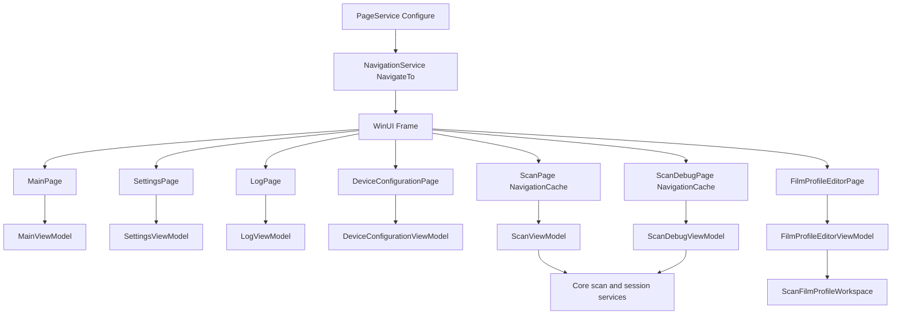

# UI 与 MVVM 结构

## Scope and non-responsibilities

本文覆盖 PRISM Utility WinUI 层的 Page 到 ViewModel 绑定方式、页面 code-behind 边界、导航缓存、事件订阅、UI dispatch 和重复状态风险。范围只到 UI 编排和 ViewModel 状态投影。底层 USB、扫描协议、电机、照明、图像解码和 DNG 写入由 Core 服务承担，本文不会把这些硬件实现写成 ViewModel 的职责。

PageMapping: MainPage -> MainViewModel
PageMapping: SettingsPage -> SettingsViewModel
PageMapping: LogPage -> LogViewModel
PageMapping: DeviceConfigurationPage -> DeviceConfigurationViewModel
PageMapping: ScanPage -> ScanViewModel
PageMapping: ScanDebugPage -> ScanDebugViewModel
PageMapping: FilmProfileEditorPage -> FilmProfileEditorViewModel

## Functionality

UI 层采用直接页面构造注入模式。每个 Page 在构造函数中通过 `App.GetService<TViewModel>()` 解析自己的 ViewModel，再调用 `InitializeComponent()`。注册关系集中在 `Host Software/PRISM Utility/Services/PageService.cs`，七条 `AppRoute` registration 定义 typed route 到 Page 类型的映射，并通过 `IPageViewModelHost<TViewModel>` 固定 Page 到 ViewModel 的编译期配对。

七个 Page 到 ViewModel 的职责如下。

| Page | ViewModel | XAML 绑定职责 | code-behind 边界 |
| --- | --- | --- | --- |
| `Host Software/PRISM Utility/Views/MainPage.xaml` | `MainViewModel` | 首页卡片按钮绑定 `NavigateToScanCommand`、`NavigateToScanDebugCommand`、`NavigateToSettingsCommand` | `MainPage.xaml.cs` 只解析 ViewModel 和初始化组件 |
| `Host Software/PRISM Utility/Views/SettingsPage.xaml` | `SettingsViewModel` | 主题 RadioButton 使用 `SwitchThemeCommand` 驱动并以 OneWay `IsChecked` 显示当前主题；语言、日志镜像、Bulk IN 传输和彩色管理设置可使用 `x:Bind` 双向值绑定 | `SettingsPage.xaml.cs` 只解析 ViewModel 和初始化组件 |
| `Host Software/PRISM Utility/Views/LogPage.xaml` | `LogViewModel` | `Entries`、`StatusText`、`EmptyStateVisibility` 和 `ClearCommand` 驱动日志列表 | `LogPage.xaml.cs` 在 Unloaded 调用 `ViewModel.Dispose()` |
| `Host Software/PRISM Utility/Views/DeviceConfigurationPage.xaml` | `DeviceConfigurationViewModel` | 电机机械参数、通道角色和 DNG 几何设置双向绑定 | `DeviceConfigurationPage.xaml.cs` 只解析 ViewModel 和初始化组件 |
| `Host Software/PRISM Utility/Views/ScanPage.xaml` | `ScanViewModel` | 扫描工作流卡片、状态提示、预览、输出和命令绑定 | `ScanPage.xaml.cs` 负责 Loaded/Unloaded 生命周期、PropertyChanged 订阅和滚动到阻塞卡片 |
| `Host Software/PRISM Utility/Views/ScanDebugPage.xaml` | `ScanDebugViewModel` | 扫描调试、校准、ROI、预览画布、DNG 导出和胶片档案快捷操作 | `ScanDebugPage.xaml.cs` 负责 Canvas 绘制、缩放、ROI 鼠标交互、对话框和 ViewModel 事件订阅 |
| `Host Software/PRISM Utility/Views/FilmProfileEditorPage.xaml` | `FilmProfileEditorViewModel` | 胶片档案草稿、导入暂存、校验、保存和响应式表单绑定 | `FilmProfileEditorPage.xaml.cs` 负责布局 VisualState、表单列数、SizeChanged 订阅和 Dispose |

## Key entry points

关键入口按调用顺序排列。

| 入口 | 作用 |
| --- | --- |
| `Host Software/PRISM Utility/Services/PageService.cs` | 七个 `AppRoute` registration 建立 typed route 到 Page 类型的唯一映射，约束 exact Page/ViewModel host pair，并校验 enum 闭集 |
| `Host Software/PRISM Utility/Services/NavigationService.cs` | `NavigateTo(AppRoute, ...)` 获取 Page 类型，Frame 导航成功后调用旧 ViewModel 的 `OnNavigatedFrom()` 和新 ViewModel 的 `OnNavigatedTo()` |
| `Host Software/PRISM Utility/Views/ScanPage.xaml` | `NavigationCacheMode="Enabled"` 让扫描页实例可被 Frame 缓存 |
| `Host Software/PRISM Utility/Views/ScanDebugPage.xaml` | `NavigationCacheMode="Enabled"` 让调试页实例可被 Frame 缓存 |
| `Host Software/PRISM Utility/Contracts/Services/IUiDispatcher.cs` | ViewModel 从服务或后台回调回到 UI 线程的最小接口 |
| `Host Software/PRISM Utility/Services/UiDispatcherService.cs` | 使用 `App.MainWindow.DispatcherQueue` 或当前线程 DispatcherQueue 执行 UI 更新 |

## Implementation mechanism

页面绑定主要使用 `x:Bind ViewModel.Property` 和 `x:Bind ViewModel.Command`。这让 XAML 编译期知道 ViewModel 类型。Page 持有 ViewModel 不是反射约定，而是 `IPageViewModelHost<TViewModel>` 契约入口；非泛型 `IPageViewModelHost` 提供导航层直接读取 object ViewModel 的统一面。简单页面不处理业务事件，复杂页面只处理 WinUI 控件层无法自然放入 ViewModel 的行为。

`PageService.Configure<TPage, TViewModel>` 要求 `TPage : Page, IPageViewModelHost<TViewModel>`。因为 `IPageViewModelHost<TViewModel>` 是不变泛型，缺少 host、Page host 的 ViewModel 类型和 registration 的 ViewModel 类型不一致、或用 derived host 代替 base host 都不能通过 compile harness。当前七个真实页面 `MainPage`、`LogPage`、`ScanPage`、`ScanDebugPage`、`FilmProfileEditorPage`、`SettingsPage` 和 `DeviceConfigurationPage` 均声明精确 host pair。

Main、Settings、DeviceConfiguration 和 Log 的 code-behind 很薄。Main、Settings、DeviceConfiguration 只解析 ViewModel。Log 额外在卸载时释放 `LogViewModel`，因为 `LogViewModel` 订阅了 `IDebugOutputMirrorService.EntryMirrored`。

Scan 和 ScanDebug 的 code-behind 是 UI 编排边界，不是硬件边界。`ScanPage.xaml.cs` 订阅 `ScanViewModel.PropertyChanged`，当 `FirstBlockingCardId` 改变时把对应卡片滚入视图。`ScanDebugPage.xaml.cs` 处理 Win2D Canvas bitmap、预览缩放、ROI overlay、TextBox 同步和 ContentDialog，底层扫描执行仍由 `ScanDebugViewModel` 调用 Core 服务完成。

FilmProfileEditor 的 code-behind 处理自适应布局。`FilmProfileEditorPage.xaml.cs` 在构造函数订阅 `SizeChanged`、多个 Grid 的 `SizeChanged` 和 ViewModel `PropertyChanged`，在 Unloaded 统一解绑并调用 `ViewModel.Dispose()`。档案解析、校验、暂存和保存都留在 `FilmProfileEditorViewModel` 及 Core workspace 服务中。

## Control and data flow

导航使用 typed `AppRoute`，不再使用 ViewModel `FullName` route 字符串。`MainViewModel.NavigateToScan()`、`NavigateToScanDebug()` 和 `NavigateToSettings()` 调用 `INavigationService.NavigateTo(AppRoute.Scan)`、`AppRoute.ScanDebug` 和 `AppRoute.Settings`。`PageService.GetPageType()` 根据 route 返回 Page 类型。Frame 导航成功后，`NavigationService.OnNavigated()` 通过 `Frame.GetPageViewModel()` 从 `IPageViewModelHost` 找到新页面的 ViewModel，并在其实现 `INavigationAware` 时调用 `OnNavigatedTo()`，再发布 `Navigated`。旧页面的 `OnNavigatedFrom()` 只在 `Frame.Navigate` 或 `GoBack` 成功后执行。

普通数据流是 XAML 直接读写 ViewModel。Settings 属性变化和 restore/default 命令把保存操作交给 owner-scoped `SettingsSaveCoordinator`, 并通过 `IUiDispatcher.TryEnqueue()` 把 latest result 的 rollback、per-scope error 和既有 persistence InfoBar 更新切回 UI 线程。DeviceConfiguration 仍在属性变化回调中保存设置。Scan 和 ScanDebug 使用 ViewModel 属性驱动按钮、InfoBar、ProgressBar 和预览，同时通过 `IUiDispatcher.TryEnqueue()` 接收会话、传输或扫描进度回调。Log 通过 `IDebugOutputMirrorService.EntryMirrored` 接收日志镜像，再由 dispatcher 把 `ObservableCollection` 修改切回 UI 线程。

ScanDebug 的 Page 事件形成额外 UI 循环。`PreviewCanvasControl_Draw` 从 `ViewModel.PreviewFrame` 创建或复用 `CanvasBitmap`。`RefreshPreviewLayout()` 设置 CanvasControl、PreviewCanvas、RoiCanvas 和 AxisCanvas 尺寸，安排初始 fit zoom，并在没有 frame 时清空 overlay、axis、cursor text 和 bitmap。zoom、pan 和 ROI pointer handlers 仍在 code-behind 内更新 `ScrollViewer` offset、捕获 pointer、计算 image x/y、更新 cursor sample text，并把 ROI 或 column sample range mutation 调回 ViewModel。`DrawAxes()` 和 `DrawRoiOverlays()` 仍负责 axis tick、ROI rectangle、label 和 sample overlay 呈现。`OnViewModelPropertyChanged` 对 `PreviewFrame`、ROI overlay version、column sample overlay version 和当前校准照明属性调用 `DispatcherQueue.TryEnqueue()` 更新画布和编辑器。ContentDialog completion 和当前校准照明 TextBox/ComboBox mirror sync 也留在 code-behind。ROI selection、overlay visibility、ROI input TextBox 和 apply/reset command 仍在 XAML/ViewModel 绑定面。这些代码只管理控件和呈现状态，不发送硬件命令。

## Dependencies

| 层 | 依赖 |
| --- | --- |
| Page | `Microsoft.UI.Xaml.Controls.Page`、XAML 控件、`App.GetService<T>()`、对应 ViewModel |
| ViewModel | CommunityToolkit MVVM 的 `ObservableRecipient`、`ObservableProperty`、`RelayCommand`，以及应用服务和 Core 合同 |
| UI dispatch | `IUiDispatcher`、`UiDispatcherService`、WinUI `DispatcherQueue` |
| 导航 | `INavigationService`、`IPageService`、`PageService`、`NavigationService`、`IPageViewModelHost<TViewModel>`、`FrameExtensions.GetPageViewModel()` |
| 扫描与档案 | `IScannerDeviceSessionManager`、`IScanWorkflowService`、`IScanFilmProfileWorkspace` 等 Core 服务 |

## State and concurrency

`NavigationCacheMode="Enabled"` 只出现在 `ScanPage.xaml` 和 `ScanDebugPage.xaml`。这两个页面的 Page 实例可能跨导航保留，因此它们必须在 Loaded 时订阅运行时事件，在 Unloaded 时解绑，避免缓存页面继续接收后台事件。当前 ScanPage 源码事实是 Loaded 无 guard 执行 `ViewModel.PropertyChanged += OnViewModelPropertyChanged`，Unloaded 只有一次 `PropertyChanged -=`，而 ScanViewModel 构造函数先调用 `Activate()`。非缓存页面仍应解绑，因为服务和 ViewModel 生命周期可能长于视觉树。

UI 线程边界有两种。ViewModel 侧通过 `IUiDispatcher.TryEnqueue()` 处理服务回调，例如 `ScanViewModel.OnSessionSnapshotChanged()` 和 `LogViewModel.OnEntryMirrored()`。Page 侧直接使用 `DispatcherQueue.TryEnqueue()`，例如 `ScanDebugPage.OnViewModelPropertyChanged()` 更新 Canvas 和 ROI overlay。

当前状态重复主要集中在两个区域。第一，Scan 和 ScanDebug 都持有扫描参数、色彩管理、DNG 导出模式、预览状态和会话状态的 UI 副本，源分别是设置服务、session manager、workflow result 和用户输入。第二，FilmProfileEditor 同时有 `CurrentDraft`、`ProfileName`、`AcquisitionEditor`、`RecipeEditor`、`SelectedChannelEditor` 和 `_inputValidationIssues`，依靠 `_isProjecting` 和 `_preserveEditorsOnNextProjection` 防止投影时把用户编辑误写回 workspace。

体量风险有源码支撑。当前 `ScanViewModel.cs` 有 2042 行，`ScanDebugViewModel.cs` 有 6395 行，`FilmProfileEditorViewModel.cs` 有 594 行。这里的结论是可维护性风险，不是说这些 ViewModel 直接实现硬件协议。硬件协议仍在 Core 服务中。

## Error handling

多数简单绑定页没有 Page 级异常处理。Settings 保存不再是未观察 fire-and-forget: language、theme、debug、transfer 和 color 五个 family, 包括 restore/default, 都由 `SettingsSaveCoordinator` 返回 result；latest failure 先写 Debug mirror diagnostic, 再经 UI dispatcher rollback visible state 并显示既有 Settings persistence InfoBar。DeviceConfiguration 的保存路径仍使用 fire-and-forget `_ = Save...Async()`，异常路径需要依赖服务层或全局异常处理记录。Log 的 `Dispose()` 防重复释放，避免多次 Unloaded 重复解绑。

ScanDebugPage 的两个 dialog 事件处理器捕获异常并写入 `TaskCompletionSource`，避免 ViewModel 等待的交互任务永久悬挂。FilmProfileEditorViewModel 的 `RunAsync()` 捕获操作异常并设置失败 message key，但没有把异常细节暴露到 UI 文档层。

## Test coverage

结构正确性由 `Host Software/docs/architecture/validate-docs.ps1` 的 Full 模式验证，覆盖必需章节、源码路径、链接和 Mermaid fenced block。UI-002 focused 16 个 tests 两次通过。UI-003 focused 8 个 tests 两次通过，覆盖 `IPageViewModelHost<TViewModel>`、`PageService` exact route/Page/ViewModel constraint、七个真实 Page host 声明、negative compile missing host、wrong pairing 和 invariance、real app metadata probe、direct `FrameExtensions` retrieval 和 nonhost failure、production navigation 无反射以及 lifecycle callback order。UI-002+UI-003 focused 24 个 tests 通过；real-app harness、fresh seven-route/back/same-route UIA 和 dual visual QA 均记录导航行为 GOOD，其中 DeviceConfiguration 经 footer flyout 进入。SET-005 focused 29 个 tests 两次通过, combined managed suite 为 487/487, 覆盖 Settings coordinator owner、per-scope errors、five settings families、restore/default、commit/rollback、UI dispatcher、bounded page/app teardown 和 existing InfoBar source contract。normal/recovery en/zh visual captures clean；rendered failure InfoBar/accessibility evidence 为 `HARNESS_BLOCKED`, 不是 visual pass。VM-001 todo 18 记录为 blocked evidence: 4 个 focused characterization tests 两次、source caller graph 和 Oracle `CONFIRMED_BLOCKED`；该结论只支持 `EXTRACTION_BLOCKED`，不证明运行时安全。UI-006 characterization 记录 15 个 focused source tests 两次通过，full managed suite 520/520 通过，Core/app builds 通过且只保留既有 app warning。覆盖范围限于 ScanViewModel 执行、预览、settings/profile 投影、cached state ownership 和 no-extraction source contract；没有生产 extraction，也没有证明 leave/return runtime 安全。Task 20 historical broad-filter characterization 记录 19 个 source/Core tests 两次通过，regression subset 9 个 tests 通过，full managed suite 534/534 通过，Core build 和 x64 app build 通过且只保留既有 app warning。覆盖范围限于 ScanDebug code-behind Canvas/ROI/display/pointer/overlay/dialog/text sync ownership、ViewModel/XAML ROI binding surface、Core `ScanColumnRange.Clamp` 和 `ScanCalibrationRoiSettings.Clamp` edge cases、no production geometry/display extraction 和 no code-behind hardware service calls；没有 runtime WinUI pointer、Canvas render、dialog 或 dispatcher smoke。其它测试集中在 Core 服务和胶片档案行为，对真实 WinUI Page code-behind 的事件订阅、NavigationCache 复用和 Canvas 交互没有直接自动化覆盖。

VM-002 characterization 记录 16 个 focused source/projection tests 两次通过，UI007/UI006/VM001 regression subset 23/23 通过，FilmProfile regression 204/204 通过，final full managed suite 540/540 通过。覆盖范围限于当前 `ScanDebugViewModel` public binding surface、commands、events、preview、ROI、calibration、film profile projection、session/workflow orchestration、lifecycle calls 和 no-split source contract；没有生产责任拆分，也不证明 runtime WinUI safety。

TEST-002 仍为 `BLOCKED`。当前可维护的自动化层是 source contracts 和 managed fakes: UI-002/UI-003 typed route and host filters pass, VM-001/UI-006 lifecycle and workspace characterization pass, UI-007/VM-002 geometry and ScanDebug surface characterization pass, and SET-005 save-result logic passes. Existing native UIA route, Settings normal/recovery, Film Profile Editor, ScanDebug external projection, CJK and export picker captures are task-specific inventory. They do not prove NavigationCache leave/return safety, ScanDebug pointer/ROI runtime interaction, Canvas rendering, file picker cancel/success coverage, Settings save-error InfoBar accessibility, language switch state retention, window-close teardown or hardware-driven pages.

## Known issues and solutions

Issue-ID: UI-MVVM-001
问题：Scan 和 ScanDebug 都启用 NavigationCache，且各自持有较多 UI 状态副本。ScanViewModel 当前仍拥有扫描执行和 stop/load/export 命令、RGB/raw 预览投影、color management 与 profile settings 投影、`_lastResult`、`_loadedSnapshot` 和 selected acquisition settings 等 cached state。VM-001 hard gate 当前为 `EXTRACTION_BLOCKED`，因为 cached ScanPage、Loaded/Unloaded 订阅、ScanViewModel cleanup 零调用者和 app close 不调用 cleanup 的所有权尚未明确。短期方案是在文档和后续审查中把 Loaded/Unloaded 订阅路径列为变更检查项；VM-001 -> UI-006 -> UI-007 已形成 P2 blocked chain，VM-002 因此只能记录 `SPLIT_BLOCKED` characterization-only 结果。长期方案是先明确 lifecycle/cleanup ownership，再决定是否提取 presenter、workspace 或 lifecycle adapter。

Issue-ID: UI-MVVM-002
问题：`ScanDebugPage.xaml.cs` 同时承担 Canvas bitmap、display sizing、zoom/pan pointer、ROI drag pointer、cursor sample text、axis and ROI overlay drawing、ContentDialog completion 和当前校准照明 TextBox/ComboBox sync。ROI selection、overlay visibility、ROI input TextBox 和 apply/reset command 仍由 XAML/ViewModel 绑定面承担。UI-007 task 20 当前为 `EXTRACTION_BLOCKED`，因为 VM-001 和 UI-006 hard blockers 仍未解除；task 21 必须走 blocked branch，不能假定 geometry/display 已提取。短期方案是保持 code-behind 只做 UI 编排，不新增硬件调用，不调用 scan session、workflow、calibration、autofocus、illumination、channel image、parameter service 或 DNG export/picker。长期方案是在 lifecycle gate 解除后，把可测试的几何和显示状态计算迁出 Page。Task 20 historical broad-filter 19 个 characterization tests 两次、9 个 regression tests、534/534 full managed suite、Core build 和 x64 app build 只证明 source-only ownership 和 Core clamp 行为，不证明 runtime pointer、Canvas render、dialog 或 dispatcher 安全。

Issue-ID: UI-MVVM-003
事实: SET-005 已关闭 Settings 保存缺口。SettingsViewModel 现在用 owner-scoped `SettingsSaveCoordinator` 管理 language、theme、debug、transfer 和 color 五个 family 的属性保存与 restore/default 命令；latest failure 会先 mirror diagnostic, 再通过 UI dispatcher rollback visible state 并显示既有 Settings persistence InfoBar；页面和 app teardown 都有 bounded flush/cancel。DeviceConfiguration 和 FilmProfileEditor 仍有双向文本输入到 typed state 的重复状态。短期方案是继续用 loading/projecting guard 防止回写循环。长期方案是提取共享的输入投影和校验模型，减少 TextBox 字符串状态和 typed settings 的漂移。

Issue-ID: UI-MVVM-004
问题：`ScanDebugViewModel` 当前仍是未拆分的扫描调试编排类。绑定面包括 start/stop/export commands、acquisition rows、motor、preview、waterfall、DNG mode、calibration channel/actions、autofocus、illumination、motion、ROI edit/reset/apply commands 和 film-profile capture/open shortcuts。事件面仍是 `CalibrationPromptRequested`、`NoticeRequested` 和 `CalibrationSectionRequested`。生命周期仍由 ScanDebugPage Loaded 调用 `AttachRuntimeBindings()`，Unloaded 调用 `DeactivateAsync()`；ViewModel 内部继续拥有 session target、transfer setting 和 film profile workspace 订阅，`CleanupAsync()` 只调用 `DeactivateAsync()`。协作者仍包括 scan debug session coordinator、workflow service、calibration/autofocus services、channel image service、parameter service、film profile workspace、UI dispatcher 和 navigation service。task 21 outcome 是 `SPLIT_BLOCKED`，不是 closed；没有生产 preview、ROI、calibration 或 profile presenter/workspace split。source-contract tests 只冻结当前 public bindings、commands、events、state transitions 和 blocker evidence，不证明 runtime safety。短期方案是保持 Attach/Deactivate/Cleanup、dialog event 和 workspace projection 边界稳定，并继续把 CAL-001、DNG-001 作为 P3 测试缺口推进，不假定 VM-002 已拆分。

Registry links: UI-MVVM-001 -> [UI-006](issues-and-remediation.md#ui-006); UI-MVVM-002 -> [UI-007](issues-and-remediation.md#ui-007); UI-MVVM-003 -> [SET-005](issues-and-remediation.md#set-005); UI-MVVM-004 -> [VM-002](issues-and-remediation.md#vm-002).

## Related source

`Host Software/PRISM Utility/Services/PageService.cs`

`Host Software/PRISM Utility/Services/NavigationService.cs`

`Host Software/PRISM Utility/Contracts/ViewModels/IPageViewModelHost.cs`

`Host Software/PRISM Utility/Helpers/FrameExtensions.cs`

`Host Software/PRISM Utility/Contracts/Navigation/NavigationLifecycleDispatcher.cs`

`Host Software/PRISM Utility/Contracts/Services/IUiDispatcher.cs`

`Host Software/PRISM Utility/Services/UiDispatcherService.cs`

`Host Software/PRISM Utility/Views/MainPage.xaml`

`Host Software/PRISM Utility/Views/MainPage.xaml.cs`

`Host Software/PRISM Utility/ViewModels/MainViewModel.cs`

`Host Software/PRISM Utility/Views/SettingsPage.xaml`

`Host Software/PRISM Utility/Views/SettingsPage.xaml.cs`

`Host Software/PRISM Utility/ViewModels/SettingsViewModel.cs`

`Host Software/PRISM Utility/Views/LogPage.xaml`

`Host Software/PRISM Utility/Views/LogPage.xaml.cs`

`Host Software/PRISM Utility/ViewModels/LogViewModel.cs`

`Host Software/PRISM Utility/Views/DeviceConfigurationPage.xaml`

`Host Software/PRISM Utility/Views/DeviceConfigurationPage.xaml.cs`

`Host Software/PRISM Utility/ViewModels/DeviceConfigurationViewModel.cs`

`Host Software/PRISM Utility/Views/ScanPage.xaml`

`Host Software/PRISM Utility/Views/ScanPage.xaml.cs`

`Host Software/PRISM Utility/ViewModels/ScanViewModel.cs`

`Host Software/PRISM Utility/Views/ScanDebugPage.xaml`

`Host Software/PRISM Utility/Views/ScanDebugPage.xaml.cs`

`Host Software/PRISM Utility/ViewModels/ScanDebugViewModel.cs`

`Host Software/PRISM Utility/Views/FilmProfileEditorPage.xaml`

`Host Software/PRISM Utility/Views/FilmProfileEditorPage.xaml.cs`

`Host Software/PRISM Utility/ViewModels/FilmProfileEditorViewModel.cs`
