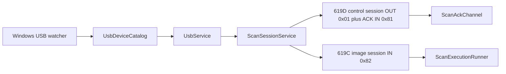

# USB 传输架构

## Scope and non-responsibilities

本文说明上位机如何发现 PRISM 扫描仪的两个 USB 功能，如何刷新设备目录，如何打开 LibUsbDotNet 会话，以及扫描链路如何使用三个固定批量端点。范围只覆盖 Host Software 里已经实现的枚举、端点选择、读写会话、错误处理和测试证据。

本文不描述固件内部实现，不推断硬件时序，不给出未在源码中出现的端点，也不承诺系统级驱动安装体验。

## Functionality

USB 层有两条主要能力。

1. 设备目录，`UsbDeviceCatalog` 枚举 `UsbDevice.AllDevices`，缓存 `UsbDeviceDto` 列表，并通过 Windows 设备接口 watcher 在设备 Added、Removed、Updated 时请求刷新。
2. 批量传输，`UsbService` 按调用方给定的配置、接口、备用设置和端点地址创建 `UsbBulkDuplexSession`，后者负责打开 LibUsbDotNet 设备、声明接口、打开批量 IN 或 OUT 端点并执行同步或多缓冲读写。

扫描会话不会直接猜端点。`ScanSessionService.ConnectAsync` 先调用 `RefreshDevicesAsync`，再用 `ScanDebugConstants` 的 VID、PID 和端点常量在当前目录中查找真实管道。

## Key entry points

| 入口 | 作用 |
| --- | --- |
| `PRISM Utility.Core/Services/UsbDeviceCatalog.cs` | 枚举、缓存、刷新和 watcher 生命周期。 |
| `PRISM Utility.Core/Services/UsbService.cs` | 对应用层暴露设备列表、端点列表、批量读写和会话工厂。 |
| `PRISM Utility.Core/Services/UsbBulkDuplexSession.cs` | 拥有一个 LibUsbDotNet 设备句柄、可选 reader、可选 writer 和接口声明。 |
| `PRISM Utility.Core/Services/ScanSessionService.cs` | 将扫描需要的 619C 图像 IN、619D 控制 OUT、619D ACK IN 绑定为两个 USB 会话。 |
| `PRISM Utility.Core/Models/ScanDebugModels.cs` | 定义扫描 USB 端点、超时、缓冲和协议常量。 |
| `PRISM Utility.Core/Configuration/ScanTransferDefaults.cs` | 定义默认多缓冲读模式、传输块大小、并发读数、超时和 RawIO 开关。 |

## Implementation mechanism

`UsbService` 构造时创建 `UsbDeviceCatalog`，启动 watcher，并立即请求一次刷新。目录刷新由 `RequestRefresh` 合并并发请求，后台 `RunRefreshLoop` 读取快照，把注册表对象按设备 ID 缓存。刷新失败只写 Debug 日志，不抛给调用方，所以 UI 需要通过后续目标状态判断设备是否仍可用。

扫描连接路径如下。

1. `ScanSessionService.ConnectAsync` 调用 `RefreshDevicesAsync`，再调用 `RefreshTargets`。
2. `RefreshTargets` 只在同时看到 `VID 0x1D50 PID 0x619C` 和 `VID 0x1D50 PID 0x619D` 时把 `Targets.IsDevicesPresent` 设为 true。
3. `FindPipe` 遍历配置、接口和批量端点，分别查找图像 IN、控制 OUT、ACK IN。
4. 619D 的 OUT 和 ACK IN 必须在同一 device、config、interface、alt 上，否则连接失败。
5. 连接成功后创建两个 LibUsbDotNet 会话，一个控制会话同时打开 619D ACK IN 和 619D OUT，一个图像会话只打开 619C IN。

Endpoint mapping: 619C IN 0x82; 619D OUT 0x01; 619D ACK IN 0x81

| USB 功能 | VID | PID | 方向 | 端点 | 上位机用途 | 源码常量 |
| --- | --- | --- | --- | --- | --- | --- |
| FIFO Buffer | `0x1D50` | `0x619C` | IN | `0x82` | 扫描图像批量读取 | `ScanDebugConstants.BulkInVid`, `BulkInPid`, `BulkInEndpoint` |
| Control Interface | `0x1D50` | `0x619D` | OUT | `0x01` | 发送控制命令 | `ScanDebugConstants.BulkOutVid`, `BulkOutPid`, `BulkOutEndpoint` |
| Control Interface | `0x1D50` | `0x619D` | ACK IN | `0x81` | 读取 ACK 和运动事件 | `ScanDebugConstants.BulkOutAckEndpoint` |

`UsbBulkDuplexSession` 的所有权很明确。构造函数打开 `UsbRegistry`，如果设备实现 `IUsbDevice`，就设置配置并声明接口。构造过程中任一步失败都会调用 `Dispose`，避免留下半开的 reader、writer 或设备句柄。`Dispose` 依次释放 reader、writer、接口和设备，释放错误被吞掉，这是清理路径而不是业务反馈路径。

## Control and data flow

控制流从 watcher 或手动刷新进入目录缓存。扫描连接再从缓存读取目标设备，并打开两个独立会话。数据流分离为 619D 控制帧和 ACK 流，以及 619C 图像流。控制会话是双向批量会话，图像会话是只读批量会话。

## Dependencies

| 依赖 | 用途 |
| --- | --- |
| LibUsbDotNet | `UsbDevice`, `UsbRegistry`, `UsbEndpointReader`, `UsbEndpointWriter`, `WinUsbDevice` 和 `UsbTransfer`。 |
| Windows Devices Enumeration | `DeviceInformation.CreateWatcher` 用于 USB 接口变化通知。 |
| `IScanProtocolService` | 构造和解析控制帧，USB 层只负责传输。 |
| `IScanTransferSettingsService` | 给扫描执行层提供读模式和多缓冲设置。 |

## State and concurrency

`UsbDeviceCatalog` 用 `_gate` 保护设备列表和注册表缓存，用 `_refreshRequestGate` 合并刷新请求。`RefreshAsync` 注册取消回调，但实际目录读取已经交给后台刷新循环，取消只影响等待方。

`UsbBulkDuplexSession` 用 `_readLock` 和 `_writeLock` 分别串行化同一会话内的读和写。`ReadBulkInExactAsync` 在 `Task.Run` 中执行阻塞的 `_reader.Read`，取消令牌只在进入阻塞读前检查，底层阻塞读开始后要等 LibUsbDotNet 超时或返回。多缓冲读会提交异步 USB transfer，并在 `finally` 取消和释放仍未完成的 transfer，再把 RawIO 设回 false。

默认传输设置来自 `ScanTransferDefaults.Settings`，当前值是多缓冲读取、`512 * 1024` 字节传输块、4 个 outstanding transfer、1000 ms 超时、RawIO enabled。

## Error handling

已验证的错误和处理方式如下。

| 场景 | 当前处理 | 风险或补救 |
| --- | --- | --- |
| watcher 停止抛 `InvalidOperationException` | `StopWatcher` 写 Debug 日志并继续把 watcher 置空 | 适合释放路径。若 UI 需要用户可见错误，需要另设通知层。 |
| 目录刷新读取失败 | `RunRefreshLoop` 写 Debug 日志，保留旧缓存 | 可能造成短时间 stale state。连接前的 `RefreshDevicesAsync` 和目标检查会再次校验。 |
| 设备打开失败 | 抛 `InvalidOperationException("Open device failed (driver/permission/device removed).")` | 常见补救是检查驱动绑定、权限、设备是否被移除或被其他进程占用。 |
| 端点缺失 | 连接返回需要 619C IN 0x82 和 619D OUT 0x01/IN 0x81 的错误 | 需要检查枚举到的接口和驱动绑定，不改端点常量绕过。 |
| 619D OUT 和 ACK IN 不在同一接口 | 连接返回同接口要求错误 | 需要选择正确接口或修正设备枚举结果。 |
| Raw Bulk IN stop API | `StopBulkIn` 已从 `IUsbService` 和 `UsbService` 退休 | 原始 USB Debug 读取通过取消传给 `StartBulkInAsync` 的 `CancellationToken` 停止；硬件时序仍需真实 USB smoke。 |
| 阻塞读取消 | 单次精确读只在进入 `_reader.Read` 前检查取消 | 补救是合理设置超时，或优先使用多缓冲读的 transfer 取消清理路径。 |

## Test coverage

| 测试 | 覆盖点 |
| --- | --- |
| `PrismUtility.Core.Tests/UsbDeviceCatalogTests.cs` | 目录刷新、设备快照和 watcher 触发后的缓存更新。 |
| `PrismUtility.Core.Tests/ScanSessionServiceUsbRefreshTests.cs` | 连接前会刷新 USB 设备，刷新后打开两个会话，并使用 619C/619D 常量端点。 |
| `PrismUtility.Core.Tests/UsbUsageCoordinatorLeaseTests.cs` | USB 使用权租约不会被错误释放，读观察不会占用所有权。 |
| `PrismUtility.Core.Tests/Usb001ContractTests.cs` | `StopBulkIn` API retirement, `StartBulkInAsync` fake runner cancellation lifecycle, fresh token restart and repeated interruption. |
| `PrismUtility.Core.Tests/ScannerAccessCoordinatorTests.cs` | 直接覆盖 Raw USB 租约阻塞 ScanWorkflow 激活；ScanDebug 激活也会被 `GetActivationBlockedReason` 的 RawUsb 分支阻塞，但当前没有单独的 ScanDebug RawUsb 阻塞测试。 |

## Known issues and solutions

Issue-ID: USB-TRANSPORT-001

现状：`StopBulkIn` 已从 public USB service contract 和 implementation 退休。原始 Bulk IN 调试入口现在以调用方传给 `StartBulkInAsync` 的 `CancellationToken` 作为停止机制，`Usb001ContractTests.cs` 用阻塞 fake runner 证明 Starting、Running、Stopping、Stopped 生命周期、fresh token restart 和 repeated cancellation。真实硬件取消时序仍需 USB smoke，不能由 fake 证据替代。

Issue-ID: USB-TRANSPORT-002

现象：目录刷新异常只写 Debug，用户层只能看到后续目标缺失或连接失败。影响：驱动权限和设备移除错误可能表现为目标丢失。短期方案：文档和 UI 文案把驱动、权限、设备移除列为排查项。长期方案：目录服务可暴露最近一次刷新错误快照。

Issue-ID: USB-TRANSPORT-003

现象：精确单次读依赖底层阻塞读返回，取消不能立即打断 `_reader.Read`。影响：取消延迟最多取决于 LibUsbDotNet 超时。短期方案：扫描默认使用多缓冲读，并保持合理超时。长期方案：如需低延迟取消，把所有扫描图像读取收敛到可取消 transfer 路径。

Registry links: USB-TRANSPORT-001 -> [USB-001](issues-and-remediation.md#usb-001); USB-TRANSPORT-002 -> [USB-002](issues-and-remediation.md#usb-002); USB-TRANSPORT-003 -> [USB-003](issues-and-remediation.md#usb-003).

## Related source

| 路径 | 说明 |
| --- | --- |
| `PRISM Utility.Core/Services/UsbDeviceCatalog.cs` | USB 目录、watcher、刷新循环和端点枚举。 |
| `PRISM Utility.Core/Services/UsbService.cs` | USB facade、`StartBulkInAsync` 和 internal bulk IN runner。 |
| `PRISM Utility.Core/Services/UsbBulkDuplexSession.cs` | LibUsbDotNet 会话所有权、读写和释放。 |
| `PRISM Utility.Core/Services/ScanSessionService.cs` | 619C/619D 端点选择和双会话连接。 |
| `PRISM Utility.Core/Models/ScanDebugModels.cs` | VID、PID、端点、超时和缓冲常量。 |
| `PRISM Utility.Core/Configuration/ScanTransferDefaults.cs` | 默认扫描批量 IN 传输参数。 |
| `PrismUtility.Core.Tests/ScanSessionServiceUsbRefreshTests.cs` | 连接前刷新和端点会话测试。 |
