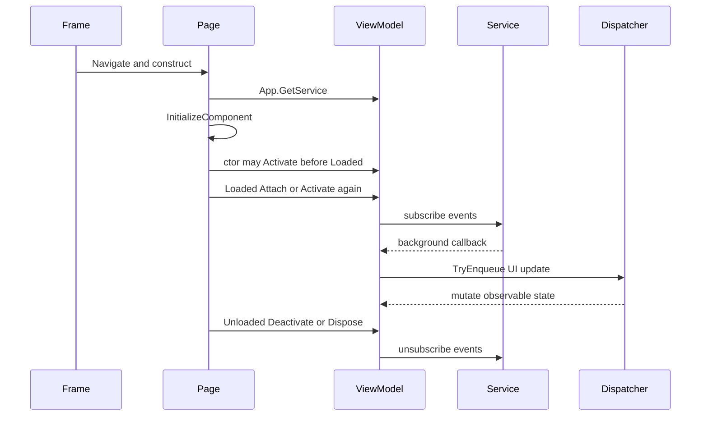

# ViewModel 生命周期

## Scope and non-responsibilities

本文说明七个主要 ViewModel 的创建、Attach、Deactivate、Cleanup 和 Dispose 路径，以及事件订阅、UI dispatch、NavigationCache 对生命周期的影响。本文不描述底层扫描硬件如何工作，也不把协议、USB 会话或 DNG 写入实现归入 ViewModel 生命周期。ViewModel 的职责是持有 UI 状态、命令和服务编排边界。

PageMapping: MainPage -> MainViewModel
PageMapping: SettingsPage -> SettingsViewModel
PageMapping: LogPage -> LogViewModel
PageMapping: DeviceConfigurationPage -> DeviceConfigurationViewModel
PageMapping: ScanPage -> ScanViewModel
PageMapping: ScanDebugPage -> ScanDebugViewModel
PageMapping: FilmProfileEditorPage -> FilmProfileEditorViewModel

## Functionality

ViewModel 生命周期由 Page 构造、Frame 导航和 Page Loaded/Unloaded 共同决定；应用关闭路径当前清理 scanner session manager，而不是调用这些 Page ViewModel 的 Cleanup 方法。所有七个页面都在 code-behind 构造函数内解析 ViewModel。轻量 ViewModel 依靠依赖注入容器和页面生命周期自然释放。订阅外部事件或持有后台回调的 ViewModel 显式提供 Deactivate、Cleanup 或 Dispose，但是否有调用者必须按当前源码确认。

MainViewModel 只发起导航命令。SettingsViewModel 和 DeviceConfigurationViewModel 在构造函数启动异步加载，并用 loading flag 避免加载期间保存回写。LogViewModel 订阅日志镜像服务，必须 Dispose。ScanViewModel 构造函数内先调用 `Activate()`，ScanPage Loaded 会再次调用 `Activate()`；`Activate()` 内的 `_areSessionEventsSubscribed` guard 防止重复订阅 session 事件。ScanPage Unloaded 调用 `Deactivate()`。`ScanViewModel.CleanupAsync()` 存在，但当前 codegraph caller 检查没有找到调用者，不能写成应用清理会调用它。ScanDebugViewModel 在 ScanDebugPage Loaded 时 AttachRuntimeBindings，Unloaded 时 DeactivateAsync，CleanupAsync 复用 DeactivateAsync。FilmProfileEditorViewModel 订阅 workspace 和内部 editor PropertyChanged，页面卸载时 Dispose。

## Key entry points

| 入口 | 生命周期动作 |
| --- | --- |
| `Host Software/PRISM Utility/Views/MainPage.xaml.cs` | 构造时解析 `MainViewModel` |
| `Host Software/PRISM Utility/Views/SettingsPage.xaml.cs` | 构造时解析 `SettingsViewModel` |
| `Host Software/PRISM Utility/Views/LogPage.xaml.cs` | 构造时解析 `LogViewModel`，Unloaded 调用 `Dispose()` |
| `Host Software/PRISM Utility/Views/DeviceConfigurationPage.xaml.cs` | 构造时解析 `DeviceConfigurationViewModel` |
| `Host Software/PRISM Utility/Views/ScanPage.xaml.cs` | Loaded 订阅 `PropertyChanged` 并调用 `Activate()`，Unloaded 解绑并调用 `Deactivate()` |
| `Host Software/PRISM Utility/Views/ScanDebugPage.xaml.cs` | Loaded 调用 `SubscribeViewModelEvents()`、`AttachRuntimeBindings()` 和刷新绑定，Unloaded 解绑、释放 bitmap 并调用 `DeactivateAsync()` |
| `Host Software/PRISM Utility/Views/FilmProfileEditorPage.xaml.cs` | Loaded 调用 `InitializeAsync()`，Unloaded 解绑 Page 事件并调用 `Dispose()` |
| `Host Software/PRISM Utility/ViewModels/ScanViewModel.cs` | 构造函数先调用 `Activate()`；Loaded 再调用 `Activate()`，由 `_areSessionEventsSubscribed` 防止重复订阅；`Deactivate()` 解绑 session 事件；`CleanupAsync()` 管理 UI lifetime token 但当前没有调用者 |
| `Host Software/PRISM Utility/ViewModels/ScanDebugViewModel.cs` | `AttachRuntimeBindings()`、`DeactivateAsync()`、`CleanupAsync()` 管理 session、transfer 和 film profile workspace 订阅 |
| `Host Software/PRISM Utility/ViewModels/FilmProfileEditorViewModel.cs` | `InitializeAsync()` 初始化 workspace，`Dispose()` 解绑 workspace 和 editor 事件 |

## Implementation mechanism

生命周期分为四类。

第一类是无外部订阅的轻量 ViewModel。MainViewModel 只持有 `INavigationService`。SettingsViewModel 和 DeviceConfigurationViewModel 持有设置服务，构造时启动加载任务，并在属性变化时保存。它们没有显式 Dispose。

第二类是订阅服务事件的 ViewModel。LogViewModel 构造时复制 `RecentEntries`，订阅 `EntryMirrored`，在回调中通过 `IUiDispatcher.TryEnqueue()` 修改 `ObservableCollection`。Dispose 解绑 `EntryMirrored` 并设置 `_disposed`。

第三类是缓存页面上的运行时绑定。ScanViewModel 构造函数在默认属性初始化后立即调用 `Activate()`，随后 `ScanPage.Loaded` 还会调用一次 `Activate()`。`Activate()` 只有在 `_areSessionEventsSubscribed` 为 false 时才绑定 `_sessionManager.TargetsChanged` 和 `_sessionManager.SnapshotChanged`，因此重复调用只会刷新 targets/snapshot，不会重复订阅。`Deactivate()` 对称解绑。`CleanupAsync()` 设置 `_isDisposed`、取消 `_uiLifetimeCts`、调用 `Deactivate()`、清空输出状态和预览图；当前源码中没有找到它的调用者。

第四类是复杂编辑器和调试台。ScanDebugViewModel 的 `AttachRuntimeBindings()` 先订阅胶片档案 workspace，再绑定 `_session.TargetsChanged` 和 `_transferSettings.BulkInReadModeChanged`。`DeactivateAsync()` 调用 `DetachRuntimeBindings()`、`UnsubscribeFilmProfileWorkspace()`、`ClearPreview()` 并隐藏进度。FilmProfileEditorViewModel 订阅 `_workspace.SnapshotChanged`，并在 editor 对象替换时解绑旧 editor 的 `PropertyChanged`、绑定新 editor 的 `PropertyChanged`。

## Control and data flow

Frame 导航阶段由 `NavigationService.NavigateTo()` 控制。导航成功后，旧页面 ViewModel 如果实现 `INavigationAware`，则调用 `OnNavigatedFrom()`。新页面 ViewModel 如果实现 `INavigationAware`，则在 `OnNavigated()` 调用 `OnNavigatedTo(e.Parameter)`。当前七个文档目标 ViewModel 的主要生命周期不是靠 INavigationAware，而是靠 Page Loaded/Unloaded 和显式清理方法。

ScanPage 的流程是：构造解析 ViewModel，而 `ScanViewModel` 构造函数内先调用 `Activate()`；Loaded 订阅 Page 级 `PropertyChanged`，再调用 `ScanViewModel.Activate()`。重复 Activate 不会重复订阅 session event，因为 `_areSessionEventsSubscribed` guard 包住 session event `+=`。Page 级 `ViewModel.PropertyChanged += OnViewModelPropertyChanged` 当前没有 Loaded guard；用户离开页面时，Unloaded 执行一次 Page 级 `PropertyChanged -=`，再调用 `Deactivate()`。由于 `ScanPage.xaml` 启用 NavigationCache，Deactivate 不应销毁全部扫描状态，只应停止页面级运行时订阅。

ScanDebugPage 的流程更宽。Loaded 先订阅 ViewModel 的 `PropertyChanged`、`CalibrationPromptRequested` 和 `NoticeRequested`，再调用 `AttachRuntimeBindings()`，随后刷新设备设置绑定、初始化缩放控件和预览布局。Unloaded 先解绑这三个事件，再释放 Canvas bitmap，最后调用 `DeactivateAsync()`。这让缓存页面离开视觉树后不再更新预览或响应 workspace/session 事件。

FilmProfileEditorPage 的流程是：构造时绑定 ViewModel 和布局事件，Loaded 初始化 workspace，Unloaded 解绑 Page 事件并 Dispose ViewModel。ViewModel 内部使用 `_isProjecting` 阻止 workspace snapshot 投影期间触发用户编辑回写。

## Dependencies

| ViewModel | 生命周期相关依赖 |
| --- | --- |
| `MainViewModel` | `INavigationService` |
| `SettingsViewModel` | `IThemeSelectorService`、`ILanguageSelectorService`、`IDebugOutputSettingsService`、`IScanTransferSettingsService`、`IScanColorManagementSettingsService` |
| `LogViewModel` | `IDebugOutputMirrorService`、`IUiDispatcher` |
| `DeviceConfigurationViewModel` | `IScanDeviceSettingsService`、`IScanDngGeometrySettingsService` |
| `ScanViewModel` | `IScannerDeviceSessionManager`、`IScanWorkflowSessionCoordinator`、扫描参数和图像服务、`IUiDispatcher`、`CancellationTokenSource` |
| `ScanDebugViewModel` | scan debug session、transfer settings、film profile workspace、校准/预览/导出服务、`IUiDispatcher` |
| `FilmProfileEditorViewModel` | `IScanFilmProfileWorkspace`、`IScanFilmProfileFileCoordinator`、`IScanFilmProfileDocumentService` |

## State and concurrency

事件订阅必须与解除订阅成对出现。`LogViewModel` 的 `EntryMirrored +=` 对应 `Dispose()` 中的 `EntryMirrored -=`。`ScanViewModel.Activate()` 可由构造函数和 Loaded 两条路径触发，但 session 事件 `+=` 受 `_areSessionEventsSubscribed` guard 保护，并对应 `Deactivate()` 中的解绑。`ScanDebugViewModel.AttachRuntimeBindings()` 中的 session 和 transfer 事件对应 `DetachRuntimeBindings()`。`SubscribeFilmProfileWorkspace()` 对应 `UnsubscribeFilmProfileWorkspace()`。`FilmProfileEditorViewModel.Dispose()` 同时解除 workspace 和三个 editor 的 `PropertyChanged`。

UI dispatch 的职责是保护 `ObservableCollection`、绑定属性和 WinUI 控件状态只在 UI 线程更新。`UiDispatcherService.TryEnqueue()` 选择 `App.MainWindow.DispatcherQueue`，没有时退回 `DispatcherQueue.GetForCurrentThread()`。Scan 和 ScanDebug 的服务回调均通过该接口投影状态。ScanDebugPage 自己操作 Canvas 和控件，因此使用 Page 的 `DispatcherQueue.TryEnqueue()`。

NavigationCache 带来两点并发风险。第一，Page 和 ViewModel 可能保留旧状态，因此离开页面时只解绑运行时事件，不应把用户输出无条件清空。第二，重新进入页面会再次触发 Loaded，所以 Attach/Activate 必须检查 `_are...Subscribed` 或 `_areRuntimeBindingsAttached`，防止重复订阅。

超大 ViewModel 和重复状态需要单独跟踪。`ScanViewModel.cs` 当前有 2042 行，`ScanDebugViewModel.cs` 当前有 6395 行，`FilmProfileEditorViewModel.cs` 当前有 594 行。Scan 和 ScanDebug 都保存扫描输入、设置服务投影、会话状态和预览输出。FilmProfileEditor 同时保存 workspace draft 和 editor 输入字符串。后续修改这些区域时，最容易出现 stale state、重复订阅和 UI 回写循环。

## Error handling

清理路径多采用幂等 guard。ScanViewModel 的 `CleanupAsync()` 先检查 `_isDisposed`，但当前 source caller graph 没有调用者；`_uiLifetimeCts` 只在 `CleanupAsync()` 中取消；应用关闭只清理 settings、scanner session manager 和 log mirror，不能被描述为会调用该方法。LogViewModel 的 `Dispose()` 检查 `_disposed`。ScanDebugViewModel 的 Detach 和 Unsubscribe 方法先检查 attached/subscribed flag。FilmProfileEditorViewModel 的 `Dispose()` 检查 `_disposed`。

异步初始化和 fire-and-forget 保存仍有可见风险。SettingsViewModel、DeviceConfigurationViewModel 在构造函数中启动加载任务，属性变化保存也多为 `_ = Save...Async()`。这减少 UI 阻塞，但异常不会在当前 Page code-behind 中展示。FilmProfileEditorViewModel 的 `RunAsync()` 会捕获操作异常并设置 message key，用户能看到失败状态，但异常详情仍不在 UI 层展开。

## Test coverage

文档验证流程覆盖本文件的标准章节、源码路径、Mermaid 和 `MissingPageMapping` self-test。现有 Core 测试覆盖大量服务和胶片档案 workspace 行为，但 Page Loaded/Unloaded、NavigationCache 实例复用、Win2D Canvas 释放和 WinUI DispatcherQueue 行为主要依赖应用级 QA 或后续专门测试。VM-001 todo 18 的完成状态是 blocked evidence: 4 个 focused characterization tests 两次、source caller graph 和 Oracle `CONFIRMED_BLOCKED`。UI-006 characterization 追加 15 个 focused source tests 两次、full managed suite 520/520 和 Core/app builds 证据，只记录 blocker propagation 和 no-extraction source contract。UI-007 characterization 继续记录 `EXTRACTION_BLOCKED`，task 21 VM-002 记录 `SPLIT_BLOCKED`，16 个 focused source/projection tests 两次通过，UI007/UI006/VM001 regression subset 23/23 通过，FilmProfile regression 204/204 通过，final full managed suite 540/540 通过。这些证据支持 completion-as-blocked，不证明运行时安全，也不关闭 VM-001、UI-006、UI-007 或 VM-002。

## Known issues and solutions

Issue-ID: VM-LIFE-001
问题：缓存页面复用和手动事件订阅并存。当前 source facts 是 cached ScanPage、构造函数 `Activate()`、Loaded 无 guard 的 Page `PropertyChanged +=`、Unloaded 单次 `PropertyChanged -=`、`CleanupAsync` 零调用者、`_uiLifetimeCts` 只在 cleanup 取消、app close 不调用 cleanup。VM-001 extraction hard gate outcome 是 `EXTRACTION_BLOCKED`，仍是 open design risk，并传播到 UI-006。短期方案是把每个 `+=` 和 `-=` 对列入代码审查清单，并把 UI-006、UI-007、VM-002 限定为 characterization-only；task 20 必须记录 blocked branch。长期方案是在明确 lifecycle/cleanup ownership 后，再评估是否提取可测试 lifecycle adapter。

Issue-ID: VM-LIFE-002
问题：ScanDebugViewModel 体量大，生命周期、扫描调试、校准、预览和胶片档案快捷入口集中在同一类。当前职责仍包括 `AttachRuntimeBindings()`、`DeactivateAsync()`、`CleanupAsync()`、Connect/Disconnect、Start/Stop scan、preview queueing、ROI overlay/input mutation、auto black/white/calibrate、autofocus、illumination/motion projection、film profile Save/Load/Apply/Discard/Capture/Open，以及 session/workflow diagnostics projection。公开事件仍是 `CalibrationPromptRequested`、`NoticeRequested` 和 `CalibrationSectionRequested`。VM-001 -> UI-006 -> UI-007 的 blocked chain 使 task 21 只能完成 `SPLIT_BLOCKED` characterization；没有生产 presenter/workspace split。短期方案是保持 Attach/Deactivate/Cleanup、dialog event 和 film profile workspace projection 边界稳定。长期方案是在 gate 解除后，再把预览、ROI、校准和 profile projection 拆成独立 presenter 或 workspace。

Issue-ID: VM-LIFE-003
问题：输入字符串和 typed settings 重复保存，容易出现保存延迟或投影覆盖。短期方案是保留 `_isLoading...`、`_isProjecting` 和 `_preserveEditorsOnNextProjection` guard。长期方案是用统一 draft/input model 减少双向绑定分叉。

Registry links: VM-LIFE-001 -> [VM-001](issues-and-remediation.md#vm-001); VM-LIFE-002 -> [VM-002](issues-and-remediation.md#vm-002); VM-LIFE-003 -> [SET-005](issues-and-remediation.md#set-005).

## Related source

`Host Software/PRISM Utility/Contracts/ViewModels/INavigationAware.cs`

`Host Software/PRISM Utility/Contracts/Services/IUiDispatcher.cs`

`Host Software/PRISM Utility/Services/UiDispatcherService.cs`

`Host Software/PRISM Utility/Services/NavigationService.cs`

`Host Software/PRISM Utility/Services/PageService.cs`

`Host Software/PRISM Utility/Views/LogPage.xaml.cs`

`Host Software/PRISM Utility/ViewModels/LogViewModel.cs`

`Host Software/PRISM Utility/Views/ScanPage.xaml`

`Host Software/PRISM Utility/Views/ScanPage.xaml.cs`

`Host Software/PRISM Utility/ViewModels/ScanViewModel.cs`

`Host Software/PRISM Utility/Views/ScanDebugPage.xaml`

`Host Software/PRISM Utility/Views/ScanDebugPage.xaml.cs`

`Host Software/PRISM Utility/ViewModels/ScanDebugViewModel.cs`

`Host Software/PRISM Utility/Views/FilmProfileEditorPage.xaml.cs`

`Host Software/PRISM Utility/ViewModels/FilmProfileEditorViewModel.cs`
